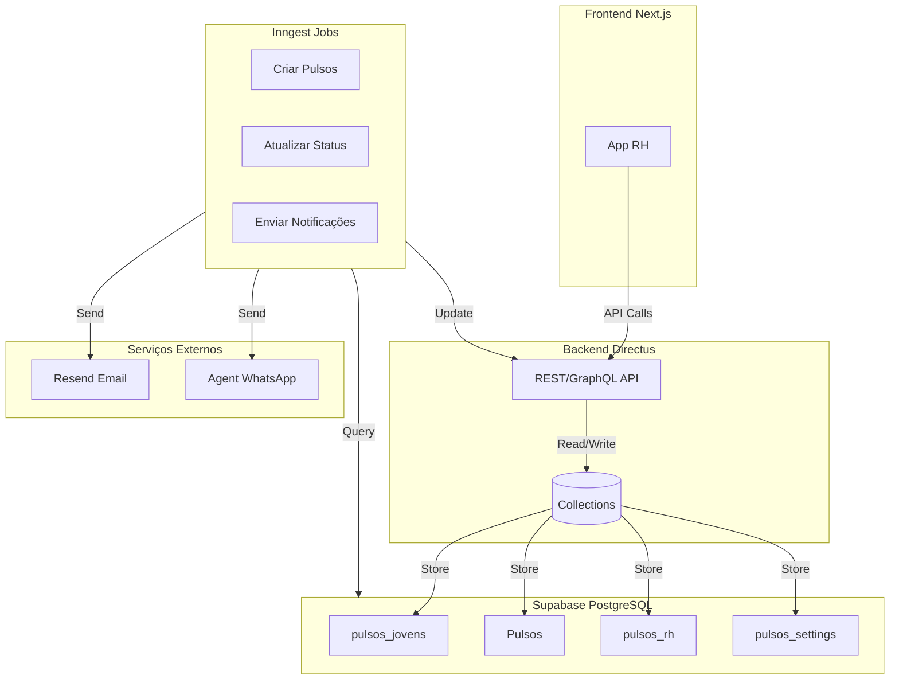
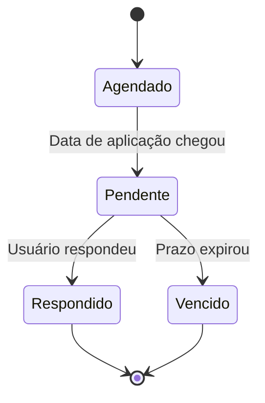

## Visão Geral

O sistema de Pulsos é um módulo crítico que coleta feedback contínuo ao longo do programa de estágio/aprendizagem através de pesquisas periódicas automatizadas. Diferente de avaliações pontuais, pulsos capturam a evolução dos talentos, lideranças e parceria Leapy ao longo do tempo.

## Arquitetura

## Tipos de Pulsos

O sistema possui **3 tipos** de pulsos, cada um com propósito e público específico:

| Tipo | Quem responde | Collection | O que mede |
|------|---------------|------------|------------|
| **Pulsos de Jovens** | Talentos (estagiários/aprendizes) | `pulsos_jovens` | Satisfação, engajamento, desejo de efetivação |
| **Pulsos de Lideranças** | Gestores diretos | `Pulsos` | Performance, probabilidade de efetivação |
| **Pulsos de RH** | Time de RH da empresa | `pulsos_rh` | Satisfação com parceria Leapy |

### Pulsos de Jovens

**Frequência**: Trimestral (5 pulsos ao longo do programa)  
**Identificação**: Sim (liderança e RH veem quem respondeu)  
**Prazo típico**: 7 dias

**Principais perguntas:**
- NPS Leapy e NPS Empresa (0-10)
- Relação com liderança (0-10)
- Avaliação de tarefas e desafios (0-10)
- Desejo de efetivação (0-10)
- Perguntas Sim/Não sobre expectativas e aprendizado
- Feedbacks abertos

### Pulsos de Lideranças

**Frequência**: Trimestral (alinhado com pulsos de jovens)  
**Identificação**: Confidencial (apenas RH tem acesso)  
**Prazo típico**: 7 dias

**Principais perguntas:**
- Performance (Abaixo / Dentro / Acima)
- Probabilidade de efetivação (Alta / Média / Baixa / Nenhuma)
- Recontrataria? (Sim / Não / Talvez)
- Depoimento detalhado
- Pontos fortes e de melhoria

### Pulsos de RH

**Frequência**: Semestral ou anual  
**Identificação**: Por empresa  
**Prazo típico**: 14 dias

**Principais perguntas:**
- NPS Leapy (0-10)
- Qualidade de reports e comunicação (0-10)
- Uso da plataforma
- Probabilidade de recontratação
- Sugestões de melhoria

## Funcionalidades Principais

<CardGroup cols={2}>
  <Card title="Criação Automática" icon="calendar">
    Jobs do Inngest criam pulsos automaticamente conforme cadência configurada
  </Card>
  <Card title="Notificações Multi-Canal" icon="envelope">
    Email (Resend) e WhatsApp (Agent System) para maximizar taxa de resposta
  </Card>
  <Card title="Agendamento Flexível" icon="gear">
    Configure cadência (mensal, trimestral, semestral) por perfil
  </Card>
  <Card title="Dashboards em Tempo Real" icon="chart-line">
    Acompanhe taxa de resposta, eNPS e tendências
  </Card>
  <Card title="Gestão de Prazos" icon="clock">
    Extensão de prazo, lembretes automáticos, vencimento automático
  </Card>
  <Card title="Privacidade" icon="shield">
    Avaliações de lideranças são confidenciais
  </Card>
</CardGroup>

## Ciclo de Vida de um Pulso

## Tecnologias Utilizadas

| Componente | Tecnologia | Uso |
|------------|------------|-----|
| **Backend** | Directus (Node.js) | API REST/GraphQL, gerenciamento de collections |
| **Database** | PostgreSQL (Supabase) | Armazenamento de dados |
| **Jobs** | Inngest | Criação automática, notificações, atualização de status |
| **Email** | Resend | Envio de notificações e lembretes |
| **WhatsApp** | Agent System | Notificações alternativas |
| **Frontend** | Next.js 13+ | Interface do usuário (App RH) |

## Próximos Passos

<CardGroup cols={2}>
  <Card title="Modelo de Dados" icon="database" href="/documentation/domains/pulses/data-model">
    Estrutura de tabelas e relacionamentos
  </Card>
  <Card title="Jobs Inngest" icon="gear" href="/documentation/domains/pulses/jobs-inngest">
    Detalhes dos 15 jobs automáticos
  </Card>
  <Card title="Integrações" icon="plug" href="/documentation/domains/pulses/integrations">
    Resend, Agent System, Inngest
  </Card>
  <Card title="Métricas" icon="chart-bar" href="/documentation/domains/pulses/metrics">
    eNPS, taxa de resposta, tempo médio
  </Card>
  <Card title="Jornadas" icon="route" href="/documentation/domains/pulses/journeys">
    Fluxos de uso por perfil
  </Card>
  <Card title="Regras de Negócio" icon="book" href="/documentation/domains/pulses/business-rules">
    Regras que governam o sistema
  </Card>
  <Card title="API Reference" icon="code" href="/api-reference/backoffice/pulsos-jovens">
    Documentação completa da API
  </Card>
  <Card title="Guia do RH" icon="user-tie" href="/guides/app-rh/pulsos-quickstart-rh">
    Tutorial para usuários
  </Card>
</CardGroup>
