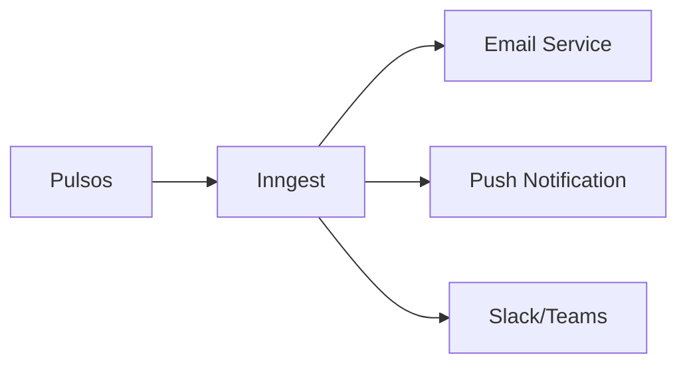

## Integrações Internas

### Módulo de Talentos

O módulo de Pulsos consome dados do módulo de Talentos para:

- **Destinatários**: Busca lista de talentos elegíveis
- **Segmentação**: Utiliza atributos para filtros (área, cargo, etc)
- **Identificação**: Vincula respostas ao perfil do talento

### Módulo de Insights

O módulo de Pulsos alimenta o módulo de Insights com:

- **Métricas agregadas**: eNPS, taxas de resposta, scores
- **Dados históricos**: Tendências e comparativos
- **Alertas**: Gatilhos para dashboards

### Módulo Admin

Integração com Admin para:

- **Permissões**: Controle de acesso às funcionalidades
- **Audit log**: Registro de ações (criação, edição, etc)

## Integrações Externas

### Notificações



| Canal | Evento | Descrição |
|-------|--------|-----------|
| Email | `pulse.activated` | Notifica destinatários sobre novo pulso |
| Email | `pulse.reminder` | Lembrete de pulso não respondido |
| Push | `pulse.activated` | Notificação no app mobile |
| Slack | `pulse.closed` | Notifica RH sobre encerramento |

### Webhooks

O módulo de Pulsos dispara webhooks para eventos importantes:

```json
{
  "event": "pulse.response.submitted",
  "timestamp": "2024-01-15T10:30:00Z",
  "data": {
    "pulse_id": "uuid",
    "response_id": "uuid",
    "is_complete": true
  }
}
```

**Eventos disponíveis:**

- `pulse.created` - Pulso criado
- `pulse.activated` - Pulso ativado
- `pulse.response.submitted` - Resposta enviada
- `pulse.closed` - Pulso encerrado

### Make (Automações)

Cenários de automação disponíveis:

<CardGroup cols={2}>
  <Card title="Sync com HRIS" icon="sync">
    Sincroniza resultados com sistemas de RH externos
  </Card>
  <Card title="Alertas customizados" icon="bell">
    Dispara alertas para condições específicas
  </Card>
  <Card title="Exportação automática" icon="file-export">
    Exporta relatórios periodicamente
  </Card>
  <Card title="Integração BI" icon="chart-bar">
    Envia dados para ferramentas de BI
  </Card>
</CardGroup>
