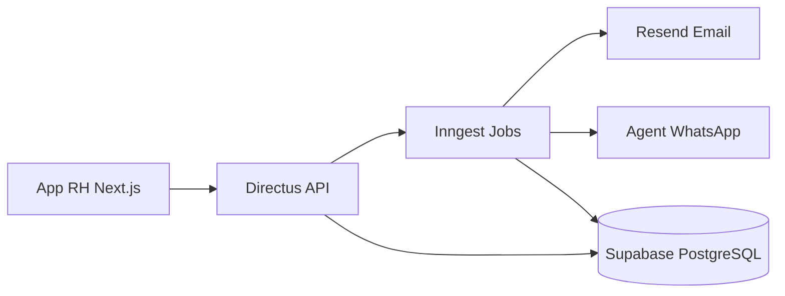
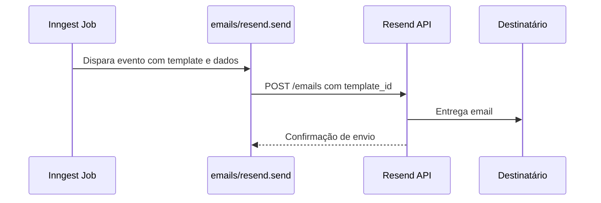
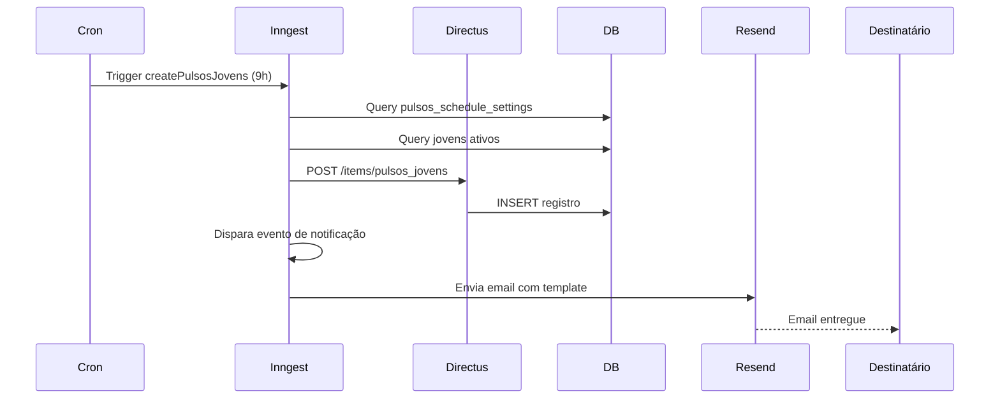
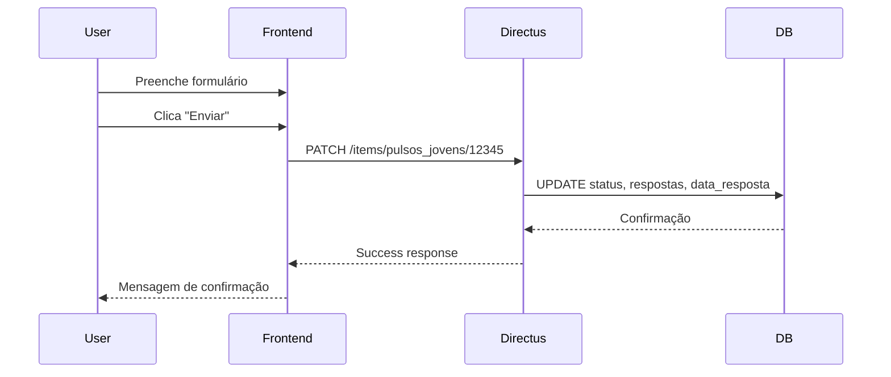

## Visão Geral

O sistema de Pulsos se integra com múltiplos serviços para criar, notificar e processar pesquisas automaticamente.



---

## Integrações Externas

### 1. Inngest (Jobs e Eventos)

**URL**: https://app.inngest.com  
**Propósito**: Orquestração de jobs automáticos e eventos assíncronos

**15 Jobs Ativos**:

<CardGroup cols={3}>
  <Card title="Criação" icon="plus">
    • createPulsosJovens  
    • createPulsosLiderancas  
    • processaPulsos
  </Card>
  <Card title="Status" icon="rotate">
    • updateStatusParaPendentes  
    • updateStatusParaVencidos  
    • updateStatusLiderancas
  </Card>
  <Card title="Notificações" icon="envelope">
    • sendLembreteJovens  
    • sendLembreteLiderancas  
    • sendLembreteRH  
    • sendLiberacoes (3x)
  </Card>
</CardGroup>

**Eventos Disparados**:

- `backoffice/jovem.created` - Cria 5 pulsos para jovem e liderança
- `backoffice/pulsos.change_status` - Atualiza status de pulsos
- `backoffice/pulsos_jovens/lembrete-to-jovens.send` - Envia lembretes
- `backoffice/pulsos_rh/liberacao-to-rh.send` - Notifica liberação

<Tip>
  Consulte a [documentação completa de Jobs](/documentation/domains/pulses/jobs-inngest) para detalhes de cada job.
</Tip>

---

### 2. Resend (Email)

**URL**: https://resend.com  
**Propósito**: Envio de notificações e lembretes por email

**9 Templates Ativos**:

| Template | Uso | Destinatário |
|----------|-----|--------------|
| `pulsos-lembrete-jovens` | Lembrete de pulso pendente | Talentos |
| `pulsos-lembrete-liderancas` | Lembrete de avaliação | Lideranças |
| `pulsos-lembrete-jovens-to-rh` | Status de jovens | RH |
| `pulsos-lembrete-liderancas-to-rh` | Status de lideranças | RH |
| `pulsos-liberacao-jovens-to-rh` | Novo pulso criado | RH |
| `pulsos-liberacao-liderancas-to-rh` | Novo pulso criado | RH |
| `pulsos-liberacao-rh-to-rh` | Novo pulso de RH | RH |
| `pulsos-lembrete-rh-to-rh` | Lembrete pulso RH | RH |
| `pulsos-notificacao-abertura` | Pulso disponível | Todos |

**Fluxo de Envio**:



**Tratamento de Erros**:

- **Bounce**: Email inválido ou caixa cheia
- **Retry**: 3 tentativas com exponential backoff
- **Fallback**: Notificação via WhatsApp (Agent System)

---

### 3. Agent System (WhatsApp)

**Propósito**: Notificações via WhatsApp como canal alternativo

**Quando é usado**:

- Email bounced (não entregue)
- Taxa de resposta < 30% após 5 dias
- Lembrete final (último dia de prazo)

**Mensagens Enviadas**:

```
🔔 Leapy: Você tem um pulso pendente!

Olá {{nome}}, lembre-se de responder o Pulso {{numero}} até {{data_vencimento}}.

Acesse: {{link}}
```

**Integração**:

```typescript
// Inngest dispara para Agent System
await step.run("send-whatsapp", async () => {
  await agentSystem.sendMessage({
    phone: talent.phone,
    template: 'pulso-lembrete',
    data: { nome, pulso_numero, link }
  });
});
```

---

## Integrações Internas

### Directus (Backend)

**Papel**: API REST/GraphQL para acesso aos dados

**Collections Usadas**:

- `pulsos_jovens` - Respostas dos talentos
- `Pulsos` - Avaliações das lideranças
- `pulsos_rh` - Pesquisas com RH
- `pulsos_settings` - Configuração de perguntas
- `pulsos_schedule_settings` - Agendamento automático

**API Endpoints**:

```bash
# Listar pulsos
GET /items/pulsos_jovens?filter[status][_eq]=pendente

# Criar pulso
POST /items/pulsos_jovens

# Atualizar status
PATCH /items/pulsos_jovens/12345
```

---

### Supabase (Database)

**Propósito**: Armazenamento persistente de dados

**Database**: PostgreSQL 15  
**Hosted by**: Supabase

**Tables**:

- 3 collections de pulsos (jovens, lideranças, RH)
- 3 collections de configuração
- 4 views materializadas para dashboards (charts)

**Performance**:

- Índices em campos críticos (status, jovem_id, data_aplicacao)
- Views pré-calculadas para métricas
- Connection pooling para escala

---

### Next.js Frontend

**App**: App RH  
**Routes**:

- `/[account]/(rh)/pulsos/*` - Gerenciamento de pulsos (RH)
- `/[account]/(talent)/pulsos-jovens/*` - Responder pulsos (Talentos)

**API Routes**:

```typescript
// app/api/pulsos/editar/route.ts
PUT /api/pulsos/editar - Editar pulsos em lote

// app/api/pulsos/send-lembrete/route.ts
POST /api/pulsos/send-lembrete - Enviar lembretes
```

**Services**:

```typescript
// src/services/pulsos.js
export async function getPulsos(filtros) {
  return await directus.request(readItems('pulsos_jovens', filtros));
}
```

---

## Webhooks do Directus

Configure webhooks em **Settings > Webhooks** para receber notificações:

**Eventos Disponíveis**:

- `items.create` - Quando pulso é criado
- `items.update` - Quando pulso é atualizado (ex: respondido)
- `items.delete` - Quando pulso é deletado

**Exemplo de Payload**:

```json
{
  "event": "items.update",
  "accountability": {
    "user": "uuid-do-usuario",
    "role": "uuid-do-role"
  },
  "payload": {
    "id": 12345,
    "status": "respondido",
    "nps_leapy": 9,
    "data_resposta": "2024-03-03T14:30:00Z"
  },
  "collection": "pulsos_jovens"
}
```

---

## Fluxo Completo de Integração

### Criação de Pulso



### Resposta de Pulso



---

## Monitoramento de Integrações

### Health Checks

| Serviço | Endpoint | Frequência |
|---------|----------|------------|
| Directus | `/server/health` | A cada minuto |
| Supabase | Dashboard | Manual |
| Inngest | Dashboard > Status | Real-time |
| Resend | Dashboard > Delivery Rate | Diário |

### Alertas Configurados

- **Inngest**: Taxa de erro > 10%
- **Resend**: Bounce rate > 5%
- **Directus**: Response time > 2s (p95)

---

## Próximos Passos

<CardGroup cols={2}>
  <Card title="Jobs Inngest" icon="gear" href="/documentation/domains/pulses/jobs-inngest">
    Detalhes dos 15 jobs
  </Card>
  <Card title="API Reference" icon="code" href="/api-reference/backoffice/pulsos-jovens">
    Documentação da API
  </Card>
  <Card title="Modelo de Dados" icon="database" href="/documentation/domains/pulses/data-model">
    Estrutura de tabelas
  </Card>
  <Card title="Troubleshooting" icon="wrench" href="/guides/backoffice/pulsos-troubleshooting">
    Resolver problemas
  </Card>
</CardGroup>
