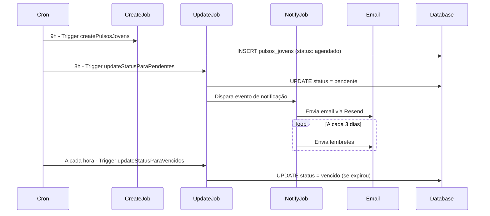

## Visão Geral

O sistema de Pulsos utiliza **Inngest** para gerenciar 15 jobs automáticos que controlam criação, atualização de status, notificações e processamento de pulsos.

**URL do Inngest Dashboard**: https://app.inngest.com

## Resumo dos Jobs

| Job | Tipo | Frequência | Propósito |
|-----|------|------------|-----------|
| `createPulsosJovens` | Cron | Diário 9h | Criar pulsos para jovens |
| `createPulsosLiderancas` | Cron | Diário 9h | Criar pulsos para lideranças |
| `createPulsosLiderancaAvaliacaoLeapy` | Event | On-demand | Criar pulsos de avaliação da Leapy |
| `processaPulsosJovensOuLiderancas` | Event | On-demand | Processar criação/atualização |
| `updateStatusPulsosJovensParaPendentes` | Cron | Diário 8h | Liberar pulsos agendados |
| `updateStatusPulsosJovensParaVencidos` | Cron | A cada hora | Marcar pulsos vencidos |
| `updateStatusPulsosLiderancasToPendente` | Event | On-demand | Atualizar para pendente |
| `updateStatusPulsosLiderancasToVencido` | Event | On-demand | Marcar como vencido |
| `sendPulsosLembretetoJovens` | Event | On-demand | Enviar lembretes jovens |
| `sendPulsosLembretetoLiderancas` | Event | On-demand | Enviar lembretes lideranças |
| `sendPulsosLembretetoRh` | Event | On-demand | Enviar lembretes RH |
| `sendLiberacaoPulsosJovensToRh` | Event | On-demand | Notificar liberação jovens |
| `sendPulsosLiderancasLiberacaotoRh` | Event | On-demand | Notificar liberação lideranças |
| `sendLiberacaoPulsosRhToRh` | Event | On-demand | Notificar liberação RH |
| `sendLembretePulsosRhToRh` | Event | On-demand | Lembrete pulsos RH |

---

## Jobs de Criação

### 1. `createPulsosJovens`

**Propósito**: Criar pulsos para todos os jovens ativos conforme agendamento.

**Trigger**: Cron diário às 9h

**Lógica**:

```typescript
1. Buscar settings de agendamento (pulsos_schedule_settings)
   - WHERE profile = 'jovens'
   - AND enabled = true
   - AND next_pulso_date <= TODAY

2. Para cada setting:
   a. Buscar jovens ativos da empresa
   b. Para cada jovem:
      - Calcular próximo número de pulso (1-5)
      - Criar registro em pulsos_jovens:
        * status = 'agendado'
        * data_aplicacao = next_pulso_date
        * data_vencimento = next_pulso_date + 7 dias
   
   c. Atualizar next_pulso_date:
      - next_pulso_date = next_pulso_date + cadence_interval
```

**Eventos disparados**:
- `backoffice/pulsos-jovens.update-to-pendente` (na data_aplicacao)

---

### 2. `createPulsosLiderancas`

**Propósito**: Criar pulsos para lideranças avaliarem seus liderados.

**Trigger**: Cron diário às 9h

**Lógica**: Similar ao `createPulsosJovens`, mas cria em `Pulsos` (collection com P maiúsculo).

```typescript
1. Buscar settings de agendamento
   - WHERE profile = 'liderancas'
   
2. Para cada jovem ativo:
   - Identificar liderança direta
   - Criar pulso de avaliação em `Pulsos`
```

---

### 3. `createPulsosLiderancaAvaliacaoLeapy`

**Propósito**: Criar pulsos específicos para lideranças avaliarem a Leapy.

**Trigger**: Evento `backoffice-inngest-functions/pulsos-liderancas-leapy.create`

**Payload**:

```json
{
  "lideranca_id": 123,
  "empresa_id": 456,
  "email": "lideranca@empresa.com"
}
```

**Collection**: `pulsos_liderancas_avaliacao_leapy`

---

## Jobs de Atualização de Status

### 4. `updateStatusPulsosJovensParaPendentes`

**Propósito**: Liberar pulsos agendados quando chega a data de aplicação.

**Trigger**: Cron diário às 8h (antes da criação de novos pulsos)

**Lógica**:

```sql
UPDATE pulsos_jovens
SET status = 'pendente'
WHERE status = 'agendado'
  AND data_aplicacao <= CURRENT_DATE;
```

**Eventos disparados**:
- `backoffice/pulsos_jovens/lembrete-to-jovens.send` (notificação inicial)

---

### 5. `updateStatusPulsosJovensParaVencidos`

**Propósito**: Marcar pulsos pendentes como vencidos quando prazo expira.

**Trigger**: Cron a cada hora

**Lógica**:

```sql
UPDATE pulsos_jovens
SET status = 'vencido'
WHERE status = 'pendente'
  AND data_vencimento < NOW();
```

---

### 6. `updateStatusPulsosLiderancasToPendente`

**Propósito**: Atualizar pulsos de lideranças para pendente.

**Trigger**: Evento `backoffice/pulsos.change_status`

**Payload**:

```json
{
  "pulso_id": 5678,
  "new_status": "pendente"
}
```

---

### 7. `updateStatusPulsosLiderancasToVencido`

**Propósito**: Marcar pulsos de lideranças como vencidos.

**Trigger**: Evento `backoffice/pulsos.vencidos_lideranca`

**Payload**:

```json
{
  "pulso_ids": [5678, 5679, 5680]
}
```

---

## Jobs de Notificação

### 8. `sendPulsosLembretetoJovens`

**Propósito**: Enviar lembrete de pulso pendente para jovens via email.

**Trigger**: Evento `backoffice/pulsos_jovens/lembrete-to-jovens.send`

**Payload**:

```json
{
  "pulso_ids": [12345, 12346],
  "destinatarios": [
    {
      "jovem_id": 789,
      "email": "jovem@empresa.com",
      "nome": "João Silva"
    }
  ]
}
```

**Lógica**:

```typescript
1. Para cada pulso_id:
   a. Buscar dados do pulso e do jovem
   b. Disparar evento de email:
      - Template: 'pulsos-lembrete-jovens'
      - To: email do jovem
      - Data: nome, pulso_numero, data_vencimento, link
```

**Email disparado via**: Resend

---

### 9. `sendPulsosLembretetoLiderancas`

**Propósito**: Enviar lembrete para lideranças.

**Trigger**: Evento `backoffice/pulsos_liderancas/lembrete-to-liderancas.send`

**Template**: `pulsos-lembrete-liderancas`

**Lógica**: Similar ao job de jovens, mas para lideranças.

---

### 10. `sendPulsosLembretetoRh`

**Propósito**: Enviar lembrete para RH sobre pulsos pendentes.

**Trigger**: Evento `backoffice/pulsos_jovens/pulsos_liderancas/lembrete-to-rh.send`

**Payload**:

```json
{
  "tipo": "jovens",
  "pendentes_count": 15,
  "account_id": "uuid-da-empresa",
  "rh_emails": ["rh@empresa.com"]
}
```

**Templates usados**:
- `pulsos-lembrete-jovens-to-rh`
- `pulsos-lembrete-liderancas-to-rh`

---

### 11. `sendLiberacaoPulsosJovensToRh`

**Propósito**: Notificar RH sobre liberação de novos pulsos de jovens.

**Trigger**: Evento `backoffice/pulsos_jovens/liberacao-to-rh.send`

**Payload**:

```json
{
  "pulso_numero": 3,
  "jovens_count": 25,
  "data_vencimento": "2024-03-15",
  "rh_emails": ["rh@empresa.com"]
}
```

**Template**: `pulsos-liberacao-jovens-to-rh`

---

### 12. `sendPulsosLiderancasLiberacaotoRh`

**Propósito**: Notificar RH sobre liberação de pulsos de lideranças.

**Trigger**: Evento `backoffice/pulsos_liderancas/liberacao-to-rh.send`

**Template**: `pulsos-liberacao-liderancas-to-rh`

---

### 13. `sendLiberacaoPulsosRhToRh`

**Propósito**: Notificar RH sobre liberação de pulsos para o próprio RH.

**Trigger**: Evento `backoffice/pulsos_rh/liberacao-to-rh.send`

**Template**: `pulsos-liberacao-rh-to-rh`

---

### 14. `sendLembretePulsosRhToRh`

**Propósito**: Enviar lembrete de pulsos de RH pendentes.

**Trigger**: Evento `backoffice/pulsos_rh/lembrete-rh.send`

**Template**: `pulsos-lembrete-rh-to-rh`

---

## Job de Processamento

### 15. `processaPulsosJovensOuLiderancas`

**Propósito**: Processar criação/atualização de pulsos baseado em eventos de talento.

**Trigger**: Evento `backoffice/jovem.selected`

**Payload**:

```json
{
  "jovem_id": 789,
  "turma_id": 456
}
```

**Lógica**:

```typescript
1. Verificar se jovem já possui pulsos
2. Se não, criar 5 pulsos iniciais (agendados)
3. Se sim, verificar se precisa ajustar datas/status
4. Criar também pulsos para liderança avaliar o jovem
```

---

## Integração entre Jobs

### Fluxo Completo de um Pulso



---

## Templates de Email (Resend)

### Templates Usados

| Template | Uso | Job |
|----------|-----|-----|
| `pulsos-lembrete-jovens` | Lembrete para talentos | sendPulsosLembretetoJovens |
| `pulsos-lembrete-liderancas` | Lembrete para lideranças | sendPulsosLembretetoLiderancas |
| `pulsos-lembrete-jovens-to-rh` | Lembrete jovens para RH | sendPulsosLembretetoRh |
| `pulsos-lembrete-liderancas-to-rh` | Lembrete lideranças para RH | sendPulsosLembretetoRh |
| `pulsos-liberacao-jovens-to-rh` | Liberação jovens | sendLiberacaoPulsosJovensToRh |
| `pulsos-liberacao-liderancas-to-rh` | Liberação lideranças | sendPulsosLiderancasLiberacaotoRh |
| `pulsos-liberacao-rh-to-rh` | Liberação RH | sendLiberacaoPulsosRhToRh |
| `pulsos-lembrete-rh-to-rh` | Lembrete RH | sendLembretePulsosRhToRh |

---

## Monitoramento

### Métricas Críticas

| Métrica | Descrição | Alerta |
|---------|-----------|--------|
| **Success Rate** | Taxa de sucesso dos jobs | < 95% |
| **Latency** | Tempo médio de execução | > 30s |
| **Retry Rate** | Taxa de retries | > 5% |
| **Failed Jobs** | Jobs que falharam completamente | > 0 |

### Onde Monitorar

- **Inngest Dashboard**: Status em tempo real de todos os jobs
- **Logs**: Cada job registra início, steps e resultado
- **Alertas**: Configure alertas para falhas críticas

---

## Troubleshooting

### Job Falhou

1. Acesse Inngest Dashboard > Functions > Selecione o job
2. Veja os **Runs** recentes
3. Abra o run falhado
4. Analise o erro em cada **Step**
5. Corrija o problema (dados, lógica, integração)
6. Re-execute manualmente se necessário

### Job Travado

Se job está "Running" por > 5min:

1. Cancele manualmente no Inngest
2. Investigue causa (query lenta? API externa?)
3. Otimize e re-execute

### Disparar Manualmente

Para testar ou reprocessar:

```typescript
// Via Inngest Dashboard
{
  "name": "backoffice/pulsos_jovens/lembrete-to-jovens.send",
  "data": {
    "pulso_ids": [12345]
  }
}
```

---

## Próximos Passos

<CardGroup cols={2}>
  <Card title="Integrações" icon="plug" href="/documentation/domains/pulses/integrations">
    Resend, Agent System, Inngest
  </Card>
  <Card title="Modelo de Dados" icon="database" href="/documentation/domains/pulses/data-model">
    Estrutura de collections
  </Card>
  <Card title="Troubleshooting" icon="wrench" href="/guides/backoffice/pulsos-troubleshooting">
    Resolver problemas
  </Card>
  <Card title="Operações" icon="gears" href="/guides/backoffice/pulsos-operacoes">
    Guia operacional
  </Card>
</CardGroup>
