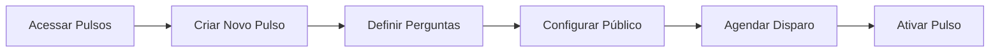
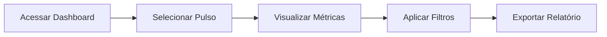
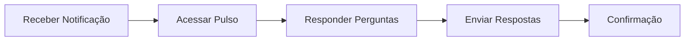
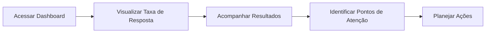

## Jornada do RH

### Criar e Configurar um Pulso

**Passos detalhados:**

1. **Acessar o módulo de Pulsos** no menu lateral
2. **Criar novo pulso** clicando no botão "+ Novo Pulso"
3. **Definir as perguntas** usando templates ou criando do zero
4. **Configurar o público-alvo** (toda empresa, área, equipe específica)
5. **Agendar o disparo** (imediato ou programado)
6. **Ativar o pulso** para iniciar a coleta

### Analisar Resultados

## Jornada do Talento

### Responder um Pulso

**Pontos importantes:**

- O talento recebe notificação por email e/ou app
- As respostas podem ser anônimas conforme configuração
- O prazo para resposta é definido pelo RH
- Após envio, não é possível alterar as respostas

## Jornada da Liderança

### Acompanhar Pulsos da Equipe

<Note>
  A liderança só visualiza resultados agregados da equipe, preservando o anonimato individual.
</Note>
