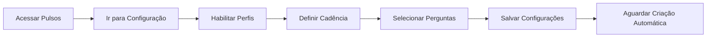
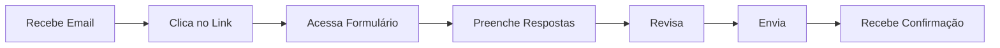
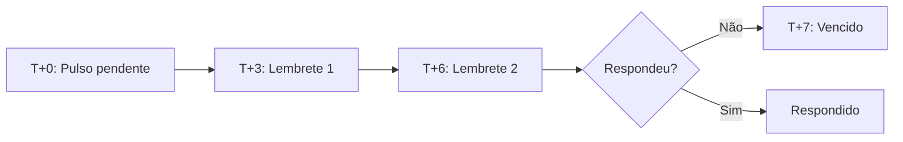
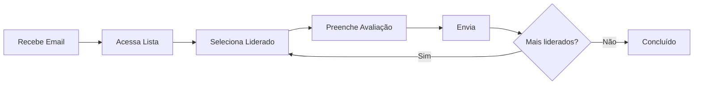
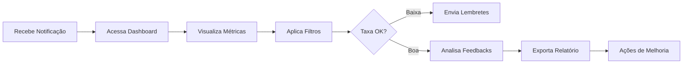
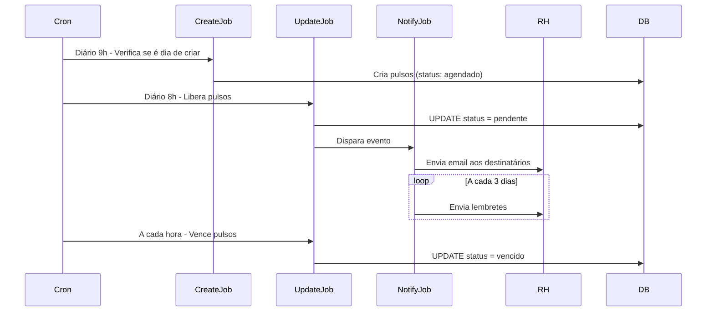

## Visão Geral

O sistema de Pulsos possui 4 jornadas principais: RH configurando o sistema, Talentos respondendo pulsos, Lideranças avaliando seus liderados, e o próprio Time de RH respondendo pulsos sobre a Leapy.

---

## Jornada 1: RH Configurando Pulsos

### Fluxo Completo

### Passos Detalhados

<Steps>
  <Step title="Acessar o Módulo">
    No App RH, clicar em **Pulsos** no menu lateral **Rota**:
    `/[account]/(rh)/pulsos`
  </Step>

  <Step title="Ir para Configuração">
    Clicar na aba **"Configuração"** no topo **Rota**:
    `/[account]/(rh)/pulsos/configuracao`
  </Step>

  <Step title="Habilitar Perfis">
    Marcar checkboxes para: - ☑️ Pulsos de Jovens - ☑️ Pulsos de Lideranças - ☑️
    Pulsos de RH (opcional)
  </Step>

  <Step title="Configurar Agendamento">
    Para cada perfil habilitado: - **Cadência**: Mensal/Trimestral/Semestral -
    **Próxima Data**: Ex: 01/04/2024 Sistema calculará automaticamente as
    próximas datas.
  </Step>

  <Step title="Selecionar Perguntas">
    Marcar quais perguntas estarão ativas: - Jovens: NPS, relação com liderança,
    feedback, etc - Lideranças: Performance, prob. efetivação, depoimento - RH:
    NPS Leapy, uso da plataforma, sugestões
  </Step>

  <Step title="Salvar">
    Clicar em **"Salvar Configurações"** Sistema confirma e mostra resumo.
  </Step>

  <Step title="Aguardar Criação Automática">
    Na data configurada (ex: 01/04), job do Inngest criará pulsos
    automaticamente às 9h.
  </Step>
</Steps>

### Pontos de Decisão

**Decisão 1: Qual cadência usar?**

- Programa curto (6-12 meses) → Mensal ou Bimestral
- Programa médio (12-18 meses) → Trimestral ✅ Recomendado
- Programa longo (24+ meses) → Semestral

**Decisão 2: Quantas perguntas habilitar?**

- Primeiro pulso → 5-7 perguntas (não sobrecarregar)
- Pulsos seguintes → Até 15 perguntas
- Último pulso → Mais extenso, incluir feedbacks abertos

---

## Jornada 2: Talento Respondendo Pulso

### Fluxo Completo

### Passos Detalhados

<Steps>
  <Step title="Receber Notificação">
    Talento recebe email do Resend: **Assunto**: "Novo Pulso Disponível - Pulso
    3" **Conteúdo**: Link direto, prazo (7 dias), importância **Fallback**: Se
    não abrir email em 3 dias, recebe lembrete. Se não abrir em 5 dias, recebe
    WhatsApp.
  </Step>

  <Step title="Acessar Pulso">
    Clicar no link do email **ou** acessar diretamente: **Rota**:
    `/[account]/(talent)/pulsos-jovens` Verá card com pulso pendente.
  </Step>

  <Step title="Preencher Formulário">
    Responder todas as perguntas: **Escalas 0-10**: - NPS Leapy: Slider de 0 a
    10 - NPS Empresa: Slider de 0 a 10 - Relação com liderança: Slider de 0 a 10
    **Perguntas Sim/Não**: - Radio buttons **Feedbacks Abertos**: - Text areas
  </Step>

  <Step title="Revisar">
    Antes de enviar, revisar todas as respostas.
    <Warning>Após enviar, não é possível editar!</Warning>
  </Step>

  <Step title="Enviar">
    Clicar em **"Enviar Pulso"** Frontend chama: `PATCH /items/pulsos_jovens/
    {id}` Payload inclui todas as respostas + `status: 'respondido'` +
    `data_resposta`.
  </Step>

  <Step title="Confirmação">
    Recebe mensagem de sucesso: ✅ "Pulso enviado com sucesso! Obrigado pelo seu
    feedback." Status muda para "Respondido" na lista.
  </Step>
</Steps>

### Cenários Alternativos

**Cenário A: Talento não responde no prazo**

**Resultado**: Status muda para `vencido`, RH é notificado.

**Cenário B: Talento estava de férias**

RH pode estender prazo:

1. RH filtra pulsos vencidos
2. Seleciona pulso do talento
3. Edita data de vencimento (+7 dias)
4. Sistema reabre pulso (vencido → pendente)
5. Envia nova notificação

---

## Jornada 3: Liderança Avaliando Liderado

### Fluxo Completo

### Passos Detalhados

<Steps>
  <Step title="Receber Notificação">
    Liderança recebe email: **Assunto**: "Avalie seus liderados - Pulso 3"
    **Conteúdo**: Lista de liderados, prazo (7 dias), link
  </Step>

  <Step title="Acessar Dashboard">
    **Rota**: `/[account]/(rh)/pulsos/lideranca` Vê tabela com todos os
    liderados e status: - 🟡 Pendente - 🟢 Respondido
  </Step>

  <Step title="Selecionar Liderado">
    Clicar em **"Avaliar"** na linha do liderado. Modal abre com formulário de
    avaliação.
  </Step>

  <Step title="Preencher Avaliação">
    **Performance**: - Radio buttons: Abaixo / Dentro / Acima **Probabilidade de
    Efetivação**: - Dropdown: Alta / Média / Baixa / Nenhuma **Recontrataria?**:
    - Radio buttons: Sim / Não / Talvez **Depoimento**: - Text area
    (obrigatório, mínimo 50 caracteres) **Pontos Fortes e Melhoria**: - Text
    areas (opcional)
  </Step>

  <Step title="Enviar">
    Clicar em **"Enviar Avaliação"**
    <Note>Avaliação é confidencial. Apenas RH terá acesso.</Note>
  </Step>

  <Step title="Repetir">
    Se tiver mais liderados, repetir processo. Sistema salva parcialmente, pode
    voltar depois.
  </Step>
</Steps>

### Cenários Especiais

**Cenário A: Liderado se desligou antes do pulso**

Liderança deve:

1. Avaliar mesmo assim (histórico é importante)
2. Mencionar no depoimento que já se desligou
3. Ser honesto sobre motivos (se souber)

**Cenário B: Liderança discorda da autoavaliação do liderado**

É normal e esperado! Liderança deve:

1. Usar o depoimento para explicar sua perspectiva
2. Dar exemplos concretos
3. Ser construtivo (não apenas crítico)

---

## Jornada 4: RH Analisando Resultados

### Fluxo Completo

### Passos Detalhados

<Steps>
  <Step title="Notificação de Liberação">
    RH recebe email quando pulsos são criados:
    
    **Assunto**: "Pulso 3 liberado para 25 jovens"  
    **Conteúdo**: Quantidade, data de vencimento, link
  </Step>
  
  <Step title="Acompanhar Taxa de Resposta">
    **Rota**: `/[account]/(rh)/pulsos/talentos`
    
    Dashboard mostra:
    - **eNPS**: Indicador principal
    - **Taxa de resposta**: % respondidos
    - **Pendentes**: Quantidade aguardando
    - **Vencidos**: Quantidade expirada
  </Step>
  
  <Step title="Ação Preventiva">
    Se taxa < 50% a 3 dias do vencimento:
    
    1. Enviar lembrete manual (botão "Enviar Lembrete")
    2. Comunicar em reunião de equipe
    3. Pedir que lideranças reforcem individualmente
  </Step>
  
  <Step title="Análise de Dados">
    Após fechamento (7 dias):
    
    **Métricas Quantitativas**:
    - eNPS Leapy: -100 a +100
    - eNPS Empresa: -100 a +100
    - Taxa de resposta: %
    
    **Análise Qualitativa**:
    - Ler todos os feedbacks abertos
    - Categorizar por tema (liderança, tarefas, ambiente)
    - Identificar padrões (3+ menções = padrão)
  </Step>
  
  <Step title="Exportação">
    Clicar em **"Exportar"** > Escolher formato:
    - **PDF**: Relatório formatado para apresentação
    - **Excel**: Dados brutos para análise
    - **CSV**: Integração com BI
  </Step>
  
  <Step title="Plano de Ação">
    Com base nos dados:
    
    **Se eNPS < 30**:
    - Reunião com lideranças
    - Identificar causa raiz
    - Plano de ação com prazos
    - Monitorar no próximo pulso
    
    **Se eNPS > 50**:
    - Celebrar com equipe
    - Identificar best practices
    - Replicar em outras áreas
  </Step>
</Steps>

---

## Jornada 5: Sistema Processando Automaticamente

### Fluxo de Automação (Background)

### Jobs e Triggers

| Momento            | Job                         | O que faz                                              |
| ------------------ | --------------------------- | ------------------------------------------------------ |
| **Diário 9h**      | `createPulsosJovens`        | Verifica se é dia de criar pulsos conforme agendamento |
| **Diário 8h**      | `updateStatusParaPendentes` | Libera pulsos agendados (agendado → pendente)          |
| **A cada hora**    | `updateStatusParaVencidos`  | Marca pulsos expirados (pendente → vencido)            |
| **T+3 e T+6 dias** | `sendLembretes`             | Envia lembretes para pendentes                         |

<Tip>Todos esses jobs rodam automaticamente. RH não precisa fazer nada!</Tip>

---

## Jornadas Alternativas

### Reabrir Pulso Vencido

**Quando usar**: Talento estava ausente (férias, licença)

**Jornada**:

1. RH acessa pulsos vencidos
2. Filtra por talento
3. Seleciona pulso
4. Clica em "Editar"
5. Define nova data de vencimento (+7 dias)
6. Confirma
7. Sistema reabre (vencido → pendente)
8. Envia nova notificação

### Criar Pulso Fora do Agendamento

**Quando usar**: Novo talento entrou após criação automática

**Jornada**:

1. Acessa Backoffice (Directus)
2. Vai em Collections > pulsos_jovens
3. Clica em "Create Item"
4. Preenche campos obrigatórios
5. Salva
6. Job de notificação dispara automaticamente

<Warning>
  Criação manual deve ser exceção. Prefira ajustar o agendamento automático.
</Warning>

---

## Próximos Passos

<CardGroup cols={2}>
  <Card
    title="Business Rules"
    icon="book"
    href="/documentation/domains/pulses/business-rules"
  >
    Regras que governam essas jornadas
  </Card>
  <Card
    title="Jobs Inngest"
    icon="gear"
    href="/documentation/domains/pulses/jobs-inngest"
  >
    Detalhes dos jobs automáticos
  </Card>
  <Card
    title="Guia Quickstart RH"
    icon="rocket"
    href="/guides/app-rh/pulsos-quickstart-rh"
  >
    Tutorial prático
  </Card>
  <Card title="FAQ" icon="question" href="/guides/app-rh/pulsos-faq">
    Perguntas frequentes
  </Card>
</CardGroup>
