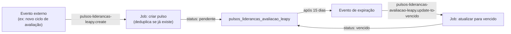

## Contexto de Produto

Além dos pulsos criados pelas empresas clientes, a Leapy cria seus próprios pulsos para avaliar
as **lideranças** diretamente. Esses pulsos (`pulsos_liderancas_avaliacao_leapy`) são distintos
dos pulsos regulares de empresa (`Pulsos`) e seguem um ciclo próprio de criação e expiração.

A diferença principal: enquanto os pulsos de empresa são configurados pelo RH, os pulsos de
avaliação Leapy são acionados por eventos internos da plataforma (ex: quando um novo ciclo de
avaliação começa).

## Eventos e Jobs

### Criação: `backoffice-inngest-functions/pulsos-liderancas-leapy.create`

**Job:** `create-pulsos-lideranca-avaliacao-leapy`

**Payload:**

```json
{
  "name": "backoffice-inngest-functions/pulsos-liderancas-leapy.create",
  "data": {
    "lideranca_id": 123,
    "data_aplicacao": "2026-05-01T00:00:00.000Z"
  }
}
```

**Lógica de criação:**

1. Calcula `data_vencimento = data_aplicacao + 15 dias` (23:59:59)
2. Define `data_aplicacao` com hora 00:00:00
3. Verifica se já existe pulso `pendente` para a mesma liderança (**deduplicação**)
4. Se já existe → retorna `{ success: false, message: "Pulso já existe" }`
5. Cria registro em `pulsos_liderancas_avaliacao_leapy` com `status: "pendente"`

**Collection `pulsos_liderancas_avaliacao_leapy`:**

| Campo | Tipo | Descrição |
|---|---|---|
| `lideranca_id` | `number` | FK para a liderança |
| `data_aplicacao` | `datetime` | Data de início (00:00:00) |
| `data_vencimento` | `datetime` | Data de encerramento = aplicacao + 15 dias (23:59:59) |
| `status` | `string` | `pendente` na criação |

---

### Expiração: `backoffice-inngest-functions/pulsos-liderancas-avaliacao-leapy.update-to-vencido`

**Job:** `update-status-pulsos-liderancas-avaliacao-leapy-to-vencidos`

**Payload:**

```json
{
  "name": "backoffice-inngest-functions/pulsos-liderancas-avaliacao-leapy.update-to-vencido",
  "data": {
    "lideranca_id": 123
  }
}
```

**Lógica de expiração:**

1. Busca todos os pulsos `pendente` da liderança
2. Se nenhum encontrado → retorna `{ success: false, message: "Pulso não encontrado" }`
3. Atualiza todos para `status: "vencido"`

<Note>
  Atenção: o job tem uma variável `const ativo = true` hardcoded. Para desativar a feature,
  é necessário alterar o código.
</Note>

---

## Ciclo Completo



## Diferença em Relação aos Pulsos de Empresa

| Dimensão | Pulsos de Empresa (`Pulsos`) | Pulsos Avaliação Leapy |
|---|---|---|
| **Quem cria** | RH da empresa cliente | A própria Leapy |
| **Collection** | `Pulsos` | `pulsos_liderancas_avaliacao_leapy` |
| **Evento de criação** | `backoffice/pulsos.change_status` | `pulsos-liderancas-leapy.create` |
| **Deduplicação** | Por configuração de pulso | Por `lideranca_id + status pendente` |
| **Expiração** | `hook-cron-change-status-pulso-lideranca` | Evento dedicado por liderança |
| **Destinatário** | Lideranças ou jovens | Somente lideranças |

## Observabilidade

```sql
-- Pulsos de avaliação Leapy ativos por status
SELECT lideranca_id, status, data_aplicacao, data_vencimento
FROM pulsos_liderancas_avaliacao_leapy
WHERE status IN ('pendente', 'respondido')
ORDER BY data_vencimento DESC;

-- Verificar deduplicação — lideranças com múltiplos pulsos pendentes (não deveria existir)
SELECT lideranca_id, COUNT(*) as total
FROM pulsos_liderancas_avaliacao_leapy
WHERE status = 'pendente'
GROUP BY lideranca_id
HAVING COUNT(*) > 1;
```

## Riscos, Limites e Trade-offs

| Risco | Mitigação |
|---|---|
| Evento de criação disparado duas vezes | Deduplicação por `lideranca_id + status pendente` antes de criar |
| Job de expiração chamado antes do vencimento | Depende do caller enviar o evento no momento correto; job não valida data |
| `ativo = true` hardcoded | Desativar requer mudança de código + deploy |
| Múltiplos pulsos vencidos não processados | Job processa todos os pendentes da liderança de uma vez |

## Referências de Código

| Arquivo | Repo | Descrição |
|---|---|---|
| `src/inngest/functions/pulsos/lideranca/create-pulsos-lideranca-avaliacao-leapy.ts` | `backoffice-inngest-functions` | Job de criação com deduplicação |
| `src/inngest/functions/pulsos/lideranca/update-status-pulsos-lideranca-avaliacao-leapy-to-vencido.ts` | `backoffice-inngest-functions` | Job de expiração |

<CardGroup cols={2}>
  <Card title="Pulsos — Visão Geral" icon="pulse" href="/documentation/domains/pulses/index">
    Domínio completo de pulsos de feedback
  </Card>
  <Card title="Jobs Inngest de Pulsos" icon="gear" href="/documentation/domains/pulses/jobs-inngest">
    Todos os jobs de pulsos documentados
  </Card>
  <Card title="Webhooks e Eventos de Pulsos" icon="webhook" href="/documentation/domains/pulses/webhooks">
    Eventos que disparam atualizações de status
  </Card>
  <Card title="Backoffice Directus" icon="database" href="/documentation/platform/backoffice-directus">
    Hooks e collections do backoffice
  </Card>
</CardGroup>
