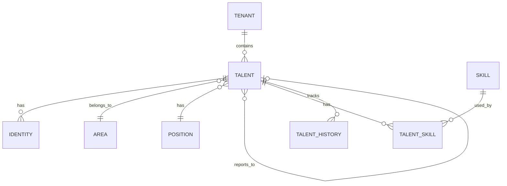
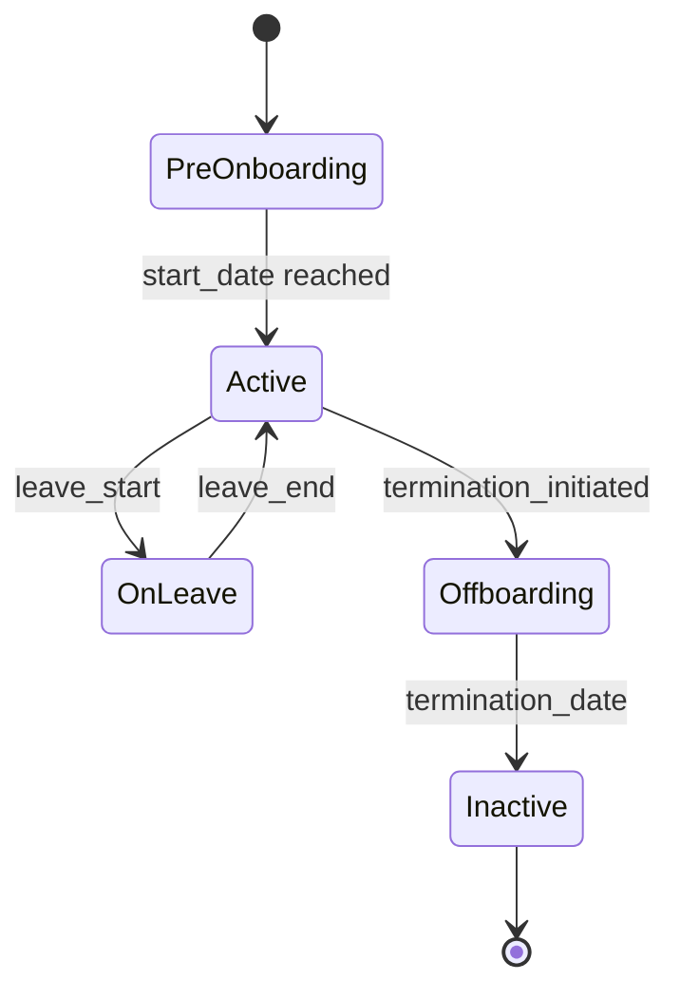

## Diagrama de Entidades

## Entidades Principais

### Talent (Talento)

Representa um colaborador na plataforma.

| Campo | Tipo | Descrição |
|-------|------|-----------|
| `id` | UUID | Identificador único |
| `tenant_id` | UUID | Tenant proprietário |
| `external_id` | string | ID do sistema externo |
| `employee_number` | string | Matrícula |
| `first_name` | string | Nome |
| `last_name` | string | Sobrenome |
| `email` | string | Email principal |
| `phone` | string | Telefone |
| `birth_date` | date | Data de nascimento |
| `hire_date` | date | Data de admissão |
| `termination_date` | date | Data de desligamento |
| `status` | enum | Status (active, inactive, on_leave) |
| `area_id` | UUID | Área atual |
| `position_id` | UUID | Cargo atual |
| `manager_id` | UUID | Gestor direto |
| `contract_type` | enum | Tipo de contrato |
| `work_location` | string | Local de trabalho |
| `avatar_url` | string | URL da foto |

### Area (Área)

Representa um departamento ou área da organização.

| Campo | Tipo | Descrição |
|-------|------|-----------|
| `id` | UUID | Identificador único |
| `tenant_id` | UUID | Tenant proprietário |
| `name` | string | Nome da área |
| `code` | string | Código da área |
| `parent_id` | UUID | Área pai (hierarquia) |
| `manager_id` | UUID | Gestor da área |
| `is_active` | boolean | Se está ativa |

### Position (Cargo)

Representa um cargo ou função.

| Campo | Tipo | Descrição |
|-------|------|-----------|
| `id` | UUID | Identificador único |
| `tenant_id` | UUID | Tenant proprietário |
| `name` | string | Nome do cargo |
| `code` | string | Código do cargo |
| `level` | enum | Nível (junior, mid, senior, lead, manager) |
| `career_track` | enum | Trilha (individual, management) |
| `is_active` | boolean | Se está ativo |

### Skill (Competência)

Representa uma competência ou habilidade.

| Campo | Tipo | Descrição |
|-------|------|-----------|
| `id` | UUID | Identificador único |
| `tenant_id` | UUID | Tenant proprietário |
| `name` | string | Nome da competência |
| `category` | enum | Categoria (technical, behavioral, language) |
| `description` | text | Descrição |

### Talent Skill (Competência do Talento)

Associação entre talento e competência.

| Campo | Tipo | Descrição |
|-------|------|-----------|
| `talent_id` | UUID | Talento |
| `skill_id` | UUID | Competência |
| `level` | enum | Nível (basic, intermediate, advanced, expert) |
| `certified_at` | date | Data de certificação |
| `source` | enum | Fonte (self, manager, assessment) |

### Talent History (Histórico)

Registra mudanças no perfil do talento.

| Campo | Tipo | Descrição |
|-------|------|-----------|
| `id` | UUID | Identificador único |
| `talent_id` | UUID | Talento |
| `event_type` | enum | Tipo de evento |
| `old_value` | json | Valor anterior |
| `new_value` | json | Novo valor |
| `changed_at` | datetime | Data da mudança |
| `changed_by` | UUID | Quem alterou |

## Status do Talento

| Status | Descrição |
|--------|-----------|
| `pre_onboarding` | Contratado, aguardando início |
| `active` | Ativo na organização |
| `on_leave` | Afastado (licença, férias) |
| `offboarding` | Em processo de desligamento |
| `inactive` | Desligado |
