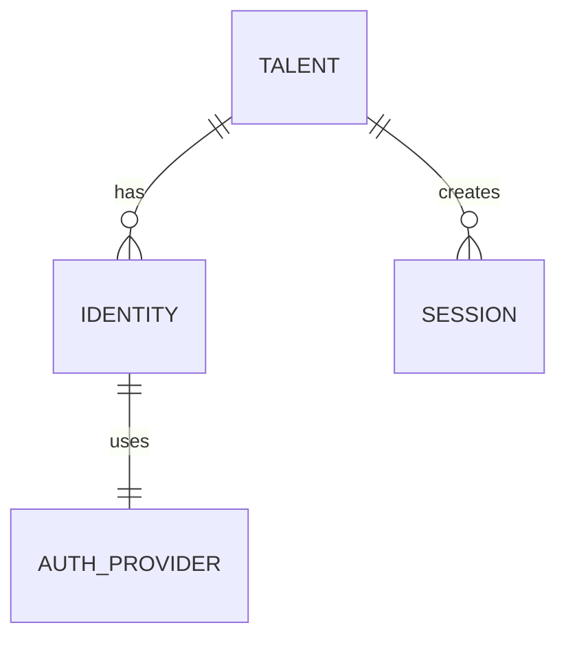
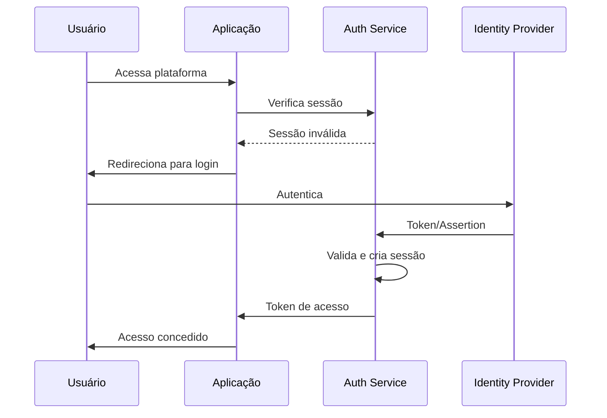

## Identificadores

Cada talento possui múltiplos identificadores para diferentes propósitos:

| Identificador | Formato | Uso |
|---------------|---------|-----|
| `id` | UUID | Identificador interno único |
| `external_id` | String | ID do sistema de origem (HRIS) |
| `email` | Email | Identificador de login |
| `employee_number` | String | Matrícula do colaborador |

## Modelo de Identidade



### Talent (Talento)

Entidade principal que representa o colaborador.

### Identity (Identidade)

Credenciais de acesso vinculadas ao talento.

| Campo | Descrição |
|-------|-----------|
| `provider` | Provedor de autenticação (email, SSO) |
| `provider_id` | ID no provedor |
| `email` | Email de login |
| `is_primary` | Se é a identidade principal |

### Auth Provider

Provedores de autenticação suportados:

- **Email/Password**: Autenticação nativa
- **Google SSO**: Login com conta Google
- **Microsoft SSO**: Login com conta Microsoft/Azure AD
- **SAML**: SSO corporativo via SAML 2.0

## Fluxo de Autenticação



## Vinculação de Identidades

Um talento pode ter múltiplas identidades vinculadas:

```json
{
  "talent_id": "uuid",
  "identities": [
    {
      "provider": "email",
      "email": "joao@empresa.com",
      "is_primary": true
    },
    {
      "provider": "google",
      "email": "joao@empresa.com",
      "is_primary": false
    }
  ]
}
```

## Regras de Identidade

### RN-IDT-001: Email Único

O email deve ser único por tenant. Não é permitido cadastrar dois talentos com o mesmo email.

### RN-IDT-002: Identidade Primária

Todo talento deve ter exatamente uma identidade primária.

### RN-IDT-003: Desvinculação

Não é permitido desvincular a última identidade de um talento ativo.

## Single Sign-On (SSO)

### Configuração

O SSO é configurado a nível de tenant:

1. Admin acessa configurações de autenticação
2. Seleciona provedor (Google, Microsoft, SAML)
3. Configura credenciais/metadados
4. Define políticas (obrigatório, opcional)

### Provisionamento Automático

Com SSO configurado, é possível habilitar provisionamento automático:

- **Just-in-Time (JIT)**: Cria talento no primeiro login
- **SCIM**: Sincronização via protocolo SCIM 2.0

<Note>
  O provisionamento automático requer mapeamento de atributos entre o IdP e a plataforma.
</Note>
