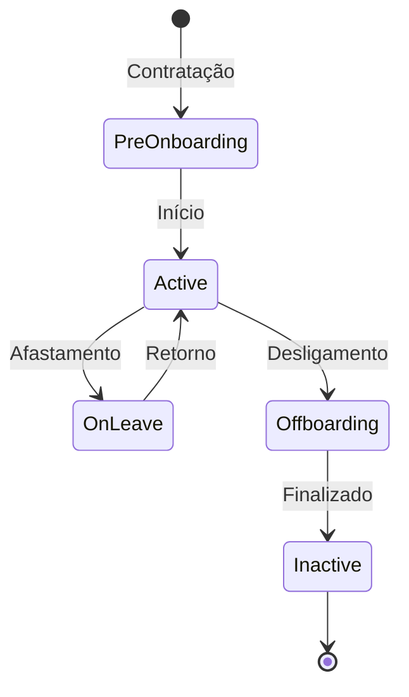

## Visão Geral

O módulo de Talentos é a base de dados central de colaboradores na plataforma Leapy. Ele gerencia informações pessoais, profissionais e organizacionais de todos os talentos.

## Funcionalidades Principais

<CardGroup cols={2}>
  <Card title="Cadastro de Talentos" icon="user-plus">
    Gestão completa do ciclo de vida do colaborador.
  </Card>
  <Card title="Perfil Profissional" icon="id-card">
    Informações de carreira, competências e experiências.
  </Card>
  <Card title="Hierarquia Organizacional" icon="sitemap">
    Estrutura de áreas, equipes e reporte.
  </Card>
  <Card title="Integrações" icon="plug">
    Sincronização com sistemas de RH externos.
  </Card>
</CardGroup>

## Informações Gerenciadas

### Dados Pessoais

- Nome completo
- Email e telefone
- Data de nascimento
- Endereço

### Dados Profissionais

- Cargo e função
- Área e equipe
- Data de admissão
- Tipo de contrato
- Gestor direto

### Competências

- Skills técnicas
- Competências comportamentais
- Certificações
- Idiomas

### Histórico

- Movimentações de cargo
- Avaliações de desempenho
- Treinamentos realizados
- Participação em projetos

## Ciclo de Vida do Talento

## Próximos Passos

<Cards>
  <Card title="Modelo de Identidade" href="/documentation/domains/talents/identity-model">
    Entenda como talentos são identificados
  </Card>
  <Card title="Modelo de Dados" href="/documentation/domains/talents/data-model">
    Explore a estrutura de dados
  </Card>
  <Card title="Operações" href="/documentation/domains/talents/operations">
    Guia operacional do módulo
  </Card>
</Cards>
