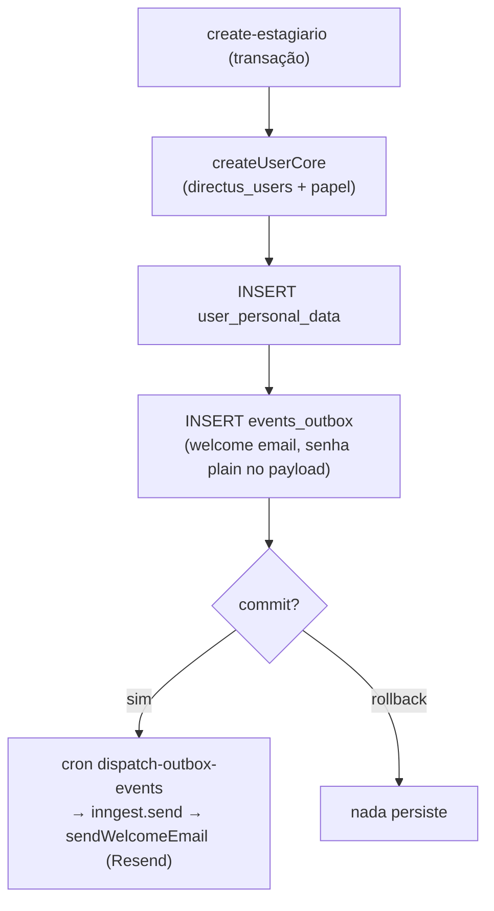

## Visão Geral

Esta página cobre o **onboarding e a importação de talentos** (estagiários e lideranças) no
monorepo `leapy/packages/core` (use-cases `talentos/*`). O ponto central é que a criação de um
talento e o agendamento do seu welcome email acontecem na **mesma transação**, via
[Events Outbox](/documentation/platform/events-outbox).

## Criação transacional de um estagiário

`create-estagiario` cria o usuário, os dados pessoais e **enfileira o welcome email no
`events_outbox`** — tudo numa única transação. Se qualquer passo falhar, **nada persiste**
(inclusive o welcome email).

<Warning>
O welcome email é entregue pelo **dispatcher do outbox** — que hoje é um **stub** (ver
[Events Outbox](/documentation/platform/events-outbox)). A escrita no outbox já funciona, mas
o envio efetivo via Resend depende do dispatcher real ser implementado.
</Warning>

## Use cases

Em `leapy/packages/core/src/use-cases/talentos/`:

| Use case | Propósito |
|---|---|
| `create-user-core` | Cria o `directus_users` + papel (base reutilizável) |
| `create-estagiario` | Onboarding transacional: user + dados pessoais + welcome no outbox |
| `bulk-import-estagiarios` | Importação em lote de estagiários |
| `bulk-upsert-leaders` | Importação/atualização em lote de lideranças |
| `check-estagiarios-emails` | Pré-checagem de e-mails (duplicatas) antes do import |
| `resend-welcome-email` | Reenvia o welcome (novo evento no outbox) |
| `handle-resend-webhook` | Processa webhook do Resend (status de entrega) |
| `list-talentos` | Listagem |

## Referências de código

| Repo | Arquivo | Propósito |
|---|---|---|
| `leapy` | `packages/core/src/use-cases/talentos/*` | Onboarding, import e webhooks |
| `leapy` | `packages/core/src/repositories/events-outbox.repo.ts` | Enfileiramento do welcome email |

## Veja também

<CardGroup cols={2}>
  <Card title="Events Outbox" icon="inbox" href="/documentation/platform/events-outbox">
    O padrão transactional outbox que entrega o welcome email
  </Card>
  <Card title="Talentos" icon="user-group" href="/documentation/domains/talents/index">
    Visão geral do domínio de talentos
  </Card>
  <Card title="Dados Pessoais e PII" icon="shield-halved" href="/documentation/platform/pii-lgpd">
    Por que a senha no payload do welcome é PII redigida em logs
  </Card>
</CardGroup>
