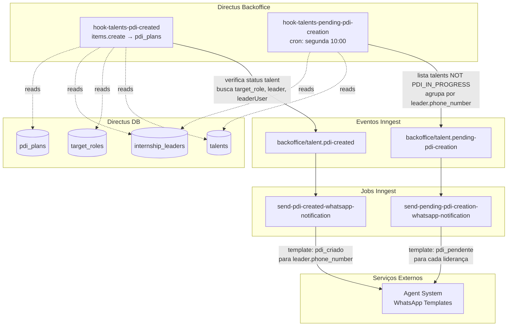

## Contexto de Produto

O PDI (Plano de Desenvolvimento Individual) é o artefato central do módulo de Talentos: define o cargo-alvo, as competências a desenvolver e as ações práticas do talento. Quando um PDI é criado, a liderança é imediatamente notificada via WhatsApp. Toda segunda-feira, lideranças com talentos sem PDI em andamento recebem um lembrete automático.

## Escopo Funcional

<CardGroup cols={2}>
  <Card title="Notificação de Criação" icon="bell">
    Ao criar um PDI para um talento elegível, a liderança recebe WhatsApp com cargo-alvo e competências definidas.
  </Card>
  <Card title="Lembrete Semanal" icon="calendar">
    Toda segunda-feira às 10:00, lideranças com talentos que ainda não têm PDI em andamento recebem lista via WhatsApp.
  </Card>
  <Card title="Status de Elegibilidade" icon="check-circle">
    Apenas talentos com status `PENDING_PDI_PLAN` ou `PDI_PENDING_CONFIRMATION` disparam notificação na criação do PDI.
  </Card>
  <Card title="Agrupamento por Liderança" icon="user-group">
    O lembrete semanal agrupa os talentos por liderança e envia uma mensagem por lote de até 5 talentos.
  </Card>
</CardGroup>

## Arquitetura Técnica



## Fluxos e Regras de Negócio

### Fluxo 1 — Criação de PDI com Notificação

1. Um PDI é criado na coleção `pdi_plans` com campo `talent_id` preenchido.
2. `hook-talents-pdi-created` detecta (`items.create`, collection = `pdi_plans`).
3. Hook verifica elegibilidade:
   - Busca o talento por `talent_id`.
   - Status deve ser `PENDING_PDI_PLAN` **ou** `PDI_PENDING_CONFIRMATION`.
   - Talento não pode estar marcado como deletado (`date_deleted IS NULL`).
4. Hook enriquece o evento com dados completos:
   - `target_role`: cargo-alvo do talento.
   - `leader`: liderança vinculada ao talento (`leader_id`).
   - `leaderUser`: usuário Directus da liderança.
   - `talent.phone_number`, `talent.start_date`, `talent.end_date`.
5. Envia `backoffice/talent.pdi-created` com payload completo.
6. Job `send-pdi-created-whatsapp-notification` envia template WhatsApp `pdi_criado` para `leader.phone_number`:
   - `{{1}}`: Nome da liderança
   - `{{2}}`: Nome do talento
   - `{{3}}`: Cargo-alvo
   - `{{4}}`: Competências em desenvolvimento (lista separada por vírgulas)

**Atenção:** Se `talent.phone_number` não existe, o job lança `NonRetriableError` — não há retry. Igualmente se `leader` não existir.

### Fluxo 2 — Lembrete Semanal de PDIs Pendentes

**Hook:** `hook-talents-pending-pdi-creation`
**Schedule:** `0 10 * * 1` — toda segunda-feira às 10:00

1. Hook lista todos os talentos com:
   - `current_status != PDI_IN_PROGRESS`
   - `leader_id IS NOT NULL`
2. Agrupa talentos por `leader.phone_number`.
3. Para cada liderança, envia `backoffice/talent.pending-pdi-creation` com:
   - `leader_phone_number`
   - `talents`: array com nome e status de cada talento
4. Job `send-pending-pdi-creation-whatsapp-notification` divide os talentos em lotes de até 5 e envia uma mensagem por lote via WhatsApp.

## Status de Talentos (PDI)

| Status | Descrição |
|--------|-----------|
| `PENDING_PDI_PLAN` | PDI ainda não criado — dispara notificação na criação |
| `PDI_PENDING_CONFIRMATION` | PDI criado, aguardando confirmação — também dispara |
| `PDI_IN_PROGRESS` | PDI em andamento — **não aparece** no lembrete semanal |

## Contratos de Eventos

### `backoffice/talent.pdi-created`

```typescript
{
  talent: {
    id: string,
    phone_number: string | null,
    start_date: string | null,
    end_date: string | null,
    user: { full_name: string }
  },
  target_role: { name: string } | null,
  leader: {
    phone_number: string,
    user: { full_name: string }
  } | null,
  pdi: {
    skills: string[]
  }
}
```

### `backoffice/talent.pending-pdi-creation`

```typescript
{
  leader_phone_number: string,
  talents: Array<{
    talent_name: string,
    talent_status: string   // exibido via STATUS_AGENTE_ESTAGIO mapeamento
  }>
}
```

## Template WhatsApp

**Template `pdi_criado`** (enviado à liderança):

| Parâmetro | Valor |
|-----------|-------|
| `{{1}}` | Nome da liderança |
| `{{2}}` | Nome do talento |
| `{{3}}` | Cargo-alvo |
| `{{4}}` | Competências (lista) |

**Número de origem:** `551152951564` (WhatsApp da Leapy)

## Observabilidade e Operação

```sql
-- Talentos elegíveis para PDI sem PDI criado
SELECT t.id, t.current_status, il.phone_number as leader_phone
FROM talents t
LEFT JOIN internship_leaders il ON il.id = t.leader_id
WHERE t.current_status IN ('PENDING_PDI_PLAN', 'PDI_PENDING_CONFIRMATION')
  AND t.date_deleted IS NULL
  AND t.leader_id IS NOT NULL;

-- PDIs recém criados (últimas 24h)
SELECT pp.id, pp.talent_id, pp.created_at
FROM pdi_plans pp
WHERE pp.created_at > NOW() - INTERVAL '24 hours'
ORDER BY pp.created_at DESC;
```

**Reprocessar notificação manualmente:**
```bash
# Via Inngest dashboard — enviar evento com dados completos do talent/leader
{
  "name": "backoffice/talent.pdi-created",
  "data": {
    "talent": { "id": "uuid", "phone_number": "+55...", "user": { "full_name": "..." } },
    "leader": { "phone_number": "+55...", "user": { "full_name": "..." } },
    "target_role": { "name": "..." },
    "pdi": { "skills": ["..."] }
  }
}
```

## Riscos e Limites

| Risco | Impacto | Mitigação |
|-------|---------|-----------|
| Talento sem `phone_number` | NotifiableError — sem retry | Verificar dados do talento antes de criar PDI |
| Liderança sem `phone_number` | Notificação não enviada | Verificar dados da liderança no cadastro |
| Agent system indisponível | WhatsApp não enviado | Inngest vai fazer retry automático (job retriable) |
| Talento com status incorreto | Hook não dispara notificação | Status deve ser `PENDING_PDI_PLAN` ou `PDI_PENDING_CONFIRMATION` |
| Hook desabilitado | Sem notificações | Verificar `HOOK_TALENTS_PDI_CREATED` e `HOOK_TALENTS_PENDING_PDI_CREATION` |

## Referências de Código (Multirepo)

| Arquivo | Repositório | Descrição |
|---------|-------------|-----------|
| `extensions/hooks/src/hook-talents-pdi-created/index.js` | `directus-backoffice-with-extensions` | Hook de criação de PDI |
| `extensions/hooks/src/hook-talents-pending-pdi-creation/index.js` | `directus-backoffice-with-extensions` | Hook de lembrete semanal |
| `src/inngest/functions/mvp-estagio/talents/pdi-created.ts` | `backoffice-inngest-functions` | Job: notificação WhatsApp criação |
| `src/inngest/functions/mvp-estagio/talents/pending-pdi-creation.ts` | `backoffice-inngest-functions` | Job: notificação WhatsApp lembrete |
| `src/app/api/backoffice/plans/route.ts` | `leapy-rh` | API route: gestão de planos |

## Veja Também

<CardGroup cols={2}>
  <Card title="Talentos — Visão Geral" icon="user-tie" href="/documentation/domains/talents/index">
    Entidade talents, ciclo de vida e módulo de desenvolvimento de talentos
  </Card>
  <Card title="Régua de Comunicação" icon="message" href="/documentation/platform/communications-fup">
    Sistema de comunicação automatizada que também usa WhatsApp via agent-system
  </Card>
  <Card title="Modelo de Dados — Talentos" icon="database" href="/documentation/domains/talents/data-model">
    Estrutura das tabelas talents, target_roles e internship_leaders
  </Card>
</CardGroup>
