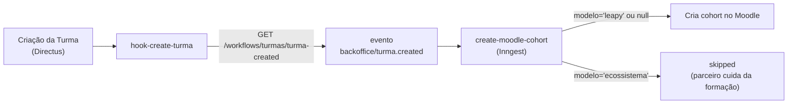

## Visão Geral

Uma **Turma** agrupa aprendizes em uma formação com janela de início/término, modelo,
modalidade e vínculo com um cohort do Moodle. O CRUD vive no monorepo
`leapy/packages/core` (use cases `backoffice/*-turma`) sobre a tabela legada `"Turmas"`
do Directus, e a criação dispara a integração com o Moodle de forma assíncrona.

<Info>
A tabela `"Turmas"` é **legada do Directus** — nomes de colunas são case-sensitive e
preservados como em produção. O monorepo adiciona apenas o soft-delete (`deleted_at`) e
opera por cima via repositório.
</Info>

## Modelo de dados

Tabela `"Turmas"` (`leapy/packages/db/src/schema/turmas.ts`). Campos principais:

| Coluna | Tipo | Descrição |
|---|---|---|
| `id` | `serial` | PK |
| `Name` | `text` | Nome da turma |
| `data_de_inicio` / `data_de_termino` | `timestamp` | Janela da formação |
| `Status_new` | `varchar(255)` | Status |
| `cohort_id` | `text` | Texto livre (ex: `Turma_35`, `ecossistema`) — **sem FK** para `cohorts_entrada` |
| `program_lead` | `uuid` | FK → `directus_users.id` (`ON DELETE SET NULL`) |
| `mes_de_inicio` / `ano_de_inicio` | `integer` | Derivados de `data_de_inicio` (ver `deriveMesAno`) |
| `modelo` | `varchar(255)` | `leapy` ou `ecossistema` (check constraint) |
| `modalidade` | `varchar` | `ead`, `hibrido` ou `presencial` (check constraint) |
| `nps` / `c_sat` | `numeric(10,5)` | Métricas agregadas |
| `moodle_cohort_status` / `moodle_cohort_error` / `moodle_cohort_attempted_at` | — | Estado da integração Moodle (gerenciado pela integração, não editável pelo monorepo) |
| `deleted_at` | `timestamptz` | Soft-delete |

**Constraints:**
- `turmas_modelo_check`: `modelo IN ('leapy', 'ecossistema')` ou `NULL`.
- `turmas_modalidade_check`: `modalidade IN ('ead', 'hibrido', 'presencial')` ou `NULL`.
- `program_lead` → `directus_users.id` com `ON DELETE SET NULL`.
- Unicidade de nome é **parcial** (`WHERE deleted_at IS NULL`, migração 0005) — permite
  reusar o nome de uma turma arquivada.

## Regras de negócio na criação

`createTurma` (`use-cases/backoffice/create-turma.ts`) aplica:

<Steps>
  <Step title="Validação de campos">
    `validateTurmaFields` (de `backoffice.rules.ts`) valida `name` (trim) e as datas.
    Falha vira `ValidationError`.
  </Step>
  <Step title="Checagem de conflito por nome">
    `repos.turmas.findByName(name)` — se já existe turma ativa com o nome, lança
    `ConflictError`. É uma checagem antecipada de UX (não atômica); o repositório também
    captura o `23505` do Postgres e relança como `ConflictError`.
  </Step>
  <Step title="Derivação de mês/ano">
    `deriveMesAno(dataDeInicio)` preenche `mes_de_inicio` e `ano_de_inicio` a partir da
    data de início.
  </Step>
</Steps>

Use cases relacionados: `update-turma`, `delete-turma` (soft-delete), `list-turmas`,
`list-turma-form-options`.

## Integração com o Moodle

Quando uma turma é criada no Directus, o hook `hook-create-turma` dispara o evento
Inngest `backoffice/turma.created`, consumido por `create-moodle-cohort`:

Comportamento por modelo:
- **`leapy` ou `null`** (legado): o job cria o cohort correspondente no Moodle.
- **`ecossistema`**: o job marca como `skipped` — a formação é responsabilidade do parceiro.

<Warning>
Falhas no disparo do evento **não** bloqueiam a criação da turma — o hook apenas registra
log. O cohort pode ser criado depois via retry do wizard ou manualmente pela UI do Inngest.
Isso substitui o Flow Directus legado "1.[Moodle] Cria Cohort" + a Lambda AWS
`createMoodleCohort`.
</Warning>

## Referências de código (multirepo)

| Repo | Arquivo | Propósito |
|---|---|---|
| `leapy` | `packages/db/src/schema/turmas.ts` | Schema da tabela `"Turmas"` |
| `leapy` | `packages/core/src/use-cases/backoffice/create-turma.ts` | Criação + validação + conflito |
| `leapy` | `packages/core/src/domain/backoffice.rules.ts` | `validateTurmaFields`, `deriveMesAno` |
| `directus-backoffice-with-extensions` | `extensions/hooks/src/hook-create-turma/index.js` | Dispara `turma.created` |
| `backoffice-inngest-functions` | `src/inngest/functions/moodle/create-moodle-cohort.ts` | Cria o cohort no Moodle |

## Veja também

<CardGroup cols={2}>
  <Card title="Integração Moodle" icon="plug" href="/documentation/domains/courses-content/moodle-integration">
    Como cohorts e matrículas são criados e sincronizados com o Moodle
  </Card>
  <Card title="Jobs e Eventos Inngest" icon="gear" href="/documentation/platform/events-jobs-inngest">
    Arquitetura de eventos assíncronos que disparam os jobs de Moodle
  </Card>
  <Card title="Cronogramas" icon="calendar" href="/documentation/domains/cronogramas/index">
    Cronogramas vinculados às turmas e suas datas
  </Card>
</CardGroup>
