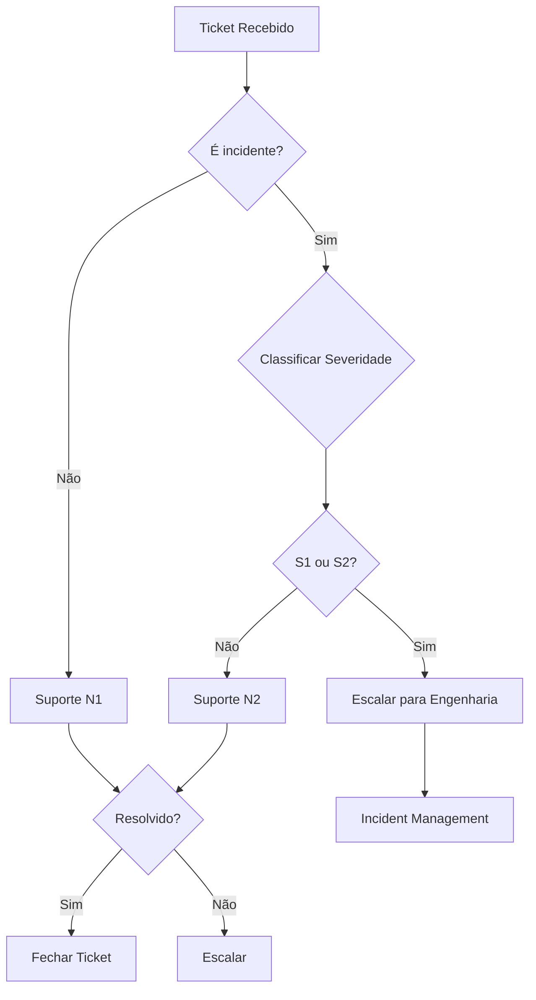

## Visão Geral

Este documento descreve os processos de suporte e triagem de incidentes na plataforma Leapy.

## Canais de Suporte

| Canal | SLA | Uso |
|-------|-----|-----|
| **Chat (Intercom)** | 2h | Dúvidas gerais, problemas menores |
| **Email** | 24h | Solicitações formais |
| **Slack (clientes enterprise)** | 4h | Suporte prioritário |
| **Emergência** | 30min | Incidentes críticos |

## Níveis de Severidade

### S1 - Crítico

**Definição**: Sistema completamente indisponível ou dados corrompidos

**Exemplos**:
- Plataforma fora do ar
- Perda de dados
- Brecha de segurança

**SLA**: 30 minutos para início de tratamento

### S2 - Alto

**Definição**: Funcionalidade principal impactada, sem workaround

**Exemplos**:
- Pulsos não podem ser criados
- Login não funciona para grupo de usuários
- Relatórios incorretos

**SLA**: 2 horas para início de tratamento

### S3 - Médio

**Definição**: Funcionalidade impactada com workaround disponível

**Exemplos**:
- Exportação lenta
- Notificações atrasadas
- Erro intermitente

**SLA**: 24 horas para início de tratamento

### S4 - Baixo

**Definição**: Problema menor ou solicitação de melhoria

**Exemplos**:
- Typo na interface
- Sugestão de funcionalidade
- Dúvida sobre uso

**SLA**: 72 horas para início de tratamento

## Fluxo de Triagem



## Checklist de Triagem

### Informações a Coletar

- [ ] Tenant ID
- [ ] Usuário afetado
- [ ] Descrição do problema
- [ ] Passos para reproduzir
- [ ] Screenshots/vídeos
- [ ] Horário de ocorrência
- [ ] Impacto (quantos usuários?)
- [ ] Já tentou alguma solução?

### Verificações Iniciais

- [ ] Verificar status page
- [ ] Consultar incidentes recentes
- [ ] Verificar logs do tenant
- [ ] Verificar se é problema conhecido

## Níveis de Suporte

### N1 - Primeiro Nível

**Responsabilidade**: Suporte inicial, dúvidas gerais

**Pode fazer**:
- Orientar uso da plataforma
- Verificar configurações básicas
- Criar tickets internos
- Escalar para N2

### N2 - Segundo Nível

**Responsabilidade**: Problemas técnicos, investigação

**Pode fazer**:
- Acessar Backoffice (leitura)
- Verificar logs
- Aplicar workarounds conhecidos
- Escalar para Engenharia

### N3 - Engenharia

**Responsabilidade**: Correções técnicas, incidentes

**Pode fazer**:
- Acessar todos os sistemas
- Aplicar fixes
- Fazer rollback
- Comunicar status

## Comunicação com Cliente

### Templates

**Recebimento de Ticket:**
```
Olá [Nome],

Recebemos sua solicitação e já estamos analisando.

Número do ticket: #[TICKET_ID]
Severidade: [SEVERIDADE]
SLA: [SLA]

Manteremos você atualizado sobre o andamento.
```

**Atualização:**
```
Olá [Nome],

Atualização sobre o ticket #[TICKET_ID]:

[STATUS ATUAL]
[PRÓXIMOS PASSOS]

Previsão: [PREVISÃO]
```

**Resolução:**
```
Olá [Nome],

O ticket #[TICKET_ID] foi resolvido.

[DESCRIÇÃO DA SOLUÇÃO]

Caso tenha outras dúvidas, estamos à disposição.
```

## Métricas de Suporte

| Métrica | Meta |
|---------|------|
| First Response Time | < 2h (S1/S2), < 24h (S3/S4) |
| Resolution Time | < 4h (S1), < 8h (S2) |
| CSAT | > 90% |
| First Contact Resolution | > 60% |
