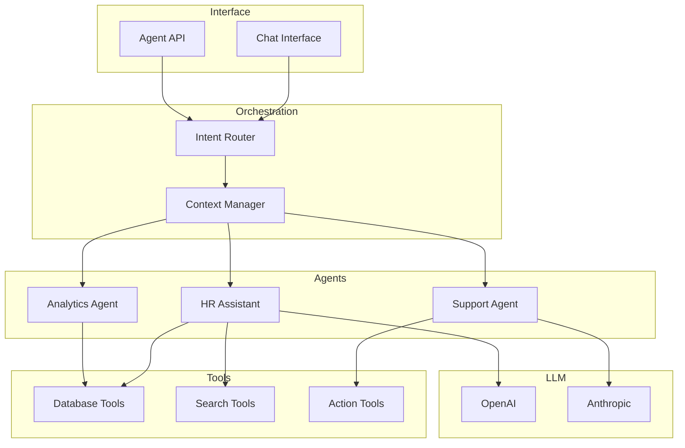

## Visão Geral

O Agent System é a camada de inteligência artificial da Leapy, fornecendo assistentes e automações inteligentes para os usuários.

## Arquitetura



## Agentes Disponíveis

### HR Assistant

Assistente para equipes de RH:

- Responde dúvidas sobre colaboradores
- Ajuda a criar pulsos
- Gera insights de dados
- Auxilia em processos

**Exemplo de interação:**

```
Usuário: Quantos talentos temos na área de Tecnologia?

Assistente: Na área de Tecnologia temos 45 talentos ativos.
Desses, 30 são desenvolvedores, 10 são analistas de dados e 
5 são gestores. Quer que eu detalhe por nível de senioridade?
```

### Support Agent

Agente de suporte para resolução de problemas:

- Diagnóstico de issues
- Sugestão de soluções
- Execução de ações corretivas
- Escalação quando necessário

### Analytics Agent

Agente especializado em análise de dados:

- Responde perguntas sobre métricas
- Gera relatórios sob demanda
- Identifica tendências
- Sugere ações baseadas em dados

## Ferramentas (Tools)

Agentes têm acesso a ferramentas para executar ações:

### Database Tools

```typescript
const tools = {
  query_talents: {
    description: "Busca talentos com filtros",
    parameters: { filters: "object" },
    execute: async (params) => {
      return await db.query.talents.findMany(params.filters);
    }
  },
  get_pulse_results: {
    description: "Obtém resultados de um pulso",
    parameters: { pulse_id: "string" },
    execute: async (params) => {
      return await getPulseResults(params.pulse_id);
    }
  }
};
```

### Action Tools

```typescript
const actionTools = {
  send_reminder: {
    description: "Envia lembrete para talento",
    parameters: { talent_id: "string", message: "string" },
    execute: async (params) => {
      return await sendReminder(params.talent_id, params.message);
    }
  }
};
```

## Segurança

### Controle de Acesso

Agentes respeitam as permissões do usuário:

```typescript
// Contexto inclui permissões do usuário
const context = {
  user_id: currentUser.id,
  tenant_id: currentTenant.id,
  permissions: currentUser.permissions,
  scope: currentUser.scope
};
```

### Audit Trail

Todas as ações de agentes são logadas:

```json
{
  "timestamp": "2024-01-15T10:00:00Z",
  "agent": "hr_assistant",
  "user_id": "uuid",
  "action": "query_talents",
  "parameters": { "area_id": "uuid" },
  "result_count": 45
}
```

### Rate Limiting

Limites de uso por usuário e tenant:

| Limite | Valor |
|--------|-------|
| Mensagens/minuto | 10 |
| Mensagens/hora | 100 |
| Actions/hora | 50 |

## Configuração

### Por Tenant

Tenants podem configurar:

- Agentes habilitados
- Ferramentas disponíveis
- Limites de uso
- Modelo de LLM preferido

### Por Papel

Permissões de agente por papel:

| Papel | HR Assistant | Support | Analytics |
|-------|:------------:|:-------:|:---------:|
| Admin | ✅ | ✅ | ✅ |
| RH | ✅ | ✅ | ✅ |
| Liderança | ❌ | ✅ | ✅ (equipe) |
| Talento | ❌ | ✅ | ❌ |

## Monitoramento

Métricas do Agent System:

| Métrica | Descrição |
|---------|-----------|
| `agent.requests` | Total de requisições |
| `agent.latency` | Tempo de resposta |
| `agent.tokens` | Tokens consumidos |
| `agent.errors` | Taxa de erros |
