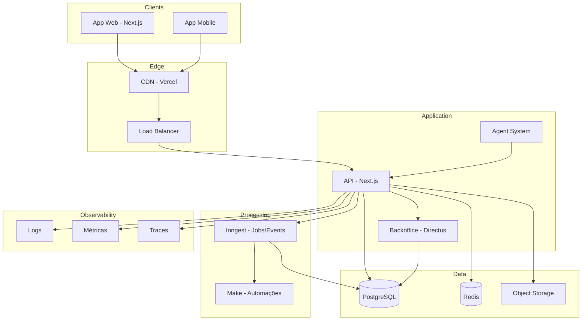

## Visão Geral

A plataforma Leapy é construída com uma arquitetura moderna, escalável e resiliente, utilizando tecnologias de ponta para garantir performance e disponibilidade.

## Diagrama de Arquitetura



## Stack Tecnológica

### Frontend

| Tecnologia | Uso |
|------------|-----|
| **Next.js 14** | Framework React para App Web |
| **React Native** | App Mobile |
| **TypeScript** | Linguagem principal |
| **TailwindCSS** | Estilização |
| **Shadcn/ui** | Componentes |

### Backend

| Tecnologia | Uso |
|------------|-----|
| **Next.js API** | API Routes e Server Actions |
| **Directus** | Backoffice e CMS |
| **PostgreSQL** | Banco de dados principal |
| **Redis** | Cache e sessões |

### Infraestrutura

| Tecnologia | Uso |
|------------|-----|
| **Vercel** | Deploy e hosting |
| **Neon** | PostgreSQL serverless |
| **Upstash** | Redis serverless |
| **Cloudflare R2** | Object storage |

### Processamento

| Tecnologia | Uso |
|------------|-----|
| **Inngest** | Jobs e eventos assíncronos |
| **Make** | Automações e integrações |

## Padrões Arquiteturais

### Multi-Tenancy

A plataforma é multi-tenant com isolamento de dados por tenant:

```typescript
// Todas as queries incluem tenant_id
const talents = await db.query.talents.findMany({
  where: eq(talents.tenant_id, currentTenant.id)
});
```

### Event-Driven

Operações assíncronas são processadas via eventos:

```typescript
// Disparo de evento
await inngest.send({
  name: "pulse.activated",
  data: { pulse_id: pulse.id }
});

// Handler do evento
inngest.createFunction(
  { id: "notify-pulse-recipients" },
  { event: "pulse.activated" },
  async ({ event }) => {
    // Processa notificações
  }
);
```

### API First

Toda funcionalidade é exposta via API:

- **REST**: Operações CRUD via Directus
- **Server Actions**: Operações Next.js
- **GraphQL**: Queries complexas (opcional)

## Ambientes

| Ambiente | URL | Uso |
|----------|-----|-----|
| Production | app.leapy.com | Produção |
| Staging | staging.leapy.com | Homologação |
| Development | dev.leapy.com | Desenvolvimento |
| Local | localhost:3000 | Local |
