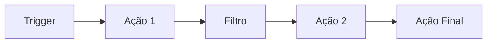
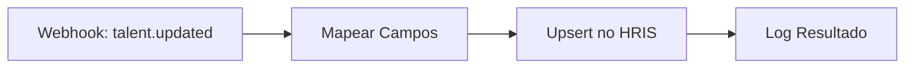
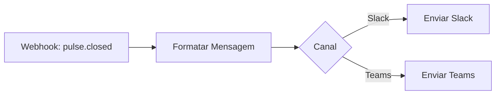
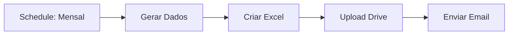
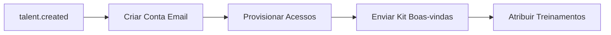

## Visão Geral

Make (anteriormente Integromat) é a plataforma de automações e integrações da Leapy, conectando a plataforma com sistemas externos e automatizando workflows complexos.

## Conceitos

### Cenários

Cenários são workflows automatizados compostos por módulos:



### Módulos

| Tipo | Descrição |
|------|-----------|
| **Trigger** | Inicia o cenário (webhook, schedule) |
| **Ação** | Executa uma operação |
| **Filtro** | Condiciona o fluxo |
| **Router** | Divide em múltiplos caminhos |
| **Aggregator** | Agrupa múltiplos itens |

## Cenários Ativos

### Sincronização HRIS

Sincroniza dados de colaboradores com sistemas externos de RH.



**Configuração:**

- Trigger: Webhook do Inngest
- Destino: API do HRIS (Gupy, etc)
- Frequência: Tempo real

### Notificações Slack/Teams

Envia notificações para canais de comunicação.



### Exportação de Relatórios

Gera e distribui relatórios automaticamente.



### Onboarding Automatizado

Workflow de onboarding de novos colaboradores.



## Integração com Inngest

### Webhook Outbound

O Inngest pode disparar webhooks para o Make:

```typescript
await step.run("trigger-make", async () => {
  await fetch(MAKE_WEBHOOK_URL, {
    method: "POST",
    body: JSON.stringify(eventData)
  });
});
```

### Webhook Inbound

Make pode disparar eventos no Inngest:

```typescript
// Endpoint que recebe webhook do Make
export async function POST(req: Request) {
  const data = await req.json();
  await inngest.send({
    name: "external.integration.completed",
    data
  });
}
```

## Gestão de Cenários

### Versionamento

Cenários são versionados e documentados:

- Backup antes de alterações
- Changelog de modificações
- Rollback quando necessário

### Monitoramento

- **Logs**: Histórico de execuções
- **Erros**: Alertas de falha
- **Operações**: Contagem de uso

### Ambientes

| Ambiente | Uso |
|----------|-----|
| Production | Cenários em produção |
| Sandbox | Testes e desenvolvimento |

## Boas Práticas

1. **Nomeação clara**: Nomes descritivos para cenários
2. **Error handling**: Sempre trate erros
3. **Logs**: Adicione logs em pontos críticos
4. **Idempotência**: Cenários devem ser seguros para reexecução
5. **Rate limits**: Respeite limites de APIs externas
6. **Documentação**: Documente cada cenário

<Warning>
  Alterações em cenários de produção devem ser testadas em sandbox primeiro.
</Warning>
