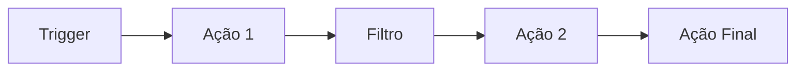

## Contexto de Produto

Make (anteriormente Integromat) é a plataforma de automação no-code da Leapy. Hoje cobre
três áreas principais:

1. **Pipeline de presenças Zoom** — coleta + reconciliação diária.
2. **Comunicações por status** — notificações automáticas quando uma vaga muda de status ou
   um jovem novo é criado.
3. **Agregação de dashboards** — atualização periódica de tabelas analíticas.

Outros caminhos (comunicações de régua, follow-up WhatsApp, alinhamento de presença) são
implementados via **Inngest functions + hooks Directus**, não Make. Ver
[Eventos e Jobs Inngest](/documentation/platform/events-jobs-inngest) e
[Régua de Comunicação e Follow-up](/documentation/platform/communications-fup).

## Conceitos

### Cenários

Cenários Make são workflows automatizados compostos por módulos encadeados:


```mermaid
flowchart LR
    A[Trigger] --> B[Ação 1]
    B --> C[Filtro]
    C --> D[Ação 2]
    D --> E[Ação Final]
```

| Tipo de Módulo | Descrição |
|---|---|
| **Trigger** | Inicia o cenário (webhook, schedule, polling) |
| **Ação** | Operação atômica (consultar API, transformar dados, enviar email) |
| **Filtro** | Conditional — passa adiante ou não |
| **Router** | Divide o fluxo em múltiplos caminhos |
| **Aggregator** | Agrupa itens de uma iteração |

### Acesso ao painel

UI: [us1.make.com/scenarios](https://us1.make.com/71159/scenarios). Cada cenário tem
histórico de execuções, blueprint editável, logs por módulo.

## Catálogo de Cenários Ativos

Listagem dos cenários ativos na conta (snapshot 29/05/2026 — confirmar no painel Make antes
de basear decisão crítica). Os IDs são canônicos e podem ser usados em consultas via API
Make (`GET /scenarios/<id>` e `GET /scenarios/<id>/executions`).

### Pipeline de Presenças Zoom

Pasta no painel: `[1.Presenças] Backoffice <> Zoom`. Detalhes completos em
[Pipeline Zoom → Backoffice](/documentation/domains/presences/pipeline-zoom-backoffice).

| ID | Nome | Trigger | O que faz |
|---|---|---|---|
| `2546826` | `Presenças Zoom` | cron 19:05 BRT | Coleta participações via Zoom API → `report_presenca_zoom_bruto` |
| `2547176` | `Presenças Retroativas 'next_page_token'` | on-demand | Continuação paginada disparada pela `Presenças Zoom` |
| `3068157` | `Consolidar Presenças` | cron 20:30 BRT | Dispara flow Directus `[Presença][Parte 1] Dados zoom bruto` |
| `4397409` | `Alinhar presenças` | cron 07:00 BRT (D+1) | Dispara evento Inngest `backoffice/alinhar-presencas.send` |

### Comunicações por Evento

| ID | Nome | Trigger | O que faz |
|---|---|---|---|
| `2043662` | `E-mail boas-vindas novos usuários` | hook `directus_users.created` | Subject `Bem-vinda(o) ao Leapy RH!` via Resend |
| `3707918` | `Vagas novas` | webhook Directus `vagas.created` | Notifica candidatos elegíveis sobre vaga recém-publicada |
| `3708160` | `Vagas status atualizadas` | webhook Directus `vagas.updated` (campo `status`) | Notifica jovem/RH/empresa conforme novo status |
| `4573490` | `Admissão - Integration Airtable, Google Sheets` | webhook | Sincronia de admissão entre planilhas externas |
| `3571191` | `Jovens faltantes` | webhook | Reage ao disparo do flow Directus `[Notif] Faltas` — uma execução por jovem com falta (~50 runs simultâneas em batch). Detalhes em [Comunicações Transacionais — Aviso de Falta](/documentation/platform/communications-transactional#aviso-de-falta--flow-manual-notif-faltas). |
| `3450372` | `Falta - Retorno justificativa de falta` | webhook | Processa retorno de justificativa pontual (poucas execuções históricas). |

Caso conhecido a investigar: o cenário `3708160` Vagas status atualizadas tem possível
buraco no roteador — cobre `4_contratacao_feita` mas pode não cobrir `2_avaliacao_empresa`
(reportes de "empresa não recebeu o e-mail de avaliação" sugerem esse gap).

### Agregação de Dashboards

| ID | Nome | Trigger | O que faz |
|---|---|---|---|
| `3780212` | `chart_presenca_por_mes_de_entrada` | schedule | Recalcula tabela analítica de presença por mês de entrada |
| `2968955` | `update_chart_presenca_por_mes_de_entrada` | schedule | Atualização incremental do mesmo |

> Estes cenários não fazem parte do pipeline operacional — apenas alimentam dashboards.

### Outros Ativos

| ID | Nome | Notas |
|---|---|---|
| `4005524` | `Teste Notificações` | Apenas teste |
| `2018053` | `Integration Webhooks` | Webhook genérico inbound |

## Integração com Inngest

Make e Inngest convivem na Leapy — Make dispara crons e gerencia integrações externas;
Inngest executa jobs assíncronos do código. Os dois se comunicam via eventos:

### Make → Inngest (mais comum)

Cenários Make como `Alinhar presenças` chamam o endpoint Inngest pra disparar um evento:

```typescript
// No blueprint Make, módulo HTTP > "Make a request":
// POST <INNGEST_INGEST_URL>
// Body:
{
  "name": "backoffice/alinhar-presencas.send",
  "data": { "ids": [101, 102, 103] }
}
```

### Inngest → Make (raro)

Inngest pode chamar webhooks Make via fetch em `step.run`, mas hoje a Leapy usa pouco essa
direção — preferencialmente os jobs Inngest fazem o trabalho localmente.

## Diagnóstico Operacional

Consultas comuns durante investigação de problemas, via UI Make ou via API:

| Pergunta | Onde checar |
|---|---|
| "Que cenários existem com nome contendo X?" | UI: filtro de busca em [us1.make.com/scenarios](https://us1.make.com/71159/scenarios). API: `GET /scenarios?teamId=<id>&name_contains=X` |
| "Esse cenário rodou em data Y?" | UI: `us1.make.com/scenarios/<id>/history`. API: `GET /scenarios/<id>/executions?from=<data>` |
| "Detalhes do erro da execução Z?" | UI: clicar na execução no history. API: `GET /scenarios/<id>/executions/<execution_id>` |

> Em investigações de campo, a **leitura** dos cenários é segura. Mutações (rodar manualmente,
> editar blueprint, ativar/desativar) afetam produção em tempo real e devem passar pelo time
> tech responsável pelo cenário, com backup do blueprint antes de qualquer alteração.

## Gestão de Cenários

### Versionamento

Cenários ativos hoje **não têm versionamento formal** — o blueprint é editável live na UI. Para
mudanças críticas: exportar blueprint via "Export Blueprint" antes de alterar, manter cópia
local, e usar "Replace Blueprint" pra rollback se necessário.

### Monitoramento

- **Histórico de execuções:** `us1.make.com/scenarios/<id>/history` — últimas 100 execuções.
- **Status do cenário:** ativo / inativo / pausado. Status `error` em ≥3 execuções
  consecutivas pausa o cenário automaticamente.
- **Operations consumption:** painel mostra operações usadas vs disponíveis no plano.

### Ambientes

A conta atual cobre apenas **produção**. Cenários com `[HMG]` ou `[POC]` no nome são restos
históricos de homologação — verificar se ativos antes de tocar.

## Boas Práticas

1. **Nomeação clara**: prefixar com domínio (`[Presença]`, `[Pulsos]`, `[Vagas]`) facilita
   filtro via `make_scenarios_list({name_contains: ...})`.
2. **Filtro inicial**: cenários com webhook devem ter filtro logo após o trigger pra ignorar
   payloads irrelevantes (reduz operations consumption).
3. **Error handling**: usar módulos `Error Handler` (resume / rollback / commit) — não deixar
   o cenário pausar silenciosamente em erro transitório.
4. **Idempotência**: cenários reexecutados não devem duplicar efeito colateral (usar
   `update` em vez de `create` quando aplicável).
5. **Documentar IDs em referência cruzada**: incluir o `scenario_id` Make em comentário no
   código Inngest correspondente, e vice-versa.

<Warning>
  Alterações em cenários ativos afetam **produção imediatamente** — não há ambiente sandbox
  isolado. Sempre exportar blueprint antes de mexer.
</Warning>

## Veja Também

<CardGroup cols={2}>
  <Card title="Pipeline Zoom → Backoffice" icon="calendar-check" href="/documentation/domains/presences/pipeline-zoom-backoffice">
    Os 4 cenários Make ativos do pipeline de presença
  </Card>
  <Card title="Comunicações Transacionais" icon="envelope" href="/documentation/platform/communications-transactional">
    Catálogo de emails por evento (vagas, boas-vindas, alinhamento)
  </Card>
  <Card title="Eventos e Jobs Inngest" icon="bolt" href="/documentation/platform/events-jobs-inngest">
    Os jobs do código que recebem eventos disparados pelos cenários Make
  </Card>
  <Card title="Observabilidade" icon="chart-line" href="/documentation/platform/observability">
    Logs, métricas e alertas dos cenários
  </Card>
</CardGroup>
