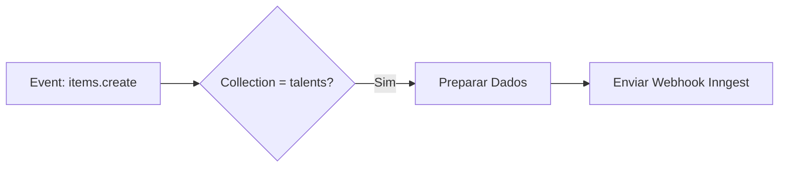

## Visão Geral

O Directus é a plataforma de backoffice da Leapy, fornecendo interface administrativa para gestão de dados, APIs automáticas e extensibilidade.

## Funcionalidades

<CardGroup cols={2}>
  <Card title="Admin UI" icon="table">
    Interface para gestão de dados
  </Card>
  <Card title="REST/GraphQL API" icon="code">
    APIs automáticas para todas as collections
  </Card>
  <Card title="Flows" icon="diagram-project">
    Automações e hooks
  </Card>
  <Card title="Permissões" icon="shield">
    Controle de acesso granular
  </Card>
</CardGroup>

## Acesso

| Ambiente | URL |
|----------|-----|
| Production | backoffice.leapy.com |
| Staging | backoffice-staging.leapy.com |
| Local | localhost:8055 |

## Collections Principais

As collections no Directus seguem a convenção de nomes do projeto (PascalCase PT-BR). Os nomes abaixo são os nomes reais usados no banco de dados e nas APIs.

### Módulo Core

| Collection | Descrição |
|------------|-----------|
| `accounts` | Organizações clientes (empresas) |
| `Jovens` | Jovens aprendizes e estagiários |
| `Liderancas` | Gestores e líderes |
| `Turmas` | Turmas de programa |
| `directus_users` | Usuários do sistema (Directus) |

### Módulo Pulsos

| Collection | Descrição |
|------------|-----------|
| `pulsos_jovens` | Pesquisas respondidas por jovens |
| `Pulsos` | Pesquisas respondidas por lideranças |
| `pulsos_rh` | Pesquisas respondidas por times de RH |
| `pulsos_settings` | Configurações de pulsos por account |
| `pulsos_schedule_settings` | Agendamento configurável por perfil |

### Módulo Cursos e Conteúdos

| Collection | Descrição |
|------------|-----------|
| `Arcos` | Arcos de aprendizagem (agrupa trilhas) |
| `Trilhas` | Trilhas de cursos |
| `Modulos` | Módulos de curso (com `moodle_id`) |
| `Matriculas` | Matrículas de jovens em módulos |

### Módulo Skills e PDI

| Collection | Descrição |
|------------|-----------|
| `skills` | Catálogo taxonômico de competências |
| `user_careers` | Carreira atual do usuário |
| `development_plans` | Planos de desenvolvimento individual (PDI) |
| `development_skills` | Skills no PDI com ações |
| `skill_development_goals` | Wishlist/metas de desenvolvimento |
| `role_skills` | Skills requeridas por cargo |

### Módulo Matchmaker

| Collection | Descrição |
|------------|-----------|
| `vagas` | Vagas e oportunidades |
| `matchmaker_search_logs` | Logs de buscas do Matchmaker |

### Módulo Operacional

| Collection | Descrição |
|------------|-----------|
| `follow_up_events` | Log de comunicações de follow-up |
| `linkedin_inference_active_jobs` | Jobs ativos de inferência de skills via LinkedIn |
| `moodle_external_links_health` | Status de links externos nos cursos Moodle |

## Usando a API

### REST API

```bash
# Listar jovens ativos
GET /items/Jovens?filter[status][_eq]=ativo

# Listar pulsos pendentes de um jovem
GET /items/pulsos_jovens?filter[jovem_id][_eq]=123&filter[status][_eq]=pendente

# Buscar matrículas de um jovem
GET /items/Matriculas?filter[Jovens_id][_eq]=123

# Atualizar matrícula
PATCH /items/Matriculas/456
{
  "certificate_status": "available",
  "certificate_url": "https://moodle.leapy.com/..."
}
```

### GraphQL

```graphql
query GetPulsosAtivos {
  pulsos_jovens(filter: { status: { _eq: "pendente" } }) {
    id
    pulso
    jovem_id {
      Name
      email_pessoal
    }
    data_vencimento
  }
}
```

## Flows

Flows são automações internas do Directus:

### Trigger Types

| Tipo | Descrição |
|------|-----------|
| **Event Hook** | Dispara em eventos CRUD |
| **Schedule** | Execução agendada |
| **Manual** | Executado manualmente |
| **Webhook** | Recebe webhooks externos |

### Exemplo: Notificar ao Criar Talento


```mermaid
flowchart LR
    A[Event: items.create] --> B{Collection = talents?}
    B -->|Sim| C[Preparar Dados]
    C --> D[Enviar Webhook Inngest]
```

### Operações Disponíveis

- **Condition**: Lógica condicional
- **Request**: Chamadas HTTP
- **Transform**: Transformar dados
- **Run Script**: Executar código
- **Send Notification**: Notificações internas

## Permissões

### Papéis Pré-definidos

| Papel | Acesso |
|-------|--------|
| `administrator` | Acesso total |
| `support` | Leitura + edições limitadas |
| `viewer` | Apenas leitura |

### Configuração de Permissões

1. Acesse **Settings > Roles & Permissions**
2. Selecione ou crie um papel
3. Configure permissões por collection:
   - Create / Read / Update / Delete
   - Campos visíveis
   - Filtros de dados

## Boas Práticas

1. **Nunca edite em produção** sem backup
2. **Use filtros** para limitar dados visíveis
3. **Documente alterações** em collections
4. **Teste flows** em staging primeiro
5. **Monitore performance** de queries
6. **Use endpoint customizado com critério**: priorize `/items` para CRUD e crie extensão de endpoint quando houver necessidade de contrato compartilhado e otimização comprovada

## Quando criar endpoint customizado no Directus

Use endpoint customizado no Directus quando:

- o contrato será consumido por múltiplos clientes/sistemas;
- a composição depende principalmente de dados e permissões do próprio Directus;
- existe necessidade real de reduzir múltiplas leituras para uma resposta otimizada;
- o time está preparado para manter extensões (versionamento, observabilidade e suporte).

Para regras de decisão completas entre Directus e BFF Next.js, veja:

<Card title="Convenções de API e DTO" href="/documentation/platform/conventions" icon="compass">
  Matriz de decisão para `/items`, BFF no Next e endpoint customizado no Directus.
</Card>

<Warning>
  Alterações no schema devem ser coordenadas com o time de desenvolvimento.
</Warning>
