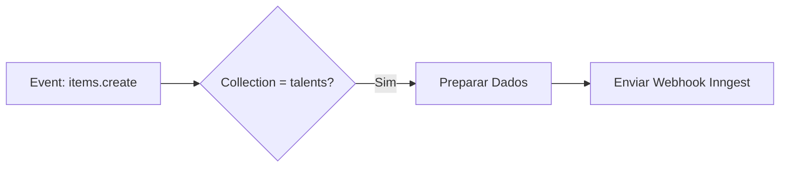

## Visão Geral

O Directus é a plataforma de backoffice da Leapy, fornecendo interface administrativa para gestão de dados, APIs automáticas e extensibilidade.

## Funcionalidades

<CardGroup cols={2}>
  <Card title="Admin UI" icon="table">
    Interface para gestão de dados
  </Card>
  <Card title="REST/GraphQL API" icon="code">
    APIs automáticas para todas as collections
  </Card>
  <Card title="Flows" icon="diagram-project">
    Automações e hooks
  </Card>
  <Card title="Permissões" icon="shield">
    Controle de acesso granular
  </Card>
</CardGroup>

## Acesso

| Ambiente | URL |
|----------|-----|
| Production | backoffice.leapy.com |
| Staging | backoffice-staging.leapy.com |
| Local | localhost:8055 |

## Collections Principais

### Módulo Core

| Collection | Descrição |
|------------|-----------|
| `tenants` | Organizações clientes |
| `talents` | Colaboradores |
| `areas` | Áreas/departamentos |
| `positions` | Cargos |

### Módulo Pulsos

| Collection | Descrição |
|------------|-----------|
| `pulses` | Pesquisas |
| `pulse_questions` | Perguntas |
| `pulse_recipients` | Destinatários |
| `responses` | Respostas |

### Módulo Matchmaker

| Collection | Descrição |
|------------|-----------|
| `opportunities` | Oportunidades |
| `applications` | Candidaturas |
| `matches` | Sugestões de match |

## Usando a API

### REST API

```bash
# Listar talentos
GET /items/talents?filter[status][_eq]=active

# Criar talento
POST /items/talents
{
  "first_name": "João",
  "email": "joao@empresa.com"
}

# Atualizar
PATCH /items/talents/uuid
{
  "area_id": "nova-area-uuid"
}
```

### GraphQL

```graphql
query GetActivePulses {
  pulses(filter: { status: { _eq: "active" } }) {
    id
    title
    recipients {
      talent {
        first_name
        email
      }
    }
  }
}
```

## Flows

Flows são automações internas do Directus:

### Trigger Types

| Tipo | Descrição |
|------|-----------|
| **Event Hook** | Dispara em eventos CRUD |
| **Schedule** | Execução agendada |
| **Manual** | Executado manualmente |
| **Webhook** | Recebe webhooks externos |

### Exemplo: Notificar ao Criar Talento


```mermaid
flowchart LR
    A[Event: items.create] --> B{Collection = talents?}
    B -->|Sim| C[Preparar Dados]
    C --> D[Enviar Webhook Inngest]
```

### Operações Disponíveis

- **Condition**: Lógica condicional
- **Request**: Chamadas HTTP
- **Transform**: Transformar dados
- **Run Script**: Executar código
- **Send Notification**: Notificações internas

## Permissões

### Papéis Pré-definidos

| Papel | Acesso |
|-------|--------|
| `administrator` | Acesso total |
| `support` | Leitura + edições limitadas |
| `viewer` | Apenas leitura |

### Configuração de Permissões

1. Acesse **Settings > Roles & Permissions**
2. Selecione ou crie um papel
3. Configure permissões por collection:
   - Create / Read / Update / Delete
   - Campos visíveis
   - Filtros de dados

## Boas Práticas

1. **Nunca edite em produção** sem backup
2. **Use filtros** para limitar dados visíveis
3. **Documente alterações** em collections
4. **Teste flows** em staging primeiro
5. **Monitore performance** de queries
6. **Use endpoint customizado com critério**: priorize `/items` para CRUD e crie extensão de endpoint quando houver necessidade de contrato compartilhado e otimização comprovada

## Quando criar endpoint customizado no Directus

Use endpoint customizado no Directus quando:

- o contrato será consumido por múltiplos clientes/sistemas;
- a composição depende principalmente de dados e permissões do próprio Directus;
- existe necessidade real de reduzir múltiplas leituras para uma resposta otimizada;
- o time está preparado para manter extensões (versionamento, observabilidade e suporte).

Para regras de decisão completas entre Directus e BFF Next.js, veja:

<Card title="Convenções de API e DTO" href="/documentation/platform/conventions" icon="compass">
  Matriz de decisão para `/items`, BFF no Next e endpoint customizado no Directus.
</Card>

<Warning>
  Alterações no schema devem ser coordenadas com o time de desenvolvimento.
</Warning>
