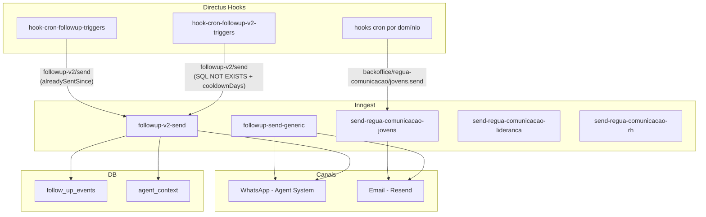

## Contexto de Produto

A Leapy mantém uma régua de comunicação ativa para engajar jovens ao longo do seu ciclo de desenvolvimento. O sistema identifica pontos de baixo engajamento (PDI pendente, inatividade, ações práticas em aberto) e dispara mensagens automatizadas via WhatsApp ou email para retomar o progresso.

## Escopo Funcional

<CardGroup cols={2}>
  <Card title="Follow-up v1" icon="envelope">
    Envio genérico por email ou WhatsApp. Suporta templates nomeados e mensagem livre.
  </Card>
  <Card title="Follow-up v2" icon="whatsapp">
    Exclusivo WhatsApp com templates Meta estruturados (header, body, button). Registra contexto do agente.
  </Card>
  <Card title="Régua de Jovens" icon="calendar">
    Emails automáticos por evento: lembrete de primeiro acesso, vencimento de atividade, etc.
  </Card>
  <Card title="Régua de Lideranças" icon="user-tie">
    Comunicações específicas para gestores sobre avaliações e relatórios.
  </Card>
  <Card title="Régua de RH" icon="building">
    Resumos periódicos e alertas para o time de RH das empresas clientes.
  </Card>
  <Card title="Triggers Automáticos" icon="gear">
    Hooks cron no Directus avaliam condições e disparam eventos Inngest conforme régua.
  </Card>
</CardGroup>

## Arquitetura Técnica



## Follow-up v1 (`followup/send`)

### Evento Inngest

```typescript
// Evento
{
  name: "followup/send",
  data: {
    user_id: "uuid",
    followup_type: "PENDING_PDI_PLAN",   // ver tipos abaixo
    method: "whatsapp" | "email",
    phone_number: "+5511999999999",
    message: "Texto livre",              // para email
    template: {
      name: "pdi_pending",
      language_code: "pt_BR",
      parameters: ["João"]
    }
  }
}
```

### Tipos de Follow-up (v1)

| Tipo | Quando usar |
|------|------------|
| `PENDING_FIRST_ACCESS` | Jovem ainda não fez o primeiro acesso |
| `PENDING_TARGET_JOB` | Cargo alvo não definido no perfil |
| `PENDING_CURRENT_SKILLS` | Skills atuais não mapeadas |
| `PENDING_PDI_PLAN` | PDI não iniciado |
| `PDI_IN_PROGRESS` | PDI em andamento, lembrete de ação prática |
| `ENGAGEMENT_INACTIVE_3DAYS` | Sem atividade há 3 dias |
| `ENGAGEMENT_PRACTICAL_ACTIONS` | Ação prática acordada pendente |
| `TALENT_PROGRESS_SUMMARY` | Resumo de progresso do talento |

### Passos internos

1. Validar campos obrigatórios (`user_id`, `followup_type`, `method`).
2. Rotear para canal: WhatsApp via Agent System ou Email via Resend.
3. Registrar evento em `follow_up_events` (`insertFollowupEvent`).
4. Atualizar contexto do agente (`updateAgentContext`).

## Follow-up v2 (`followup-v2/send`)

Versão simplificada e mais estruturada, **exclusivamente WhatsApp** com templates Meta (estrutura explícita de componentes).

### Evento Inngest

```typescript
{
  name: "followup-v2/send",
  data: {
    user_id: "uuid",
    followup_type: "pdi_pending",        // ver tipos abaixo
    phone_number: "+5511999999999",
    template_name: "pdi_pending_confirmation",
    language_code: "pt_BR",
    components: [
      {
        type: "body",
        parameters: [{ type: "text", text: "João" }]
      }
    ]
  }
}
```

### Tipos de Follow-up (v2)

| Tipo | Quando |
|------|--------|
| `primeiro_acesso_pendente` | Jovem nunca acessou a plataforma |
| `warmup_pending` | Aquecimento inicial não concluído |
| `target_role_pending` | Cargo alvo não definido |
| `skills_mapping_pending` | Mapeamento de skills pendente |
| `pdi_pending` | PDI não iniciado |
| `pdi_in_progress_day3` | PDI iniciado há 3 dias sem ação prática |
| `engagement_practical_actions` | Ação prática acordada em aberto |
| `engagement_peer_exchange` | Troca com par não realizada |
| `engagement_no_active_action` | Nenhuma ação ativa no PDI |
| `engagement_inactive_3days` | Inatividade de 3 dias |
| `engagement_inactive_7days` | Inatividade de 7 dias |

### Passos internos

1. Validar campos obrigatórios (falha rápida se `user_id`, `followup_type`, `phone_number` ou `template_name` ausentes).
2. Enviar template WhatsApp via `sendWhatsAppV2Template`.
3. Registrar em `follow_up_events`.
4. Tentar atualizar `agent_context` (falha não bloqueia).

## Régua de Comunicação por Domínio

### Régua de Jovens

**Evento:** `backoffice/regua-comunicacao/jovens.send`  
**Job:** `send-regua-comunicacao-jovens`

Envia emails a partir de templates da Régua. Cada item do `event.data.data` representa um jovem:

```typescript
{
  name: "backoffice/regua-comunicacao/jovens.send",
  data: {
    evento: "lembrete_pulso_jovem",   // nome do template
    data: [
      { jovem_email_corporativo: "...", jovem_email_pessoal: "..." },
    ]
  }
}
```

### Régua de Lideranças

**Evento:** `backoffice/regua-comunicacao/lideranca.send`  
**Job:** `send-regua-comunicacao-lideranca`

Equivalente à régua de jovens, mas para gestores.

### Régua de RH

**Evento:** `backoffice/regua-comunicacao/rh.send`  
**Job:** `send-regua-comunicacao-rh`

Comunicações para o time de RH das empresas clientes.

## Triggers Automáticos v1 (hook-cron-followup-triggers)

O hook `hook-cron-followup-triggers` é a implementação original dos triggers de follow-up. Avalia condições via `ItemsService` do Directus e dispara eventos `followup-v2/send`.

### Lógica de deduplicação (v1)

Cada handler verifica se o mesmo `followup_type` já foi enviado para o usuário desde um ponto de referência (`last_status_change_at`):

```javascript
await alreadySentSince({
  services, schema,
  userId: talent.user_id,
  followupType: "pdi_pending",
  sinceISO: talent.last_status_change_at,
})
```

Se já foi enviado no período, o trigger é pulado.

### Templates WhatsApp e nomes de parâmetros (v1)

| Template | Parâmetros |
|----------|-----------|
| `engagement_inactive_3days` | `first_name` |
| `engagement_practical_actions` | `first_name`, `agreed_action`, `skill_name` |
| `pdi_in_progress_day3` | `first_name` |
| `pdi_pending_confirmation` | `nome` |
| `skills_mapping_pending` | `first_name` |
| `target_role_pending` | `first_name` |
| `warm_up_pending` | `first_name` |

---

## Triggers Automáticos v2 (hook-cron-followup-v2-triggers)

Implementação mais recente dos triggers de follow-up. Usa SQL/Knex direto em vez de `ItemsService`, com dedup embutido nas queries via cláusula `NOT EXISTS` na tabela `follow_up_events`.

<Note>
  Diferença chave do v1: o dedup não é `alreadySentSince` (comparação por evento pontual) mas sim uma janela de cooldown configurada por FUP type. Cada FUP tem seu `cooldownDays` e a query já inclui o filtro `NOT EXISTS ... WHERE sent_at >= cooldownDate`.
</Note>

### Requisito de subscription

Todos os FUPs v2 só disparam para usuários de contas com a feature `feleapy-whatsapp` ativa em sua subscription:

```sql
-- commonFilters() verifica internamente:
WHERE EXISTS (
  SELECT 1 FROM subscriptions sub
  JOIN plan_features pf ON pf.plan_id = sub.plan_id
  JOIN features feat ON feat.id = pf.feature_id
  WHERE sub.account_id = du.account
    AND feat.normalized_name = 'feleapy-whatsapp'
)
```

Contas sem essa feature na subscription não recebem nenhum FUP v2.

### Definições de FUP v2 — schedules, cooldowns e templates

| FUP type | Schedule | Cooldown | Template Meta | Parâmetros |
|----------|----------|----------|--------------|------------|
| `primeiro_acesso_pendente` | `0 13 * * 1-5` (13h úteis) | 7 dias | `primeiro_acesso_pendente` | `empresa` |
| `warmup_pending` | `0 13 * * 1-5` | 7 dias | `warm_up_pending` | `first_name` |
| `target_role_pending` | `0 13 * * 1-5` | 7 dias | `target_role_pending` | `first_name` |
| `skills_mapping_pending` | `0 13 * * 1-5` | 7 dias | `skills_mapping_pending` | `first_name` |
| `pdi_pending` | `0 13 * * 1-5` | 7 dias | `pdi_pending_confirmation` | `nome` |
| `pdi_in_progress_day3` | `0 14 * * 1-5` (14h úteis) | **36500 dias** (lifetime — dispara uma vez por PDI) | `pdi_in_progress_day3` | `first_name` |
| `engagement_practical_actions` | `0 16 * * 1-5` (16h úteis) | 7 dias | `engagement_practical_actions` | `first_name`, `agreed_action`, `skill_name` |
| `engagement_peer_exchange` | `0 16 * * 1-5` | 7 dias | `engagement_peer_exchange` | `first_name` |
| `engagement_no_active_action` | `0 18 * * 1-5` (18h úteis) | 7 dias | `engagement_no_active_action` | `first_name`, `competencia`, `lista_acoes` |
| `engagement_inactive_3days` | `0 18 * * 1-5` | 7 dias | `engagement_inactive_3days` | `first_name` |
| `engagement_inactive_7days` | `0 18 * * 1-5` | 7 dias | `engagement_inactive_7days` | `first_name` |

**Sobreposição 3d/7d:** `engagement_inactive_3days` filtra inatividade de 3–7 dias; `engagement_inactive_7days` filtra 7+ dias. As janelas não se sobrepõem.

**Cooldown lifetime de `pdi_in_progress_day3`:** `cooldownDays = 36500` (~100 anos). Garante que o lembrete de "3 dias de PDI" dispara no máximo uma vez por plano de desenvolvimento.

### Condições de disparo por FUP

| FUP type | Condição principal |
|----------|--------------------|
| `primeiro_acesso_pendente` | `user_career.onboarding_status = 'not_started'` e `last_agent_interaction_at IS NULL` |
| `warmup_pending` | `onboarding_status = 'warmup_started'` |
| `target_role_pending` | `onboarding_status = 'warmup_done'` e `target_role_id IS NULL` |
| `skills_mapping_pending` | `onboarding_status = 'target_set'` e sem `user_skills` para a carreira |
| `pdi_pending` | `development_plan.status = 'pending_review'` |
| `pdi_in_progress_day3` | `development_plan.status = 'active'` e `start_date` entre 2 e 5 dias atrás |
| `engagement_practical_actions` | PDI ativo com `development_action.status = 'in_progress'` e `type = 'pratica'` |
| `engagement_peer_exchange` | PDI ativo com action do `type = 'troca'` em `pending` ou `in_progress` |
| `engagement_no_active_action` | PDI ativo com skill ativa mas **sem** action `in_progress` |
| `engagement_inactive_3days` | `last_agent_interaction_at` entre 3 e 7 dias atrás |
| `engagement_inactive_7days` | `last_agent_interaction_at` há mais de 7 dias |

### Fluxo de execução

```javascript
// hook-cron-followup-v2-triggers/index.js
for (const fup of FUP_DEFINITIONS) {
  schedule(fup.schedule, async () => {
    if (!fup.flagKey) return; // feature flag desabilitada
    await runFupCron({ definition: fup, database });
  });
}

// runFupCron em utils.js:
// 1. cooldownDate = agora - cooldownDays
// 2. rows = fup.query(database, cooldownDate)
//    └─ query já tem NOT EXISTS em follow_up_events WHERE sent_at >= cooldownDate
// 3. Para cada row: dispatchFollowupV2() → Inngest followup-v2/send
```

## Observabilidade

### Tabela `follow_up_events`

Registra toda comunicação enviada:

| Campo | Descrição |
|-------|-----------|
| `user_id` | UUID do usuário |
| `followup_type` | Tipo do follow-up |
| `method` | Canal: `whatsapp` ou `email` |
| `message` | Texto enviado ou `[template:nome]` |
| `sent_at` | Timestamp do envio |

### Diagnóstico

```sql
-- Follow-ups enviados nos últimos 7 dias por tipo
SELECT followup_type, method, COUNT(*)
FROM follow_up_events
WHERE sent_at > NOW() - INTERVAL '7 days'
GROUP BY followup_type, method
ORDER BY COUNT(*) DESC;

-- Usuários sem follow-up há mais de 14 dias
SELECT user_id, MAX(sent_at) as ultimo_contato
FROM follow_up_events
GROUP BY user_id
HAVING MAX(sent_at) < NOW() - INTERVAL '14 days';
```

## Riscos, Limites e Trade-offs

| Risco | Mitigação |
|-------|-----------|
| Spam (v1) — múltiplos envios | `alreadySentSince` impede reenvio no mesmo período |
| Spam (v2) — múltiplos envios | NOT EXISTS em `follow_up_events` com `cooldownDays` por FUP type |
| Template WhatsApp rejeitado pela Meta | Erro logado; Inngest faz retry (max 2x) |
| Usuário sem telefone | Validação em `dispatchFollowupV2` antes de enviar evento (`phone_number` NULL → skip) |
| FUP v2 falha ao atualizar agent context | Erro capturado e logado; não bloqueia o envio |
| Conta sem `feleapy-whatsapp` recebe FUP v2 | Impossível — `commonFilters()` na query filtra no nível SQL |

## Triggers Automáticos — Régua de Comunicação

Os três hooks cron a seguir disparam as réguas de comunicação por domínio. Cada hook executa diariamente e chama uma lista de endpoints de workflow no Directus (via HTTP GET com `?send_event=true`). Os endpoints, por sua vez, consultam quais jovens/lideranças/RH devem receber comunicação e emitem eventos Inngest individualmente.

| Hook | Schedule | Domínio | Evento Inngest | Workflows ativos |
|------|----------|---------|----------------|-----------------|
| `hook-regua-comunicacao-jovens` | `1 6 * * *` (06:01) | Jovens | `backoffice/regua-comunicacao/jovens.send` | 17 jornadas (imersão, PDI, 90 dias, efetivação…) |
| `hook-regua-comunicacao-lideranca` | `1 5 * * *` (05:01) | Lideranças | `backoffice/regua-comunicacao/lideranca.send` | 12 jornadas (recepção, 100 dias, efetivação…) |
| `hook-regua-comunicacao-rh` | `1 4 * * *` (04:01) | RH | `backoffice/regua-comunicacao/rh.send` | 9 jornadas (explorar plataforma, contratos, vagas…) |

Cada hook itera os paths ativos (alguns comentados no código para desativação temporária) e faz:

```javascript
// Exemplo: hook-regua-comunicacao-jovens/index.js
schedule("1 6 * * *", async () => {
    const paths = [
        "workflows/regua-comunicacao/jovens/acabou-a-imersao-e-agora",
        "workflows/regua-comunicacao/jovens/pense-no-seu-pdi",
        // ... 15 outros paths
    ];

    paths.forEach(async path => {
        await axios.get(`${DIRECTUS_LOCAL_URL}/${path}`, {
            params: { send_event: "true" },
            headers: { Authorization: `Bearer ${DIRECTUS_LOCAL_TOKEN}` },
        });
    });
});
```

**Feature flags:** `HOOK_CRON_REGUA_COMUNICACAO_JOVENS`, `HOOK_CRON_REGUA_COMUNICACAO_LIDERANCA`, `HOOK_CRON_REGUA_COMUNICACAO_RH`

Para desativar temporariamente um evento específico dentro de um hook (ex: email de lançamento de projeto ainda não pronto), comentar o path correspondente no array `paths` do hook.

## Referências de Código

| Arquivo | Repo | Descrição |
|---------|------|-----------|
| `src/inngest/functions/follow-up/follow-up-send.ts` | `backoffice-inngest-functions` | Job FUP v1 |
| `src/inngest/functions/follow-up-v2/follow-up-v2-send.ts` | `backoffice-inngest-functions` | Job FUP v2 |
| `src/inngest/functions/follow-up-v2/types.ts` | `backoffice-inngest-functions` | Tipos de FUP v2 |
| `src/inngest/functions/regua-comunicacao/` | `backoffice-inngest-functions` | Jobs de régua |
| `extensions/hooks/src/hook-cron-followup-triggers/` | `directus-backoffice-with-extensions` | Triggers FUP v1 (ItemsService + alreadySentSince) |
| `extensions/hooks/src/hook-cron-followup-v2-triggers/index.js` | `directus-backoffice-with-extensions` | Triggers FUP v2 (SQL direto + NOT EXISTS dedup) |
| `extensions/hooks/src/hook-cron-followup-v2-triggers/fup-definitions.js` | `directus-backoffice-with-extensions` | 11 FUP definitions com schedules e cooldowns |
| `extensions/hooks/src/hook-cron-followup-v2-triggers/utils.js` | `directus-backoffice-with-extensions` | `runFupCron` e `dispatchFollowupV2` |
| `extensions/hooks/src/hook-regua-comunicacao-jovens/` | `directus-backoffice-with-extensions` | Cron régua jovens |
| `extensions/hooks/src/hook-regua-comunicacao-lideranca/` | `directus-backoffice-with-extensions` | Cron régua lideranças |
| `extensions/hooks/src/hook-regua-comunicacao-rh/` | `directus-backoffice-with-extensions` | Cron régua RH |
| `src/services/messaging.service.ts` | `backoffice-inngest-functions` | Canal WhatsApp/Email |
| `src/services/followup-log.service.ts` | `backoffice-inngest-functions` | Log de follow-ups |

<CardGroup cols={2}>
  <Card title="Eventos e Jobs Inngest" icon="gear" href="/documentation/platform/events-jobs-inngest">
    Arquitetura de jobs assíncronos
  </Card>
  <Card title="Agent System" icon="robot" href="/documentation/platform/agent-system">
    Sistema de agentes e WhatsApp
  </Card>
  <Card title="Talentos" icon="user" href="/documentation/domains/talents/index">
    Contexto do domínio de talentos
  </Card>
  <Card title="Observabilidade" icon="chart-line" href="/documentation/platform/observability">
    Logs, métricas e alertas
  </Card>
</CardGroup>
