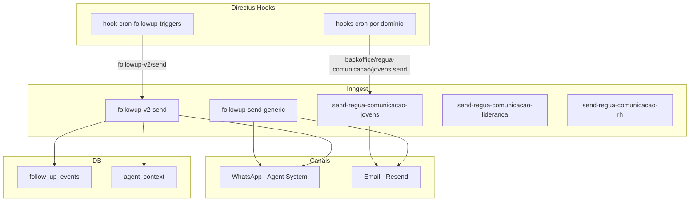

## Contexto de Produto

A Leapy mantém uma régua de comunicação ativa para engajar jovens ao longo do seu ciclo de desenvolvimento. O sistema identifica pontos de baixo engajamento (PDI pendente, inatividade, ações práticas em aberto) e dispara mensagens automatizadas via WhatsApp ou email para retomar o progresso.

## Escopo Funcional

<CardGroup cols={2}>
  <Card title="Follow-up v1" icon="envelope">
    Envio genérico por email ou WhatsApp. Suporta templates nomeados e mensagem livre.
  </Card>
  <Card title="Follow-up v2" icon="whatsapp">
    Exclusivo WhatsApp com templates Meta estruturados (header, body, button). Registra contexto do agente.
  </Card>
  <Card title="Régua de Jovens" icon="calendar">
    Emails automáticos por evento: lembrete de primeiro acesso, vencimento de atividade, etc.
  </Card>
  <Card title="Régua de Lideranças" icon="user-tie">
    Comunicações específicas para gestores sobre avaliações e relatórios.
  </Card>
  <Card title="Régua de RH" icon="building">
    Resumos periódicos e alertas para o time de RH das empresas clientes.
  </Card>
  <Card title="Triggers Automáticos" icon="gear">
    Hooks cron no Directus avaliam condições e disparam eventos Inngest conforme régua.
  </Card>
</CardGroup>

## Arquitetura Técnica



## Follow-up v1 (`followup/send`)

### Evento Inngest

```typescript
// Evento
{
  name: "followup/send",
  data: {
    user_id: "uuid",
    followup_type: "PENDING_PDI_PLAN",   // ver tipos abaixo
    method: "whatsapp" | "email",
    phone_number: "+5511999999999",
    message: "Texto livre",              // para email
    template: {
      name: "pdi_pending",
      language_code: "pt_BR",
      parameters: ["João"]
    }
  }
}
```

### Tipos de Follow-up (v1)

| Tipo | Quando usar |
|------|------------|
| `PENDING_FIRST_ACCESS` | Jovem ainda não fez o primeiro acesso |
| `PENDING_TARGET_JOB` | Cargo alvo não definido no perfil |
| `PENDING_CURRENT_SKILLS` | Skills atuais não mapeadas |
| `PENDING_PDI_PLAN` | PDI não iniciado |
| `PDI_IN_PROGRESS` | PDI em andamento, lembrete de ação prática |
| `ENGAGEMENT_INACTIVE_3DAYS` | Sem atividade há 3 dias |
| `ENGAGEMENT_PRACTICAL_ACTIONS` | Ação prática acordada pendente |
| `TALENT_PROGRESS_SUMMARY` | Resumo de progresso do talento |

### Passos internos

1. Validar campos obrigatórios (`user_id`, `followup_type`, `method`).
2. Rotear para canal: WhatsApp via Agent System ou Email via Resend.
3. Registrar evento em `follow_up_events` (`insertFollowupEvent`).
4. Atualizar contexto do agente (`updateAgentContext`).

## Follow-up v2 (`followup-v2/send`)

Versão simplificada e mais estruturada, **exclusivamente WhatsApp** com templates Meta (estrutura explícita de componentes).

### Evento Inngest

```typescript
{
  name: "followup-v2/send",
  data: {
    user_id: "uuid",
    followup_type: "pdi_pending",        // ver tipos abaixo
    phone_number: "+5511999999999",
    template_name: "pdi_pending_confirmation",
    language_code: "pt_BR",
    components: [
      {
        type: "body",
        parameters: [{ type: "text", text: "João" }]
      }
    ]
  }
}
```

### Tipos de Follow-up (v2)

| Tipo | Quando |
|------|--------|
| `primeiro_acesso_pendente` | Jovem nunca acessou a plataforma |
| `warmup_pending` | Aquecimento inicial não concluído |
| `target_role_pending` | Cargo alvo não definido |
| `skills_mapping_pending` | Mapeamento de skills pendente |
| `pdi_pending` | PDI não iniciado |
| `pdi_in_progress_day3` | PDI iniciado há 3 dias sem ação prática |
| `engagement_practical_actions` | Ação prática acordada em aberto |
| `engagement_peer_exchange` | Troca com par não realizada |
| `engagement_no_active_action` | Nenhuma ação ativa no PDI |
| `engagement_inactive_3days` | Inatividade de 3 dias |
| `engagement_inactive_7days` | Inatividade de 7 dias |

### Passos internos

1. Validar campos obrigatórios (falha rápida se `user_id`, `followup_type`, `phone_number` ou `template_name` ausentes).
2. Enviar template WhatsApp via `sendWhatsAppV2Template`.
3. Registrar em `follow_up_events`.
4. Tentar atualizar `agent_context` (falha não bloqueia).

## Régua de Comunicação por Domínio

### Régua de Jovens

**Evento:** `backoffice/regua-comunicacao/jovens.send`  
**Job:** `send-regua-comunicacao-jovens`

Envia emails a partir de templates da Régua. Cada item do `event.data.data` representa um jovem:

```typescript
{
  name: "backoffice/regua-comunicacao/jovens.send",
  data: {
    evento: "lembrete_pulso_jovem",   // nome do template
    data: [
      { jovem_email_corporativo: "...", jovem_email_pessoal: "..." },
    ]
  }
}
```

### Régua de Lideranças

**Evento:** `backoffice/regua-comunicacao/lideranca.send`  
**Job:** `send-regua-comunicacao-lideranca`

Equivalente à régua de jovens, mas para gestores.

### Régua de RH

**Evento:** `backoffice/regua-comunicacao/rh.send`  
**Job:** `send-regua-comunicacao-rh`

Comunicações para o time de RH das empresas clientes.

## Triggers Automáticos (hook-cron-followup-triggers)

O hook `hook-cron-followup-triggers` no Directus avalia condições periodicamente e dispara eventos `followup-v2/send` para jovens que atendem critérios de cada tipo de follow-up.

### Lógica de deduplicação

Antes de disparar, o hook verifica se já foi enviado o mesmo `followup_type` para o mesmo usuário desde um ponto de referência (ex: `last_status_change_at`):

```javascript
await alreadySentSince({
  services, schema,
  userId: talent.user_id,
  followupType: "pdi_pending",
  sinceISO: talent.last_status_change_at,
})
```

Se já foi enviado, o trigger é pulado para evitar spam.

### Templates WhatsApp e nomes de parâmetros

| Template | Parâmetros |
|----------|-----------|
| `engagement_inactive_3days` | `first_name` |
| `engagement_practical_actions` | `first_name`, `agreed_action`, `skill_name` |
| `pdi_in_progress_day3` | `first_name` |
| `pdi_pending_confirmation` | `nome` |
| `skills_mapping_pending` | `first_name` |
| `target_role_pending` | `first_name` |
| `warm_up_pending` | `first_name` |

## Observabilidade

### Tabela `follow_up_events`

Registra toda comunicação enviada:

| Campo | Descrição |
|-------|-----------|
| `user_id` | UUID do usuário |
| `followup_type` | Tipo do follow-up |
| `method` | Canal: `whatsapp` ou `email` |
| `message` | Texto enviado ou `[template:nome]` |
| `sent_at` | Timestamp do envio |

### Diagnóstico

```sql
-- Follow-ups enviados nos últimos 7 dias por tipo
SELECT followup_type, method, COUNT(*)
FROM follow_up_events
WHERE sent_at > NOW() - INTERVAL '7 days'
GROUP BY followup_type, method
ORDER BY COUNT(*) DESC;

-- Usuários sem follow-up há mais de 14 dias
SELECT user_id, MAX(sent_at) as ultimo_contato
FROM follow_up_events
GROUP BY user_id
HAVING MAX(sent_at) < NOW() - INTERVAL '14 days';
```

## Riscos, Limites e Trade-offs

| Risco | Mitigação |
|-------|-----------|
| Spam (múltiplos envios) | `alreadySentSince` impede reenvio no mesmo período |
| Template WhatsApp rejeitado pela Meta | Erro logado; Inngest faz retry (max 2x) |
| Usuário sem telefone | Validação no trigger antes de disparar evento |
| FUP v2 falha ao atualizar agent context | Erro capturado e logado; não bloqueia o envio |

## Referências de Código

| Arquivo | Repo | Descrição |
|---------|------|-----------|
| `src/inngest/functions/follow-up/follow-up-send.ts` | `backoffice-inngest-functions` | Job FUP v1 |
| `src/inngest/functions/follow-up-v2/follow-up-v2-send.ts` | `backoffice-inngest-functions` | Job FUP v2 |
| `src/inngest/functions/follow-up-v2/types.ts` | `backoffice-inngest-functions` | Tipos de FUP v2 |
| `src/inngest/functions/regua-comunicacao/` | `backoffice-inngest-functions` | Jobs de régua |
| `extensions/hooks/src/hook-cron-followup-triggers/` | `directus-backoffice-with-extensions` | Triggers automáticos |
| `src/services/messaging.service.ts` | `backoffice-inngest-functions` | Canal WhatsApp/Email |
| `src/services/followup-log.service.ts` | `backoffice-inngest-functions` | Log de follow-ups |

<CardGroup cols={2}>
  <Card title="Eventos e Jobs Inngest" icon="gear" href="/documentation/platform/events-jobs-inngest">
    Arquitetura de jobs assíncronos
  </Card>
  <Card title="Agent System" icon="robot" href="/documentation/platform/agent-system">
    Sistema de agentes e WhatsApp
  </Card>
  <Card title="Talentos" icon="user" href="/documentation/domains/talents/index">
    Contexto do domínio de talentos
  </Card>
  <Card title="Observabilidade" icon="chart-line" href="/documentation/platform/observability">
    Logs, métricas e alertas
  </Card>
</CardGroup>
