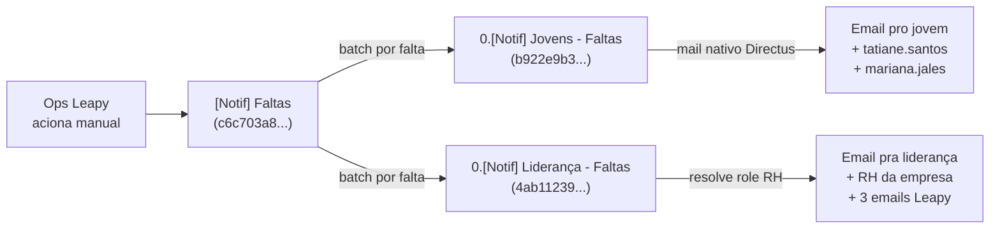

## Contexto de Produto

A Leapy emite comunicações automáticas em diversos pontos do ciclo do jovem aprendiz —
aniversários de contrato, lançamentos de presença, justificativas analisadas, mudanças de
status de vaga, reset de senha. Esta página é o **catálogo operacional** dessas comunicações
**por evento** (1 email por acontecimento), complementando a [Régua de Comunicação e
Follow-up](/documentation/platform/communications-fup) que cobre o caminho WhatsApp + emails
periódicos de engagement.

## Arquitetura — Quem Dispara o Quê

```mermaid
flowchart TB
    subgraph Origem
        CRON[hook cron Directus]
        MANUAL[flow manual Directus<br/>(ops aciona via UI)]
        EVENT[evento de produto<br/>(jovem submete, vaga muda status)]
        WHK[webhook Make<br/>(scenario com cron)]
    end

    subgraph Pipeline Email
        DIRECTUS[Endpoint Directus<br/>POST /emails/send]
        RENDER[Render Liquid<br/>(templates/*.liquid)]
        INNGEST_EM[Evento Inngest<br/>emails/resend.send]
        SENDR[Job Inngest<br/>send-resend-email]
        RESEND[Resend API]
    end

    CRON --> DIRECTUS
    MANUAL -->|envia direto via Directus mail| RESEND
    EVENT --> INNGEST_EM
    WHK --> INNGEST_EM
    DIRECTUS --> RENDER
    RENDER --> INNGEST_EM
    INNGEST_EM --> SENDR
    SENDR --> RESEND
```

Existem **quatro caminhos** distintos:

1. **Cron Directus → endpoint `/emails/send` → render Liquid → Inngest → Resend.**
   Caminho principal das **réguas de comunicação** (Jovens / Lideranças / RH). Templates Liquid
   em `directus-backoffice-with-extensions/templates/*.liquid`.

2. **Flow Directus → operação `mail` nativa do Directus.** Flow executa operação `mail` que
   manda direto via SMTP/Resend, sem passar pelo Inngest. Caminho do flow `[Notif] Faltas` e
   `[Notif] Liderança - Faltas` (ver [Aviso de Falta](#aviso-de-falta--flow-manual-notif-faltas)
   abaixo).

3. **Evento de produto → Inngest direto.** Sem render Liquid no Directus. Caminho do
   alinhamento diário e justificativa analisada/recebida (jobs Inngest em
   `backoffice-inngest-functions/src/inngest/functions/presencas/`).

4. **Make scenario.** Caminho do "Vagas status atualizadas" (3708160) e "E-mail boas-vindas
   novos usuários" (2043662).

Em todos os caminhos, **Resend é a fonte de verdade do envio final** — qualquer email da
Leapy passa por lá e fica registrado em `https://resend.com/emails`.

## Régua de Comunicação por Domínio

Catálogo de eventos por papel. Cada evento corresponde a um path
`workflows/regua-comunicacao/<dominio>/<evento>` no Directus, disparado pelos cron hooks
`hook-regua-comunicacao-{jovens,lideranca,rh}` diariamente.

### Régua de Jovens — 19 eventos, cron `1 6 * * *` (06:01 BRT)

Template Liquid e subject em `directus-backoffice-with-extensions`. Todos os subjects começam
com `Leapy | ` exceto onde indicado.

| Evento Inngest (`evento` no payload) | Template Liquid | Subject |
|---|---|---|
| `regua-comunicacao-jovem-acabou-a-imersao-e-agora` | `regua-comunicacao-jovem-acabou-a-imersao-e-agora.liquid` | Leapy \| Acabou a imersão. E agora? |
| `regua-comunicacao-jovem-o-que-fazer-no-primeiro-mes` | … | Leapy \| O que fazer no seu 1º mês? |
| `regua-comunicacao-jovem-fechamos-o-primeiro-mes-e-agora` | … | Leapy \| O 1º mês já foi |
| `regua-comunicacao-jovem-pense-no-seu-pdi` | … | Leapy \| Está na hora de pensar no seu PDI |
| `regua-comunicacao-jovem-avalie-seu-mapa-de-competencias-e-gaps` | … | Leapy \| Como estão suas competências? |
| `regua-comunicacao-jovem-90-dias-passaram-voce-tem-sido-protagonista` | … | Leapy \| Já se foram 3 meses. Como você está? |
| `regua-comunicacao-jovem-como-lidar-com-falhas-e-medos` | … | Leapy \| Aprendendo a lidar com medos e erros |
| `regua-comunicacao-jovem-cuide-da-sua-ansiedade-e-mantenha-o-foco` | … | Leapy \| Cuide da sua saúde mental |
| `regua-comunicacao-jovem-qual-seu-proximo-salto-de-carreira` | … | Leapy \| 6 meses já se foram. Qual seu próximo salto? |
| `regua-comunicacao-jovem-metade-do-contrato-ja-foi-e-agora` | … | Leapy \| Vamos refletir juntos? |
| `regua-comunicacao-jovem-hora-de-ter-aquela-conversa-com-a-lideranca` | … | Leapy \| Hora de conversar com sua liderança |
| `regua-comunicacao-jovem-crie-o-dossie-e-puxe-sua-lideranca` | … | Leapy \| Lute pela sua efetivação |
| `regua-comunicacao-jovem-1-ano-de-empresa` | `regua-comunicacao-jovem-1-ano-de-empresa.liquid` | **Leapy \| Aniversário de 1 ano como jovem leaper** |
| `regua-comunicacao-jovem-13-meses` | `regua-comunicacao-jovem-13-meses.liquid` | Leapy \| Estamos na reta final |
| `regua-comunicacao-jovem-chegou-o-momento-de-concluir-sua-jornada-conosco` | … | Lepy \| Falta apenas 1 mês *(sic — typo no subject em produção)* |
| `regua-comunicacao-jovem-reflita-e-valorize-essa-experiencia` | … | Leapy \| Reflita e valorize sua jornada |

**Eventos desativados** (comentados em
`extensions/hooks/src/hook-regua-comunicacao-jovens/index.js`): `proximos-passos`,
`lancamento-projeto-empreendedor`, `10-meses`.

**Feature flag:** `HOOK_CRON_REGUA_COMUNICACAO_JOVENS`. Para desativar um evento específico,
comentar o path no array em `index.js` (sem deploy).

<Warning>
  **Bug conhecido — templates com duração de contrato hardcoded.** Vários templates da régua
  citam "X meses restantes" com valor estático que assume duração específica de contrato.
  Quando o jovem tem contrato de duração diferente, recebe texto incorreto. Ver
  [seção de bugs conhecidos](#bugs-conhecidos) abaixo.
</Warning>

### Régua de Liderança — 16 eventos, cron `1 5 * * *` (05:01 BRT)

Inclui eventos de **efetivação** (`efetivacao-faltam-apenas-6-meses`, `nao-deixe-para-a-ultima-hora`,
`como-defender-a-efetivacao`, `contratos-perto-do-encerramento`) e marcos temporais
(`13-meses`, `14-meses`, `15-meses` — sem subject definido em produção).

Feature flag: `HOOK_CRON_REGUA_COMUNICACAO_LIDERANCA`.

### Régua de RH — 12 eventos, cron `1 4 * * *` (04:01 BRT)

Cobre recepção de jovens, preparação de liderança, plataforma, 100 dias, acompanhamento,
pontos de atenção, contratos perto do encerramento, efetivação, abertura de vagas de
reposição, procedimentos de encerramento.

Feature flag: `HOOK_CRON_REGUA_COMUNICACAO_RH`.

> Para detalhes de envio (lógica de elegibilidade, payload Inngest, processamento por chunk),
> ver [Régua de Comunicação e Follow-up](/documentation/platform/communications-fup#régua-de-comunicação-por-domínio).

## Comunicações de Presença

### Alinhamento Diário — Email pro Jovem (07h BRT)

Cron Make `[4397409] Alinhar presenças` (07:00 BRT) dispara o evento Inngest
`backoffice/alinhar-presencas.send` que processa os IDs de `report_presenca_zoom` do dia
anterior em chunks de 10. O job seleciona o template Liquid de acordo com a `presenca`:

| `presenca` | Template Liquid | Subject |
|---|---|---|
| `presente`, `presente_com_atraso` | `presenca-confirmada.liquid` | `[LEAPY] - Presença confirmada e coração quentinho! <data>` |
| `ausente` | `presenca-nao-confirmada.liquid` | `[LEAPY] - Ei, você pulou o encontro do dia <data>?` |

Detalhes do job em [Alinhamento de Presenças](/documentation/domains/presences/alinhamento).
Pipeline upstream em [Pipeline Zoom → Backoffice](/documentation/domains/presences/pipeline-zoom-backoffice).

### Justificativa — Recebida e Analisada

O jovem submete a justificativa via LeapyRH; o PL aprova ou reprova pelo backoffice. O fluxo
gera dois emails (recebimento + resultado da análise):

- **Submissão:** hook Directus `hook-justificativa-recebida` (em
  `report_presenca_zoom.items.update` quando `justificativa` mudou) → endpoint
  `/workflows/presencas/justificativa-recebida` → job Inngest dispara email pro jovem.
  Template: `justificativa-recebida.liquid`. Subject típico: `[LEAPY] - Justificativa recebida – estamos analisando sua solicitação`.

- **Análise:** hook `hook-justificativa-analisada` reage quando `status_justificativa` muda
  pra `aprovada` ou `reprovada`. Job Inngest envia email com resultado.
  Templates: `justificativa-aprovada.liquid` / `justificativa-reprovada.liquid`.
  Subject quando aprovada: `[LEAPY] - Conclusão da análise - Justificativa abonada`.

Quando aprovada, o job Inngest **`justificativa-analisada` atualiza `report_presenca_zoom.presenca = 'abono'` automaticamente** — não há intervenção manual do PL nesse passo.

Detalhes em [Justificativas](/documentation/domains/presences/justificativas).

## Aviso de Falta — Flow Manual `[Notif] Faltas`

Caso típico onde esta seção é relevante: o RH de uma empresa cliente reporta que não está
recebendo os avisos de falta dos jovens.

**Importante:** ao contrário das réguas (cron automático diário), o aviso de falta é um **flow
Directus manual** que o time de ops aciona via UI passando início e fim do período (tipicamente
a semana anterior).

### Arquitetura



### `[Notif] Faltas` (orquestrador, manual)

- **ID:** `c6c703a8-5ada-47b9-946f-0ecea80b6a97`
- **Trigger:** manual (POST com `body.inicio` e `body.fim` no formato ISO)
- **Operações:**
  1. `get_faltas` — query em `report_presenca_zoom` filtrando `meeting_date` no período e
     `presenca` em ausências reportáveis.
  2. `trigger "Notif Jovens"` — invoca `[Notif] Jovens - Faltas` em modo **batch** (uma
     iteração por falta).
  3. `trigger "Notif Liderancas"` — invoca `[Notif] Liderança - Faltas` em modo batch.

### `0.[Notif] Jovens - Faltas` (sub-flow, operation)

- **ID:** `b922e9b3-3d43-499c-aaa9-fce366797710`
- Pra cada `falta_id`:
  1. Lê falta + jovem (filtrando `ativo=true` e `Status_formacao=em_andamento`).
  2. Conta histórico total de faltas reportáveis do jovem.
  3. Envia email via operação `mail` nativa do Directus.
- **Destinatários:** `E-mail corporativo` + `email_pessoal` do jovem + **`tatiane.santos@leapy.com.br`** + **`mariana.jales@leapy.com.br`** (hardcoded — operacional Leapy).
- **Subject:** `Leapy | Falta registrada no curso de jovem aprendiz`.

### `0.[Notif] Liderança - Faltas` (sub-flow, operation)

- **ID:** `4ab11239-9a15-4ed2-a934-072e4bac5ae6`
- Pra cada `falta_id`:
  1. Lê falta + jovem ativo em `em_andamento`.
  2. Lê liderança em `Liderancas` (via `Jovens.lideranca_id`).
  3. Lê empresa e usuários da conta com role **`de3307d1-e3b5-43b4-a764-0fc8c9fb38a3`** (papel "RH" no Directus).
  4. Envia email para a liderança + todos os RHs da conta + 3 emails Leapy hardcoded (`matheus.fonseca`, `tatiane.santos`, `mariana.jales`).
- **Subject:** `Leapy | Seu jovem faltou no curso de jovem aprendiz`.

### Troubleshooting "RH não recebeu aviso de falta"

| Hipótese | Como confirmar |
|---|---|
| Ops esqueceu de acionar o flow nesta semana | Sem registros recentes do flow em `directus_activity` filtrando `collection=directus_flows` e `item=c6c703a8-...`. Sem emails no Resend com subject `Leapy \| Seu jovem faltou`. |
| Conta da empresa não tem usuário com role `de3307d1-...` (RH) | `GET /users?filter[account]=<account_uuid>&filter[role]=de3307d1-e3b5-43b4-a764-0fc8c9fb38a3` retorna lista vazia. Solução: criar user com esse role pra conta. |
| Jovem com `lideranca_id` nulo | `Jovens.lideranca_id IS NULL` → sub-flow não acha líder, mas RH ainda recebe (o `emails` array inclui RHs independente). |
| Jovem com `ativo = false` ou `Status_formacao != em_andamento` | Ambos sub-flows filtram esses jovens — RH NÃO recebe notificação. |
| Período passado pelo ops sem faltas no `report_presenca_zoom` | `get_faltas` retorna lista vazia → nenhum sub-flow é disparado. |
| Email do RH com bounce no Resend | Consulta no painel Resend pelo email mostra `last_event: bounced`. |

### Outros Flows de Notificação de Faltas

| Flow ID | Nome | Trigger | Status |
|---|---|---|---|
| `25f7a94f-88d4-46f0-b8a3-025b98dc8c1b` | `[Notif] Presenças e faltas` | **schedule** | Ativo — mas filtra **`empresa_id = 12` hardcoded** (caso específico) |
| `39545f64-...` | `[Notif] Presenças e faltas II` | operation | Sub-flow do anterior |
| `12dddfae-...` | `[Adv] Faltas` | manual | Aviso de **advertência** por falta acumulada |
| `e391ce8e-...` | `Faltas - advertência` | operation | Sub-flow de advertência |
| `9c37268c-...` | `[Manual] Calcular Faltas` | manual | Re-calcular faltas (suporte) |

### Cenários Make Complementares

Junto aos flows Directus acima, dois cenários Make participam do fluxo de notificação de
falta — provavelmente reagem a webhooks disparados pelos sub-flows:

| ID Make | Nome | Status | Comportamento observado |
|---|---|---|---|
| `3571191` | `Jovens faltantes` | ativo | Padrão de execução em **batch** (~50 runs simultâneas em segundos), uma execução por jovem. Última run em 25/05/2026 às 10:05 BRT — depois disso, zero execuções. Confirma que o disparo upstream (provavelmente o flow manual `[Notif] Faltas`) não foi acionado desde então. |
| `3450372` | `Falta - Retorno justificativa de falta` | ativo | Zero execuções no último mês — provavelmente processa casos pontuais de retorno de justificativa. |
| `3405106` | `Faltas - Coleta de justificativa` | inativo | Legado. |

{/* TODO: confirmar função exata do scenario 3571191 dentro do fluxo (operação atômica
por jovem — envio de e-mail, registro auxiliar, sync com sistema externo?). O ID é
descobrível via `make_scenarios_list({name_contains: "falt"})`. */}

**Sinal operacional:** se [resend logs](https://resend.com/emails) mostram que o aviso de
falta parou de sair, mas o flow Directus `[Notif] Faltas` aparenta estar ativo, vale
verificar também o histórico de execuções de `3571191` — se ele também parou no mesmo dia,
confirma que o problema é a cadeia upstream (ops esqueceu de acionar) e não falha de email.

## Vagas — Status Atualizadas

Caso típico: o status de uma vaga é atualizado para `2_avaliacao_empresa` mas a empresa
cliente não recebe o e-mail correspondente.

Make scenario **`[3708160] Vagas status atualizadas`** (ativo) reage a webhook do Directus
quando uma linha em `vagas` muda. O scenario verifica o novo `status` (provavelmente via
roteador interno) e envia email correspondente via Resend. Subject típico observado em
Resend: `Vaga em admissão | Aprendiz <Cargo> | <Empresa>`.

Detalhes do scenario: ver [Automações Make](/documentation/platform/automations-make).

Hipóteses de falha quando RH não recebe:
- Status não está coberto pelo roteador do scenario (ex: blueprint cobre `4_contratacao_feita`
  mas não `2_avaliacao_empresa`).
- Email do requisitante incorreto em `vagas.email_requisitante` ou `email_adicional`.
- Make scenario com erro de execução — checar `https://us1.make.com/scenarios/3708160/history`.

## Boas-vindas a Novos Usuários

Make scenario **`[2043662] E-mail boas-vindas novos usuários`** (ativo). Disparado quando um
novo `directus_users` é criado. Subject observado: `Bem-vinda(o) ao Leapy RH!`.

## Marcos Contratuais — Aniversários e Encerramento

Os marcos temporais cobertos pela [Régua de Jovens](#régua-de-jovens--19-eventos-cron-1-6----0601-brt)
são:

| Marco | Evento Inngest | Quando dispara |
|---|---|---|
| 1 mês | `fechamos-o-primeiro-mes-e-agora` | ~30 dias após `Início de contrato` |
| 90 dias | `90-dias-passaram-voce-tem-sido-protagonista` | ~90 dias após início |
| 6 meses | `metade-do-contrato-ja-foi-e-agora` | ~6 meses após início (assume contrato 12m) |
| 6 meses (alt) | `qual-seu-proximo-salto-de-carreira` | subject menciona "6 meses já se foram" |
| 1 ano | `1-ano-de-empresa` | ~12 meses após início |
| 13 meses | `13-meses` | ~13 meses após início |
| Próximo do fim | `chegou-o-momento-de-concluir-sua-jornada-conosco` | próximo do `Fim de contrato` |
| Pós-encerramento | `reflita-e-valorize-essa-experiencia` | após `Fim de contrato` |

> A elegibilidade do jovem para cada marco é decidida pelo endpoint Directus
> `workflows/regua-comunicacao/jovens/<evento>` (em `extensions/endpoints/src/workflows/`).
> Cada endpoint consulta `Jovens` filtrando por janela temporal específica.

## Password Reset (LeapyRH)

Caso típico: o jovem solicita a redefinição de senha no LeapyRH mas o e-mail não chega.

Implementado pelo **fluxo nativo de reset password do Directus** via `@directus/sdk`. Não
passa por template Liquid customizado nem por job Inngest dedicado da Leapy.

```typescript
// leapy-rh/src/services/auth.js
import { passwordRequest, passwordReset } from "@directus/sdk";

export async function requestResetPassword(email) {
  return clientDirectus.request(passwordRequest(email, resetUrl));
}

export async function resetPassword(reset_token, new_password) {
  return clientDirectus.request(passwordReset(reset_token, new_password));
}
```

- **Subject:** `Password Reset Request` (label padrão Directus, em inglês — fica visível no Resend).
- **Mecanismo:** Directus core gera token, envia email via Mail Service interno
  (configurado para Resend SMTP).
- **NÃO confundir com:**
  - `verification_codes` — tabela usada na **criação de usuários do hub** (não reset).
  - `email_confirmations` — tabela usada pra **alterar email do user no LeapyRH** (não reset).

Hipóteses quando "e-mail de redefinição não chega":
1. Email do jovem (`E-mail corporativo`) bouncing no Resend.
2. Spam folder do destinatário.
3. SMTP do Directus mal-configurado (env vars de mail) — confirmar via logs do app.
4. User do jovem em `directus_users` está com `status != 'active'`.

> Para mudar template ou copy do email de reset, é necessário override do template do
> Directus core via env var `EMAIL_TEMPLATES_PATH` ou similar — não há template Liquid
> customizado da Leapy hoje.

## Troubleshooting Genérico — "Esse Email Não Chegou"

Investigação canônica em 4 passos:

1. **Confirma que o email foi disparado** — consultar o histórico no painel Resend
   ([resend.com/emails](https://resend.com/emails)) ou via API filtrando por destinatário,
   subject e janela:
   ```
   GET https://api.resend.com/emails?to=<email_jovem>&subject=<trecho>&since=<data>
   ```
   Status `delivered` = chegou no servidor do destinatário; `bounced` = recusado; `sent` mas
   sem `delivered` = em trânsito; **nenhum match** = não foi disparado.

2. **Se não foi disparado, identifica quem deveria disparar:**
   - Comunicação periódica de engagement → ver [Régua de Comunicação e Follow-up](/documentation/platform/communications-fup).
   - Aniversário/marco temporal → régua de jovens (cron 06:01).
   - Aviso de falta → flow manual `[Notif] Faltas` (ops aciona).
   - Alinhamento de presença → cron Make `[4397409]` (07:00).
   - Justificativa → hooks `hook-justificativa-*` reativos a mudanças no Directus.
   - Status de vaga → Make scenario `[3708160] Vagas status atualizadas`.
   - Reset password → fluxo Directus core (LeapyRH).

3. **Se o cron/scenario rodou mas o email não saiu** — inspecionar o endpoint Directus de
   workflow (`workflows/<dominio>/<evento>`) ou o job Inngest pra ver se o jovem entrou no
   filtro. Critérios comuns:
   - `Jovens.ativo = true`
   - `Jovens.Status_formacao = 'em_andamento'`
   - Janela temporal correta (`Início de contrato + N dias = hoje`)

4. **Se chegou no Resend mas conteúdo errado** — provavelmente bug no template Liquid (ver
   [Bugs Conhecidos](#bugs-conhecidos) abaixo).

## Bugs Conhecidos

### Templates da Régua de Jovens com duração de contrato hardcoded

Caso real reportado: uma jovem aprendiz recebeu o e-mail de aniversário de 1 ano de empresa
com texto indicando 5 meses restantes de contrato, quando seu contrato encerrava em
aproximadamente 2 meses.

Vários templates da régua-comunicacao-jovens têm referências numéricas estáticas que
assumem durações de contrato específicas. Como não há substituição via variáveis Liquid
(o `data: {}` passado ao endpoint `/emails/send` é vazio), o texto sai sempre igual,
independentemente da duração real do contrato do jovem.

| Template | Trecho hardcoded | Assume contrato de |
|---|---|---|
| `regua-comunicacao-jovem-1-ano-de-empresa.liquid` | "faltando **5 meses** para o fim do seu contrato" | **18 meses** |
| `regua-comunicacao-jovem-13-meses.liquid` | "você está a **2 meses** do fim da sua jornada" | **15 meses** |
| `regua-comunicacao-jovem-metade-do-contrato-ja-foi-e-agora.liquid` | "faz **7 meses** que trabalhamos juntos" | **14 meses** |
| `regua-comunicacao-jovem-chegou-o-momento-de-concluir-sua-jornada-conosco.liquid` | "Foram **14 meses** de desafios" | **14 meses** |

**Inconsistência:** templates assumem **três durações diferentes** (14, 15 e 18 meses) entre
si. Jovens com contratos fora dessa faixa recebem texto incorreto — por exemplo, uma jovem
com contrato curto recebe o template `1-ano-de-empresa.liquid` (que assume 18 meses) mas seu
contrato termina pouco depois, gerando desencontro entre "5 meses restantes" do texto e a
duração real do contrato.

**Correção recomendada:**
1. Passar `data` real ao template — calcular `meses_restantes` no endpoint Directus a partir
   de `Jovens.Início_de_contrato` + `Fim_de_contrato`, expor como variável Liquid.
2. Substituir referências numéricas estáticas por `{{ meses_restantes }}` no Liquid.
3. Alternativa minimalista: remover qualquer referência a número específico do template e
   manter copy genérica.

### Subject com typo: "Lepy"

O subject do template `chegou-o-momento-de-concluir-sua-jornada-conosco` em
[`regua-comunicacao/constants.ts`](https://github.com/leapy-edtech/backoffice-inngest-functions/blob/main/src/inngest/functions/regua-comunicacao/constants.ts)
diz `Lepy | Falta apenas 1 mês` em vez de `Leapy | …`. Bug menor mas visível pro jovem.

### `[Notif] Presenças e faltas` filtra empresa hardcoded

O flow scheduled `25f7a94f-88d4-46f0-b8a3-025b98dc8c1b` filtra `empresa_id = 12` no `get_empresas`.
Provavelmente é um deploy específico para uma única empresa — vale confirmar com ops se ainda
é caso de uso ativo.

## Referências de Código

| Recurso | Localização |
|---|---|
| Templates Liquid (todos) | `directus-backoffice-with-extensions/templates/*.liquid` |
| Endpoint render Liquid | `directus-backoffice-with-extensions/extensions/endpoints/src/emails/index.js` |
| Hook cron régua jovens | `directus-backoffice-with-extensions/extensions/hooks/src/hook-regua-comunicacao-jovens/index.js` (cron `1 6 * * *`) |
| Job Inngest envio régua jovens | `backoffice-inngest-functions/src/inngest/functions/regua-comunicacao/regua-comunicacao-jovens.ts` |
| Constants (subjects régua) | `backoffice-inngest-functions/src/inngest/functions/regua-comunicacao/constants.ts` |
| Job envio Resend genérico | `backoffice-inngest-functions/src/inngest/functions/resend-email/email-send-resend.ts` |
| LeapyRH auth (password reset) | `leapy-rh/src/services/auth.js` |
| Flow `[Notif] Faltas` | Directus admin → Flows → buscar "Notif Faltas" |

## Veja Também

<CardGroup cols={2}>
  <Card title="Régua de Comunicação e Follow-up" icon="message" href="/documentation/platform/communications-fup">
    FUP v1/v2 WhatsApp + arquitetura de réguas (Jovens/Lideranças/RH)
  </Card>
  <Card title="Alinhamento de Presenças" icon="envelope" href="/documentation/domains/presences/alinhamento">
    Job Inngest do alinhamento diário (07:00 BRT)
  </Card>
  <Card title="Justificativas de Presença" icon="file-pen" href="/documentation/domains/presences/justificativas">
    Hooks Directus + jobs Inngest do fluxo de justificativa
  </Card>
  <Card title="Pipeline Zoom → Backoffice" icon="calendar-check" href="/documentation/domains/presences/pipeline-zoom-backoffice">
    Pipeline upstream que materializa `report_presenca_zoom`
  </Card>
  <Card title="Automações Make" icon="gear" href="/documentation/platform/automations-make">
    Catálogo dos scenarios Make ativos
  </Card>
  <Card title="Eventos e Jobs Inngest" icon="bolt" href="/documentation/platform/events-jobs-inngest">
    Arquitetura Inngest
  </Card>
</CardGroup>
