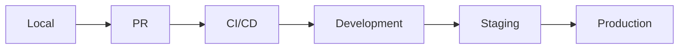

## Visão Geral

A plataforma Leapy possui múltiplos ambientes para garantir qualidade e segurança no ciclo de desenvolvimento.

## Ambientes Disponíveis

| Ambiente | Propósito | Dados |
|----------|-----------|-------|
| **Local** | Desenvolvimento local | Dados fake/seed |
| **Development** | Integração contínua | Dados de teste |
| **Staging** | Homologação | Dados anonimizados de prod |
| **Production** | Produção | Dados reais |

## URLs por Ambiente

### Aplicação Web

| Ambiente | URL |
|----------|-----|
| Local | http://localhost:3000 |
| Development | https://dev.leapy.com |
| Staging | https://staging.leapy.com |
| Production | https://app.leapy.com |

### Backoffice (Directus)

| Ambiente | URL |
|----------|-----|
| Local | http://localhost:8055 |
| Development | https://backoffice-dev.leapy.com |
| Staging | https://backoffice-staging.leapy.com |
| Production | https://backoffice.leapy.com |

### APIs

| Ambiente | URL |
|----------|-----|
| Local | http://localhost:3000/api |
| Development | https://dev.leapy.com/api |
| Staging | https://staging.leapy.com/api |
| Production | https://api.leapy.com |

## Configuração por Ambiente

### Variáveis de Ambiente

```bash
# Exemplo de variáveis por ambiente

# Local
DATABASE_URL=postgresql://localhost:5432/leapy_dev
REDIS_URL=redis://localhost:6379
INNGEST_EVENT_KEY=local_key

# Staging
DATABASE_URL=postgresql://staging-db.neon.tech/leapy_staging
REDIS_URL=redis://staging.upstash.io:6379
INNGEST_EVENT_KEY=staging_key

# Production
DATABASE_URL=postgresql://prod-db.neon.tech/leapy_prod
REDIS_URL=redis://prod.upstash.io:6379
INNGEST_EVENT_KEY=prod_key
```

### Feature Flags

Feature flags controlam funcionalidades por ambiente:

```typescript
const flags = {
  local: {
    newDashboard: true,
    aiAssistant: true,
    betaFeatures: true
  },
  development: {
    newDashboard: true,
    aiAssistant: true,
    betaFeatures: true
  },
  staging: {
    newDashboard: true,
    aiAssistant: true,
    betaFeatures: false
  },
  production: {
    newDashboard: true,
    aiAssistant: false,
    betaFeatures: false
  }
};
```

## Fluxo de Deploy



### Processo

1. **Development**: Deploy automático a cada merge em `main`
2. **Staging**: Deploy manual ou agendado
3. **Production**: Deploy manual com aprovação

## Dados entre Ambientes

### Local → Development

- Usar migrations para schema
- Seeds para dados iniciais
- Fixtures para testes

### Production → Staging

- Cópia anonimizada semanal
- PII removida/mascarada
- Volumes reduzidos

<Warning>
  Nunca copie dados de produção para ambientes inferiores sem anonimização.
</Warning>

## Acesso aos Ambientes

| Ambiente | Quem tem acesso |
|----------|-----------------|
| Local | Desenvolvedores |
| Development | Time de engenharia |
| Staging | Engenharia + QA + PMs |
| Production | Equipe autorizada |

### Credenciais

Credenciais são gerenciadas via:

- **1Password**: Senhas e tokens
- **Vercel**: Variáveis de ambiente
- **AWS Secrets Manager**: Secrets de produção

## Monitoramento por Ambiente

| Ambiente | Nível de Monitoramento |
|----------|------------------------|
| Local | Logs locais |
| Development | Logs básicos |
| Staging | Logs + métricas |
| Production | Completo + alertas |

## Troubleshooting

### Problema específico de ambiente

1. Verificar variáveis de ambiente
2. Comparar versões deployadas
3. Verificar conectividade com serviços
4. Analisar logs do ambiente específico

### Replicar issue de produção em staging

1. Garantir que staging tem dados recentes
2. Reproduzir fluxo do usuário
3. Verificar se comportamento é o mesmo
4. Debuggar em staging antes de corrigir
