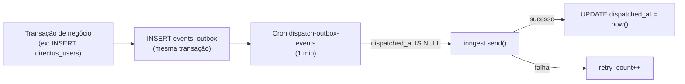

## Visão Geral

A tabela `events_outbox` implementa o padrão **transactional outbox**: eventos de domínio
(`talento.imported`, `talento.welcome-resend`, etc.) são inseridos **dentro da mesma
transação** que produz a mudança de estado. Se a transação der rollback, o evento **não**
fica enfileirado — garantindo atomicidade entre "estado mudou" e "evento agendado", sem
2-phase commit com o Inngest.

## Como funciona

<Steps>
  <Step title="Enfileiramento atômico">
    O caller insere o evento em `events_outbox` na mesma transação da mudança de estado.
    A redação de PII acontece **antes** do insert (responsabilidade do caller).
  </Step>
  <Step title="Dispatch por cron">
    O cron `dispatch-outbox-events` (a cada 1 min) lê linhas com `dispatched_at IS NULL`
    ordenadas por `created_at`, dispara cada uma via `inngest.send()` e grava
    `dispatched_at` no sucesso.
  </Step>
  <Step title="Retries">
    Retries do processamento são responsabilidade do **Inngest**. `retry_count` só cresce
    quando o `inngest.send()` em si lança (erro de rede, signing key inválida), com backoff
    exponencial até um teto de 8 tentativas — aí entra alerta.
  </Step>
</Steps>

## Modelo de dados

Tabela `events_outbox` (`leapy/packages/db/src/schema/events-outbox.ts`):

| Coluna | Tipo | Nulo | Default | Descrição |
|---|---|---|---|---|
| `id` | `uuid` | não | `defaultRandom()` | PK |
| `event_name` | `text` | não | — | Nome canônico; deve bater com `LeapyEvents` em `@leapy/api-contracts` |
| `event_data` | `jsonb` | não | — | Payload (validar shape no consumer via Zod; PII já redigida) |
| `created_at` | `timestamptz` | não | `now()` | Enfileiramento |
| `dispatched_at` | `timestamptz` | sim | — | `NULL` = pendente; preenchido quando `inngest.send()` retorna ok |
| `retry_count` | `integer` | não | `0` | Incrementa quando o dispatch lança |

**Índices:**
- `events_outbox_pending_idx` em `(created_at)` **parcial** `WHERE dispatched_at IS NULL` —
  hot path do cron; mantém o índice pequeno mesmo com a tabela crescendo.
- `events_outbox_event_name_idx` em `(event_name)`.

<Warning>
A tabela é **append-only e nunca soft-deletable** — linhas não são apagadas pelo fluxo.
A limpeza de linhas já despachadas (> 30 dias) é responsabilidade de um cron de cleanup
separado.
</Warning>

## Referências de código

| Repo | Arquivo | Propósito |
|---|---|---|
| `leapy` | `packages/db/src/schema/events-outbox.ts` | Schema da tabela |
| `leapy` | `packages/core/src/repositories/events-outbox.repo.ts` | Repositório (insert/dispatch) |
| `leapy` | `packages/api-contracts/inngest-events.ts` | `LeapyEvents` — nomes canônicos |

## Veja também

<CardGroup cols={2}>
  <Card title="Jobs e Eventos Inngest" icon="gear" href="/documentation/platform/events-jobs-inngest">
    Arquitetura de eventos assíncronos consumidos a partir do outbox
  </Card>
  <Card title="Arquitetura do Monorepo" icon="cubes" href="/documentation/architecture/monorepo-core">
    A camada packages/core onde o outbox é produzido
  </Card>
</CardGroup>
