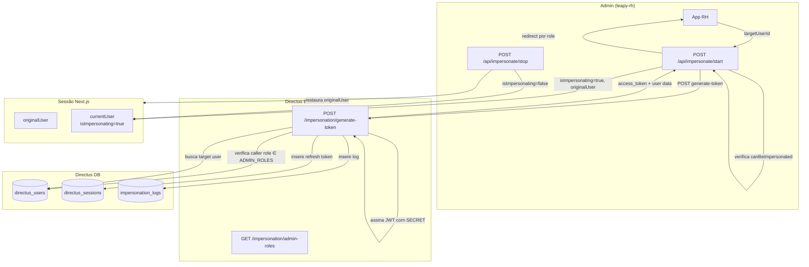

## Contexto de Produto

Impersonation permite que administradores da Leapy acessem a plataforma exatamente como um usuário específico — sem conhecer sua senha. É um recurso crítico de suporte: possibilita reproduzir problemas relatados, validar permissões e depurar comportamentos. **Todo acesso de impersonation é registrado em `impersonation_logs` para auditoria.**

## Escopo Funcional

<CardGroup cols={2}>
  <Card title="Gerar Token" icon="key">
    Endpoint Directus gera JWT válido assinado com o SECRET da instância, idêntico ao fluxo de login normal do Directus.
  </Card>
  <Card title="Iniciar Sessão" icon="play">
    App RH inicia sessão de impersonation via `POST /api/impersonate/start`, preservando o usuário original na sessão.
  </Card>
  <Card title="Encerrar Sessão" icon="stop">
    `POST /api/impersonate/stop` restaura o usuário original com possibilidade de registrar motivo.
  </Card>
  <Card title="Audit Trail" icon="clipboard-list">
    Toda geração de token é registrada em `impersonation_logs` com admin, target, IP e timestamp.
  </Card>
  <Card title="Timeout Automático" icon="clock">
    Sessão tem timeout definido por `IMPERSONATION_TIMEOUT_MS` — encerramento automático por inatividade.
  </Card>
  <Card title="Roles Autorizadas" icon="shield">
    Apenas 4 roles com `admin_access` podem iniciar impersonation. Não configurable via UI.
  </Card>
</CardGroup>

## Arquitetura Técnica



## Fluxos de Execução

### Fluxo 1 — Iniciar Impersonation

1. Admin seleciona um usuário para impersonar no app RH.
2. `POST /api/impersonate/start` com `{ targetUserId: string }`.
3. Leapy-rh verifica `canImpersonate(session.user)` — o admin deve ter role autorizada.
4. Verifica `canBeImpersonated(targetUser)` — o usuário alvo deve poder ser impersonado.
5. Chama `POST /impersonation/generate-token` no Directus com `targetUserId`.
6. Directus verifica que o caller (token atual) tem role em `ADMIN_ROLES`.
7. Directus busca dados completos do usuário alvo: role, account, jovem_id.
8. Gera JWT assinado com mesmo `SECRET` do Directus.
9. Registra refresh token na tabela `directus_sessions`.
10. **Registra em `impersonation_logs`:** admin_email, target_email, target_account, IP, timestamp.
11. Leapy-rh preserva `originalUser` na sessão e define `isImpersonating = true`.
12. Redireciona para a URL correta baseada no role do usuário impersonado.

### Fluxo 2 — Encerrar Impersonation

1. Admin clica em "Sair da impersonation" ou sessão atinge timeout.
2. `POST /api/impersonate/stop` com `{ reason: 'manual' | 'timeout' | 'logout' }`.
3. Leapy-rh verifica que a sessão está em modo impersonation.
4. Restaura `originalUser` como usuário ativo.
5. Define `isImpersonating = false`.
6. Redireciona para backoffice.

## Roles Autorizadas (ADMIN_ROLES)

| Role ID | Nome |
|---------|------|
| `1c532a3b-...` | Tech Team |
| `42144055-...` | Administrator |
| `7e47a776-...` | Operations Owner |
| `b9475ca7-...` | applications |

## Redirecionamento por Role

Ao iniciar impersonation, o app redireciona para a página inicial correta do usuário impersonado:

| Role / Account | Destino |
|----------------|---------|
| Account com slug `blip*` | `/{slug}/estagio` |
| `user-learning-*` | `/{slug}/home` |
| `intern` | `/{slug}/home` |
| `user-leadership*` | `/{slug}/talents` |
| Outros | `/{slug}/pagina-inicial` |

## Modelo de Dados — `impersonation_logs`

| Campo | Tipo | Descrição |
|-------|------|-----------|
| `id` | `number` | Identificador único |
| `admin_user_id` | `string` | UUID do admin que impersonou |
| `admin_email` | `string` | Email do admin |
| `target_user_id` | `string` | UUID do usuário impersonado |
| `target_email` | `string` | Email do usuário impersonado |
| `target_account` | `string` | Nome da account do usuário |
| `started_at` | `datetime` | Momento de início |
| `ip_address` | `string` | IP de origem |

## Tokens JWT Gerados

O token gerado é compatível com o padrão Directus:

```json
{
  "id": "<targetUserId>",
  "role": "<targetUser.role>",
  "app_access": true,
  "admin_access": false,
  "iat": 1234567890,
  "exp": 1234568790,
  "iss": "directus"
}
```

**TTLs:** `ACCESS_TOKEN_TTL` (padrão: `15m`), `REFRESH_TOKEN_TTL` (padrão: `7d`) — configuráveis via env do Directus.

> **Atenção:** `admin_access` é sempre `false` no token gerado — o usuário impersonado não recebe poderes de admin mesmo se o admin tiver.

## Segurança

- **Apenas roles específicas** podem gerar tokens — lista hardcoded em `ADMIN_ROLES`, não configurável via UI do Directus.
- **`SECRET` do Directus** é necessário para assinar o JWT — deve ser a mesma variável de ambiente `SECRET` usada pelo Directus.
- **Audit trail é melhor-esforço** — falha no log não bloqueia a geração do token, mas o erro é registrado no console.
- **`canBeImpersonated`** no leapy-rh pode bloquear certos usuários de serem impersonados (verificar implementação em `src/lib/auth/permissions/impersonation.ts`).

## Observabilidade e Operação

```sql
-- Histórico de impersonation (últimas 24h)
SELECT il.admin_email, il.target_email, il.target_account, il.started_at, il.ip_address
FROM impersonation_logs il
WHERE il.started_at > NOW() - INTERVAL '24 hours'
ORDER BY il.started_at DESC;

-- Sessões ativas de impersonation (directus_sessions)
SELECT ds.user, ds.expires, ds.origin
FROM directus_sessions ds
WHERE ds.origin = 'backoffice'
  AND ds.expires > NOW()
ORDER BY ds.expires DESC;
```

## Riscos e Limites

| Risco | Impacto | Mitigação |
|-------|---------|-----------|
| `SECRET` diferente entre ambientes | Token inválido | Mesma variável `SECRET` em leapy-rh e Directus |
| Falha ao registrar em `impersonation_logs` | Sem rastreabilidade | Erro logado no console mas operação continua |
| Sessão expira antes de `stop` | Token inválido | Timeout automático via `IMPERSONATION_TIMEOUT_MS` |
| Role não está em `ADMIN_ROLES` | 403 Forbidden | Verificar UUID da role no Directus |

## Referências de Código (Multirepo)

| Arquivo | Repositório | Descrição |
|---------|-------------|-----------|
| `extensions/endpoints/src/impersonation/index.js` | `directus-backoffice-with-extensions` | Endpoint principal |
| `src/app/api/impersonate/start/route.ts` | `leapy-rh` | API route: iniciar |
| `src/app/api/impersonate/stop/route.ts` | `leapy-rh` | API route: encerrar |
| `src/lib/auth/permissions/impersonation.ts` | `leapy-rh` | Funções `canImpersonate`, `canBeImpersonated` |
| `src/services/impersonation.ts` | `leapy-rh` | `generateTokenForUser`, `getUserForImpersonation` |

## Veja Também

<CardGroup cols={2}>
  <Card title="Segurança e Dados" icon="shield" href="/documentation/platform/security-data">
    Política de segurança geral da plataforma
  </Card>
  <Card title="Auditoria e Segurança" icon="clipboard-list" href="/documentation/domains/admin/audit-security">
    Logs de auditoria e controles de segurança do domínio Admin
  </Card>
  <Card title="Roles e Permissões" icon="lock" href="/documentation/domains/admin/roles-permissions">
    Estrutura de roles e permissões do Directus
  </Card>
</CardGroup>
