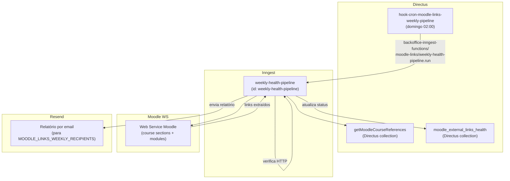

## Contexto de Produto

Cursos Moodle frequentemente contêm links externos (YouTube, artigos, recursos online). Com o
tempo, esses links ficam quebrados — páginas removidas, domínios expirados, redirects circulares.
O pipeline semanal verifica todos os links externos dos cursos ativos e envia um relatório de
saúde para a equipe responsável.

## Arquitetura Técnica



## Hook CRON

### `hook-cron-moodle-links-weekly-pipeline`

Executa toda semana no **domingo às 02:00** (`0 2 * * 0`).

**Feature flag:** `HOOK_CRON_MOODLE_LINKS_WEEKLY_PIPELINE` — quando falso, o hook loga e retorna sem disparar.

**Pré-condição:** variável `MOODLE_LINKS_WEEKLY_RECIPIENTS` deve conter ao menos um email
(lista separada por vírgula). Se vazia, o hook loga e retorna sem disparar.

**Evento Inngest disparado:**

```json
{
  "name": "backoffice-inngest-functions/moodle-links/weekly-health-pipeline.run",
  "data": {
    "heuristic_enabled": true,
    "to": ["equipe@leapy.com", "tech@leapy.com"]
  }
}
```

## Job Inngest: `weekly-health-pipeline`

Escuta o evento `backoffice-inngest-functions/moodle-links/weekly-health-pipeline.run`.

### Fases de execução

#### 1. Extração de referências (Directus)

Carrega a lista de cursos Moodle ativos via `getMoodleCourseReferencesFromDirectus`.
Esta função consulta a collection do Directus que mapeia cursos disponíveis na plataforma.

#### 2. Extração de links (Moodle Web Service)

Para cada curso, faz requisições ao Web Service Moodle para obter as seções e módulos:

```typescript
// Por curso, extrai sections → modules → links externos
interface ExtractedLink {
  extracted_at: string;
  course_id: number;
  course_name: string | null;
  cmid: number | null;
  module_modname: string | null;
  module_name: string | null;
  url: string;
  external_link_key: string; // hash de identificação do link
}
```

**Concorrência:**
- `EXTRACT_COURSE_CONCURRENCY = 3` cursos em paralelo
- `EXTRACT_MODULE_DETAIL_CONCURRENCY = 6` módulos em paralelo por curso
- Retry automático em caso de falha (`MOODLE_WS_MAX_ATTEMPTS = 3`, delays: 400ms e 1200ms)

#### 3. Verificação de saúde (HTTP check)

Para cada link extraído, verifica o status HTTP via `fetch`. Classifica o resultado segundo
a política `HEALTH_POLICY`:

**Status de saúde (`HealthStatus`):**

| Status | Descrição |
|---|---|
| `ok` | Resposta 2xx |
| `redirect` | Redirecionamento sem destino 2xx estável |
| `access_restricted` | Resposta de autenticação/paywall (não necessariamente quebrado) |
| `server_error` | 5xx — servidor com problema |
| `removed` | 4xx persistente (404, 410) — link provavelmente removido |
| `unknown` | Status não reconhecido |

**Labels de confiabilidade (`ReliabilityLabel`):**

| Label | Significado |
|---|---|
| `stable` | Link consistentemente saudável |
| `unstable` | Alternância entre ok e erro |
| `broken` | Falha persistente — ação recomendada |

#### 4. Atualização no Directus

Persiste os resultados na collection `moodle_external_links_health`:

```typescript
interface MoodleLinksHealthRow {
  external_link_key: string; // chave de dedup (hash)
  course_id: number;
  course_name: string | null;
  cmid: number | null;
  module_name: string | null;
  module_modname: string | null;
  url: string;
  last_extracted_at: string;
  // + campos de saúde atualizados
}
```

O pipeline roda **cleanup antes da extração** (`deleteAllMoodleLinks`) para evitar acúmulo de
links obsoletos. Links novos são criados e links existentes (por `external_link_key`) são atualizados.

#### 5. Relatório por email (Resend)

Envia email de relatório para todos os endereços em `MOODLE_LINKS_WEEKLY_RECIPIENTS` via
`ResendEmailService`. O relatório inclui apenas links **acionáveis** (`isActionableForReport`) —
filtra links com restrição de acesso estável (paywall esperado).

**Heurística (`heuristic_enabled: true`):** quando ativa, aplica lógica adicional para
reduzir falsos positivos — links que parecem quebrados mas são restrições de autenticação
previsíveis não são incluídos no relatório de ação imediata.

## Variáveis de Ambiente

| Variável | Descrição |
|---|---|
| `HOOK_CRON_MOODLE_LINKS_WEEKLY_PIPELINE` | Feature flag do hook (`true`/`false`) |
| `MOODLE_LINKS_WEEKLY_RECIPIENTS` | Emails dos destinatários, separados por vírgula |
| `MOODLE_INTEGRATION_URL` | URL base do Moodle para requisições Web Service |
| `MOODLE_INTEGRATION_AUTH_TOKEN` | Token de autenticação Moodle |

## Observabilidade e Operação

### Diagnóstico no Directus

```sql
-- Links com problemas por curso
SELECT course_name, url, health_status, reliability_label, last_extracted_at
FROM moodle_external_links_health
WHERE reliability_label = 'broken'
ORDER BY course_name, url;

-- Resumo de saúde por status
SELECT health_status, COUNT(*) as total
FROM moodle_external_links_health
GROUP BY health_status
ORDER BY total DESC;
```

### Reprocessar manualmente

Para rodar o pipeline fora do horário agendado, dispare o evento Inngest diretamente:

```bash
# Via Inngest Dashboard ou CLI
inngest event send backoffice-inngest-functions/moodle-links/weekly-health-pipeline.run \
  --data '{"heuristic_enabled": true, "to": ["seu@email.com"]}'
```

### Adicionar destinatário ao relatório

Atualizar a variável `MOODLE_LINKS_WEEKLY_RECIPIENTS` no env do Directus:

```
MOODLE_LINKS_WEEKLY_RECIPIENTS=tech@leapy.com,outro@leapy.com
```

O hook lê a variável em cada execução — sem necessidade de redeploy.

## Riscos, Limites e Trade-offs

| Risco | Mitigação |
|---|---|
| Links com paywall/auth retornam falso positivo | Heurística `isLikelyAccessRestrictionStatus` filtra do relatório |
| Curso com muitos links → timeout Inngest | Concorrência limitada (3 cursos / 6 módulos); retry automático |
| Cleanup deleta todos os links antes de reextrair | Janela de inconsistência durante execução; aceitável pois é pipeline de análise |
| MOODLE_LINKS_WEEKLY_RECIPIENTS vazia | Hook loga aviso e retorna sem disparar — sem erro silencioso |
| Moodle WS indisponível no domingo | Retry 3x com backoff 400ms/1200ms; job falha e Inngest notifica |

## Referências de Código

| Arquivo | Repo | Descrição |
|---|---|---|
| `extensions/hooks/src/hook-cron-moodle-links-weekly-pipeline/index.js` | `directus-backoffice-with-extensions` | Hook CRON que dispara o evento |
| `src/inngest/functions/moodle-links/weekly-health-pipeline.ts` | `backoffice-inngest-functions` | Job principal — orquestração completa |
| `src/inngest/functions/moodle-links/moodle-links-directus.ts` | `backoffice-inngest-functions` | CRUD da collection Directus |
| `src/inngest/functions/moodle-links/moodle-links-utils.ts` | `backoffice-inngest-functions` | Concorrência e utilitários |

<CardGroup cols={2}>
  <Card title="Integração Moodle" icon="plug" href="/documentation/domains/courses-content/moodle-integration">
    Sync de matrículas, usuários e progresso com Moodle
  </Card>
  <Card title="Moodle SSO" icon="key" href="/documentation/platform/moodle-sso">
    Autenticação automática de talentos no Moodle
  </Card>
  <Card title="Jobs e Eventos Inngest" icon="gear" href="/documentation/platform/events-jobs-inngest">
    Arquitetura de jobs assíncronos da plataforma
  </Card>
  <Card title="Observabilidade" icon="chart-line" href="/documentation/platform/observability">
    Logs, métricas e monitoramento de jobs
  </Card>
</CardGroup>
