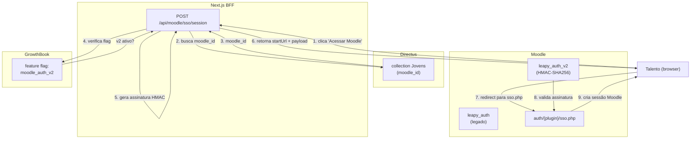

## Contexto de Produto

A Leapy integra com o Moodle para acesso a cursos e conteúdos de aprendizagem. Para evitar que
talentos precisem de senha separada, o sistema implementa **SSO (Single Sign-On)** — o talento
clica em "Acessar Moodle" e é autenticado automaticamente sem inserir credenciais.

Existem dois plugins de SSO em operação simultânea:
- **`leapy_auth`** (v1 legado) — autenticação por token simples
- **`leapy_auth_v2`** (atual) — autenticação por HMAC-SHA256 com nonce e TTL

A seleção do plugin é feita por feature flag (`moodle_auth_v2` no GrowthBook) por usuário.

## Arquitetura Técnica



## Endpoint Principal: Criar Sessão SSO

### `POST /api/moodle/sso/session`

Prepara os dados para autenticação automática no Moodle. O frontend recebe `startUrl` e redireciona
o usuário — o plugin Moodle valida a assinatura e cria a sessão.

**Autenticação:** Sessão NextAuth com `session.user.jovem` (ID do talento).

**Body:**

```json
{
  "courseId": 42,
  "returnTo": "/cursos/introducao-ao-python"
}
```

| Campo | Tipo | Obrigatório | Descrição |
|---|---|---|---|
| `courseId` | `number` | Não | ID do curso Moodle (inteiro positivo). Omitir para `/my/` |
| `returnTo` | `string` | Não | Path de retorno após autenticação (sanitizado) |

**Response `200` (sucesso):**

```json
{
  "ok": true,
  "authVariant": "v2",
  "plugin": "leapy_auth_v2",
  "supportsSilentSso": true,
  "ssoEndpoint": "https://moodle.leapy.com/auth/leapy_auth_v2/sso.php",
  "startUrl": "https://moodle.leapy.com/auth/leapy_auth_v2/sso.php?username=...&sig=...&response=redirect",
  "request": {
    "username": "joao.silva",
    "courseid": 42,
    "ts": 1746000000,
    "nonce": "a1b2c3d4e5f6...",
    "sig": "sha256hex...",
    "callback": "https://app.leapy.com/cursos/introducao-ao-python",
    "origin": "https://app.leapy.com"
  },
  "courseUrl": "https://moodle.leapy.com/course/view.php?id=42",
  "signatureTtlSeconds": 300
}
```

**Status codes de erro:**

| Código | `code` | Causa |
|---|---|---|
| `400` | `invalid_course_id` | `courseId` não é inteiro positivo |
| `401` | `unauthorized` | Sessão ausente ou sem `jovem` |
| `404` | `moodle_id_not_found` | Talento sem `moodle_id` no Directus |
| `404` | `moodle_username_not_found` | `moodle_id` sem username no Moodle |
| `500` | `moodle_config_missing` | Variáveis `MOODLE_INTEGRATION_*` não configuradas |
| `500` | `sso_prepare_error` | Erro interno na geração da assinatura |

## Assinatura HMAC-SHA256 (leapy_auth_v2)

O plugin v2 usa assinatura HMAC para garantir que a requisição SSO foi gerada pelo servidor Leapy.

**Payload assinado:**

```
{username}:{courseId}:{ts}:{nonce}:{origin}:{callback}
```

**Geração:**

```javascript
const ts = Math.floor(Date.now() / 1000);           // Unix timestamp
const nonce = randomBytes(16).toString("hex");       // 32 chars hex aleatório
const payload = `${username}:${courseId}:${ts}:${nonce}:${origin}:${callback}`;
const sig = createHmac("sha256", MOODLE_INTEGRATION_AUTH_TOKEN).update(payload).digest("hex");
```

**TTL:** Configurável via `MOODLE_INTEGRATION_AUTH_TOKEN` no env. Padrão: **300 segundos**.
O plugin Moodle valida que `ts` não é mais antigo que o TTL configurado.

## Feature Flag: Seleção de Plugin

A decisão entre `leapy_auth` e `leapy_auth_v2` é feita por usuário via GrowthBook:

```javascript
const isV2 = await serverAnalytics?.isFeatureEnabled("moodle_auth_v2", userId, {
  personProperties: { role, account, account_id }
});
const plugin = isV2 ? "leapy_auth_v2" : "leapy_auth";
```

- `supportsSilentSso: true` indica que o plugin suporta autenticação silenciosa (sem redirecionamento visível)
- Em caso de falha na verificação do flag, o sistema usa `leapy_auth` (v1) por segurança

## Endpoints de Gestão de Credenciais

Usados pelo backoffice (Directus Admin) para gerenciar credenciais Moodle de usuários específicos.

### `POST /api/moodle/auth-mode/[id]`

Altera o método de autenticação de um usuário Moodle.

```json
{ "method": "manual" }
```

Útil ao migrar usuários entre plugins ou desabilitar SSO temporariamente. Chama `updateMoodleUser` via Web Service Moodle.

---

### `POST /api/moodle/password/[id]`

Atualiza a senha de um usuário no Moodle.

```json
{ "password": "nova-senha" }
```

<Warning>
  Operação administrativa — não usar no fluxo SSO normal. Só necessária para usuários sem SSO ativo.
</Warning>

---

### `GET /api/moodle/username/[id]`

Retorna o username Moodle de um usuário pelo ID do usuário Moodle (`moodle_id`).

```json
{ "username": "joao.silva" }
```

## Variáveis de Ambiente

| Variável | Descrição |
|---|---|
| `MOODLE_INTEGRATION_URL` | URL base do Moodle (ex: `https://moodle.leapy.com`) |
| `MOODLE_INTEGRATION_AUTH_TOKEN` | Token HMAC compartilhado entre Next.js e plugin Moodle |
| `MOODLE_SSO_SIGNATURE_TTL_SECONDS` | TTL da assinatura em segundos (default: `300`) |

## Riscos, Limites e Trade-offs

| Risco | Mitigação |
|---|---|
| Talento sem `moodle_id` | Retorna `404` com code `moodle_id_not_found` — usuário precisa ser provisionado |
| Token HMAC comprometido | Rotacionar `MOODLE_INTEGRATION_AUTH_TOKEN`; assinaturas antigas expiram pelo TTL |
| Feature flag indisponível | Fallback para `leapy_auth` (v1) — SSO continua funcionando |
| `courseId` inválido | Validação server-side retorna `400` antes de gerar assinatura |
| Replay attack | Nonce único por requisição + TTL de 300s impedem reuso da assinatura |

## Referências de Código

| Arquivo | Repo | Descrição |
|---|---|---|
| `src/app/api/moodle/sso/session/route.js` | `leapy-rh` | Criação de sessão SSO com HMAC |
| `src/app/api/moodle/auth-mode/[id]/route.js` | `leapy-rh` | Troca de modo de auth |
| `src/app/api/moodle/password/[id]/route.js` | `leapy-rh` | Atualização de senha |
| `src/app/api/moodle/username/[id]/route.js` | `leapy-rh` | Busca de username |
| `src/app/service/moodle.js` | `leapy-rh` | Client do Web Service Moodle |
| `moodle/auth/leapy_auth_v2/auth.php` | `moodle` | Plugin SSO v2 — validação HMAC |
| `moodle/auth/leapy_auth/auth.php` | `moodle` | Plugin SSO v1 (legado) |

<CardGroup cols={2}>
  <Card title="Integração Moodle" icon="plug" href="/documentation/domains/courses-content/moodle-integration">
    Provisionamento de usuários e sync de matrículas
  </Card>
  <Card title="Monitoramento de Links Moodle" icon="link" href="/documentation/platform/moodle-links-weekly">
    Pipeline semanal de verificação de links em cursos
  </Card>
  <Card title="Segurança e Dados" icon="shield" href="/documentation/platform/security-data">
    Políticas de token e autenticação na plataforma
  </Card>
  <Card title="Cursos e Conteúdos" icon="book" href="/documentation/domains/courses-content/index">
    Domínio de cursos, matrículas e progresso
  </Card>
</CardGroup>
