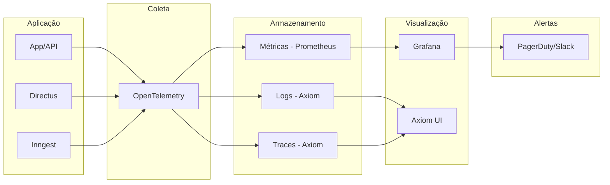

## Visão Geral

A observabilidade da plataforma Leapy é baseada nos três pilares: logs, métricas e traces.

## Stack de Observabilidade



## Logs

### Formato

Logs estruturados em JSON:

```json
{
  "timestamp": "2024-01-15T10:30:00Z",
  "level": "info",
  "message": "Pulse activated",
  "service": "api",
  "tenant_id": "uuid",
  "pulse_id": "uuid",
  "user_id": "uuid",
  "duration_ms": 150,
  "trace_id": "abc123"
}
```

### Níveis de Log

| Nível | Uso |
|-------|-----|
| `error` | Erros que requerem atenção |
| `warn` | Situações anormais |
| `info` | Eventos importantes |
| `debug` | Informações detalhadas |

### Consulta de Logs

Via Axiom:

```sql
['leapy-production']
| where service == 'api'
| where level == 'error'
| where timestamp > ago(1h)
| order by timestamp desc
```

## Métricas

### Métricas de Aplicação

| Métrica | Tipo | Descrição |
|---------|------|-----------|
| `http_requests_total` | Counter | Total de requisições |
| `http_request_duration_seconds` | Histogram | Latência de requisições |
| `active_sessions` | Gauge | Sessões ativas |
| `pulse_responses_total` | Counter | Respostas de pulso |

### Métricas de Negócio

| Métrica | Tipo | Descrição |
|---------|------|-----------|
| `talents_active` | Gauge | Talentos ativos por tenant |
| `pulses_active` | Gauge | Pulsos ativos |
| `enps_score` | Gauge | Score eNPS atual |

### Dashboards

**Dashboard Principal:**

- Requisições por segundo
- Latência P50/P95/P99
- Taxa de erros
- Recursos (CPU, memória)

**Dashboard de Negócio:**

- Usuários ativos
- Pulsos em andamento
- Taxa de resposta
- Métricas por tenant

## Traces

### Distributed Tracing

Traces conectam requisições através dos serviços:

```
[Frontend] → [API] → [Database]
    ↓
[Inngest] → [Email Service]
```

### Exemplo de Trace

```json
{
  "trace_id": "abc123",
  "spans": [
    {
      "name": "HTTP POST /api/pulses",
      "duration_ms": 250,
      "status": "ok"
    },
    {
      "name": "db.insert.pulse",
      "duration_ms": 50,
      "parent": "HTTP POST /api/pulses"
    },
    {
      "name": "inngest.send.pulse.created",
      "duration_ms": 20,
      "parent": "HTTP POST /api/pulses"
    }
  ]
}
```

## Alertas

### Configuração

Alertas são configurados no Grafana:

| Alerta | Condição | Severidade |
|--------|----------|------------|
| High Error Rate | > 1% erros em 5min | Critical |
| High Latency | P95 > 2s | Warning |
| Service Down | 0 requests em 2min | Critical |
| Job Failed | Inngest job falhou | Warning |

### Canais de Notificação

- **Critical**: PagerDuty (on-call)
- **Warning**: Slack #alerts
- **Info**: Email

## Ferramentas

### Axiom

- Logs e traces
- Queries em tempo real
- Dashboards customizados

### Grafana

- Métricas e alertas
- Dashboards pré-configurados
- Integração com Prometheus

### Inngest Dashboard

- Monitoramento de jobs
- Logs de execução
- Replay de eventos

## Boas Práticas

1. **Sempre inclua contexto** nos logs (tenant_id, user_id)
2. **Use trace_id** para correlacionar logs
3. **Monitore métricas de negócio**, não só técnicas
4. **Configure alertas** com thresholds realistas
5. **Revise dashboards** periodicamente
