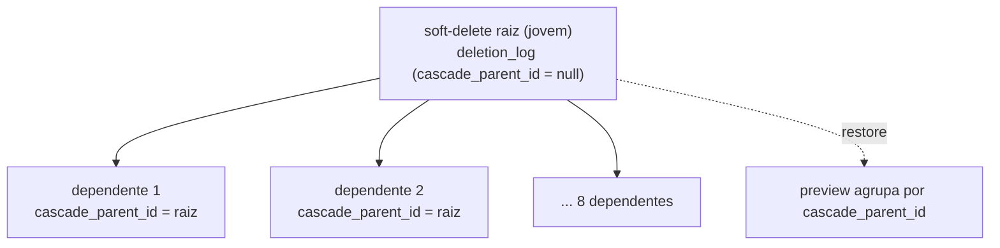

## Visão Geral

A exclusão na Leapy é **reversível por padrão**: entidades não somem na hora — são marcadas
com `deleted_at` e agendadas para purga (`purge_after`). Toda exclusão, restauração e purga
definitiva é registrada num **ledger de auditoria** (`deletion_log`) que **sobrevive ao dado
ser apagado** — requisito de LGPD (saber quem apagou o quê, mesmo depois de ambos sumirem).

## O padrão soft-delete

Entidades soft-deletáveis carregam um conjunto comum de colunas:

| Coluna | Significado |
|---|---|
| `deleted_at` | Quando foi arquivada (`null` = ativa) |
| `deleted_by` | Quem arquivou |
| `purge_after` | Quando pode ser purgada definitivamente |

Hoje aplicado em `accounts`, `Empresas`, `Turmas` e `directus_users` (e, via cascata, nas
tabelas dependentes). As regras de domínio `canSoftDeleteAccount` / `canSoftDeleteEmpresa` /
`canSoftDeleteCandidato` garantem que só uma entidade ativa pode ser arquivada (idempotência).

<Note>
**Reciclagem difere por entidade.** O `slug` de [Contas](/documentation/domains/accounts/index)
é reciclável após soft-delete (partial unique `WHERE deleted_at IS NULL`); o `cnpj` de
[Empresas](/documentation/domains/empresas/index) **não** é (unique global — a Receita não
recicla CNPJ). Por isso a chave cross-system é sempre o `id` (UUID), nunca o slug.
</Note>

## O ledger — `deletion_log`

Tabela `deletion_log` (`leapy/packages/db/src/schema/deletion-log.ts`). Registra cada
soft-delete, restore e purga **de todo o sistema**. Nunca é soft-deletada; as linhas só saem
por um cron de retenção após 5 anos.

| Coluna | Descrição |
|---|---|
| `id` | PK (uuid) |
| `entity_type` | Tipo da entidade |
| `entity_id` | **TEXT** (não uuid) — a cascata atravessa tabelas com PKs de tipos mistos |
| `deleted_by` / `deleted_at` | Quem/quando arquivou |
| `purge_after` | Quando pode ser purgada |
| `hard_purged_at` / `hard_purged_by` | Purga definitiva |
| `restored_at` | Restauração |
| `reason` | Motivo |
| `cascade_parent_id` | `id` da linha do `deletion_log` da raiz agregada que disparou a cascata (`null` na raiz) |

<Warning>
`deleted_by` e `hard_purged_by` **não têm FK** para `directus_users` de propósito — o registro
de auditoria precisa **sobreviver à purga do próprio usuário** (LGPD: quem deletou quem, mesmo
após os dois sumirem). E `entity_id` é `text` porque a cascata cobre tabelas com PK `uuid`
(`directus_users`, `user_personal_data`, `user_careers`, `pulsos_jovens`) e tabelas legadas com
serial inteiro (`Jovens`, `Matriculas`, `Pulsos`) — um só ledger registra as duas formas.
</Warning>

## Cascata e restore

Quando uma raiz agregada é arquivada (ex.: um jovem), seus dependentes também são — cada um
gera uma linha no `deletion_log` com `cascade_parent_id` apontando para a linha da raiz. Isso
permite ao preview de restauração agrupar "arquivar o jovem X também arquiva 8 dependentes"
a partir do snapshot da cascata.

## Referências de código

| Repo | Arquivo | Propósito |
|---|---|---|
| `leapy` | `packages/db/src/schema/deletion-log.ts` | Ledger de auditoria |
| `leapy` | `packages/core/src/domain/{account,empresa,candidato}.rules.ts` | Predicados `canSoftDelete*` |

## Veja também

<CardGroup cols={2}>
  <Card title="Dados Pessoais e PII" icon="shield-halved" href="/documentation/platform/pii-lgpd">
    O outro pilar de privacidade: redação de PII em logs
  </Card>
  <Card title="Contas" icon="building-user" href="/documentation/domains/accounts/index">
    Slug reciclável e por que id é a chave cross-system
  </Card>
</CardGroup>
