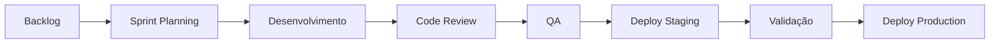
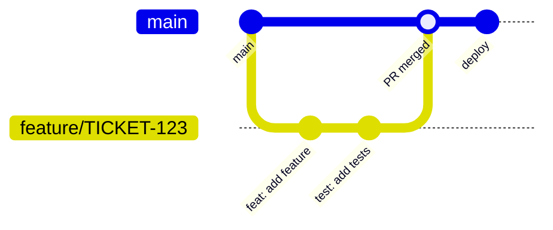

## Visão Geral

O ciclo de desenvolvimento na Leapy segue práticas ágeis com foco em qualidade, colaboração e entrega contínua.

## Fluxo de Desenvolvimento

## Etapas do Ciclo

### 1. Planejamento

**Sprint Planning:**
- Duração: 2 semanas
- Revisão do backlog priorizado
- Estimativa de esforço
- Comprometimento do time

**Artefatos:**
- User stories refinadas
- Critérios de aceite claros
- Design/mockups aprovados

### 2. Desenvolvimento

**Workflow de Branch:**

**Convenções:**
- Branch: `feature/TICKET-description` ou `fix/TICKET-description`
- Commits: Conventional Commits
- PR: Template preenchido

### 3. Code Review

**Checklist do Reviewer:**
- [ ] Código segue padrões
- [ ] Testes adequados
- [ ] Sem vulnerabilidades
- [ ] Performance aceitável
- [ ] Documentação atualizada

**SLAs:**
- PR pequena (< 200 linhas): 4h
- PR média (200-500 linhas): 8h
- PR grande (> 500 linhas): 24h

### 4. Quality Assurance

**Tipos de Teste:**
- Unitários (obrigatório)
- Integração (features críticas)
- E2E (fluxos principais)
- Manual (exploratório)

**Critérios de QA:**
- [ ] Critérios de aceite atendidos
- [ ] Sem regressões
- [ ] Performance adequada
- [ ] Acessibilidade verificada

### 5. Deploy

**Ambientes:**
- Development: Deploy automático (merge em main)
- Staging: Deploy manual ou agendado
- Production: Deploy manual com aprovação

**Checklist de Deploy:**
- [ ] Testes passando
- [ ] Review aprovado
- [ ] QA validado
- [ ] Migrations testadas
- [ ] Rollback plan definido

## Cerimônias

| Cerimônia | Frequência | Duração | Participantes |
|-----------|------------|---------|---------------|
| Daily | Diária | 15 min | Time de dev |
| Sprint Planning | Quinzenal | 2h | Time + PO |
| Review | Quinzenal | 1h | Time + Stakeholders |
| Retrospectiva | Quinzenal | 1h | Time |
| Refinamento | Semanal | 1h | Time + PO |

## Ferramentas

| Ferramenta | Uso |
|------------|-----|
| Linear | Gestão de tarefas |
| GitHub | Código e PRs |
| Vercel | Deploy |
| Slack | Comunicação |
| Figma | Design |

## Definition of Done

Uma tarefa está "Done" quando:

- [ ] Código implementado e testado
- [ ] Code review aprovado
- [ ] Testes passando (unit + integration)
- [ ] QA validado
- [ ] Documentação atualizada
- [ ] Deploy em staging validado
- [ ] Métricas/logs configurados
