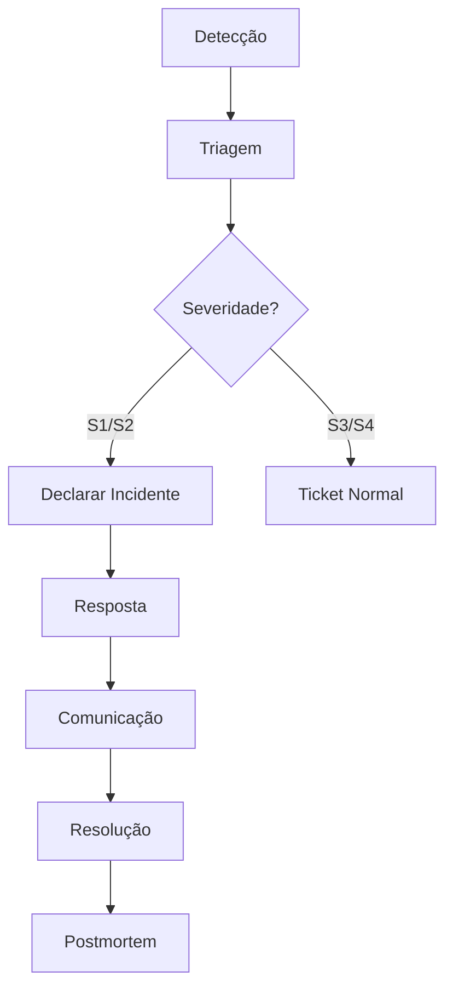

## Visão Geral

A gestão de incidentes garante resposta rápida e eficaz a problemas que afetam a disponibilidade ou qualidade do serviço.

## Definição de Incidente

Um incidente é qualquer evento que:

- Causa indisponibilidade do serviço
- Degrada significativamente a experiência
- Compromete segurança ou dados
- Afeta múltiplos clientes

## Severidades

| Severidade | Descrição | SLA Resposta | SLA Resolução |
|------------|-----------|--------------|---------------|
| **S1 - Crítico** | Sistema indisponível | 15 min | 1 hora |
| **S2 - Alto** | Funcionalidade crítica degradada | 30 min | 4 horas |
| **S3 - Médio** | Funcionalidade secundária afetada | 2 horas | 24 horas |
| **S4 - Baixo** | Problema menor | 24 horas | 72 horas |

## Processo de Incidente



### 1. Detecção

**Fontes:**
- Alertas de monitoramento
- Reporte de cliente
- Observação interna
- Métricas anormais

### 2. Triagem

**Perguntas-chave:**
- Qual o impacto? (usuários/funcionalidades)
- É um incidente ou bug isolado?
- Qual a severidade?
- Quem deve ser acionado?

### 3. Declaração de Incidente

Para S1/S2, declarar imediatamente:

```
🚨 INCIDENTE DECLARADO

Severidade: S[1/2]
Descrição: [BREVE DESCRIÇÃO]
Impacto: [QUEM/O QUE ESTÁ AFETADO]
Incident Commander: [NOME]
Canal: #incident-[DATE]-[ID]
```

### 4. Papéis

| Papel | Responsabilidade |
|-------|------------------|
| **Incident Commander** | Coordena resposta, comunicação |
| **Tech Lead** | Investigação e correção técnica |
| **Comunicação** | Atualizações internas e externas |
| **Scribe** | Documenta timeline e ações |

### 5. Comunicação

**Interna (a cada 15-30 min):**
```
📢 Atualização - [HH:MM]
Status: [Investigando/Mitigando/Resolvido]
Descobertas: [O QUE SABEMOS]
Próximos passos: [AÇÕES]
ETA: [ESTIMATIVA]
```

**Externa (para clientes):**
- Status page atualizada
- Email para clientes afetados (S1)
- Comunicação proativa

### 6. Resolução

Quando resolvido:

```
✅ INCIDENTE RESOLVIDO

Duração: X horas Y minutos
Causa: [RESUMO]
Solução: [O QUE FOI FEITO]
Impacto total: [MÉTRICAS]
Postmortem: [QUANDO]
```

## Postmortem

### Quando Fazer

Obrigatório para:
- Todos incidentes S1 e S2
- Incidentes com downtime > 30 min
- Incidentes com perda de dados
- A pedido de stakeholders

### Template

```markdown
# Postmortem: [Título]

**Data do Incidente**: YYYY-MM-DD
**Duração**: X horas
**Severidade**: S[X]
**Autor**: [Nome]
**Participantes**: [Nomes]

## Resumo Executivo
[2-3 frases descrevendo o que aconteceu e o impacto]

## Impacto
- Usuários afetados: X
- Funcionalidades impactadas: [Lista]
- Duração do impacto: X minutos

## Timeline
| Hora | Evento |
|------|--------|
| HH:MM | [Primeiro sinal] |
| HH:MM | [Incidente declarado] |
| HH:MM | [Ações tomadas] |
| HH:MM | [Resolução] |

## Causa Raiz
[Análise detalhada da causa raiz usando 5 Whys ou similar]

## O Que Funcionou
- [Pontos positivos na resposta]

## O Que Não Funcionou
- [Pontos de melhoria]

## Ações de Melhoria
| Ação | Responsável | Prazo |
|------|-------------|-------|
| [Ação 1] | [Nome] | [Data] |
| [Ação 2] | [Nome] | [Data] |

## Lições Aprendidas
[Insights importantes para o time]
```

### Reunião de Postmortem

**Agenda (1 hora):**
1. Review do documento (10 min)
2. Timeline e causa raiz (20 min)
3. Discussão de melhorias (20 min)
4. Definição de ações (10 min)

**Regras:**
- Sem culpabilização individual
- Foco em processo e sistemas
- Todos podem contribuir

## Métricas

| Métrica | Meta |
|---------|------|
| MTTD (Mean Time to Detect) | < 5 min |
| MTTR (Mean Time to Resolve) | < 1h (S1), < 4h (S2) |
| Incidentes/mês | < 2 (S1/S2) |
| Postmortems realizados | 100% (S1/S2) |
| Ações concluídas | > 90% no prazo |
