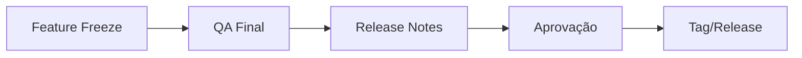

## Política de Releases

### Tipos de Release

| Tipo | Frequência | Conteúdo |
|------|------------|----------|
| **Regular** | Quinzenal | Features planejadas |
| **Patch** | Conforme necessário | Bug fixes |
| **Hotfix** | Emergencial | Correções críticas |

### Versionamento

Seguimos Semantic Versioning (SemVer):

```
MAJOR.MINOR.PATCH

Exemplo: 2.5.3
- MAJOR (2): Breaking changes
- MINOR (5): Novas features (backward compatible)
- PATCH (3): Bug fixes
```

## Processo de Release

### 1. Preparação



**Feature Freeze:**
- 2 dias antes da release
- Apenas bug fixes após este ponto

### 2. Release Notes

Template:

```markdown
# Release v2.5.0

**Data**: DD/MM/YYYY

## ✨ Novas Funcionalidades

### [Módulo] Título da Feature
Descrição breve da funcionalidade.

## 🐛 Correções

- [TICKET-123] Descrição do bug corrigido
- [TICKET-124] Outra correção

## 🔧 Melhorias

- Melhoria de performance em X
- Atualização de dependências

## ⚠️ Breaking Changes

- Descrição da mudança que quebra compatibilidade
- Como migrar

## 📝 Notas

Informações adicionais relevantes.
```

### 3. Deploy de Release

```bash
# Criar tag
git tag -a v2.5.0 -m "Release v2.5.0"
git push origin v2.5.0

# Deploy é automático via CI/CD
```

### 4. Comunicação

**Canais:**
- Changelog no produto
- Email para clientes (features relevantes)
- Slack interno
- Status page (se necessário)

## Manutenção do Changelog

### Arquivo CHANGELOG.md

```markdown
# Changelog

Todas as mudanças notáveis do projeto.

## [Unreleased]

### Added
- Nova feature em desenvolvimento

## [2.5.0] - 2024-01-15

### Added
- Feature X para módulo Y

### Changed
- Comportamento Z foi alterado

### Fixed
- Bug no cálculo de métricas

### Removed
- Feature deprecated removida
```

### Boas Práticas

1. **Atualizar durante desenvolvimento**: Não deixar para o final
2. **Linguagem clara**: Escrever para o usuário final
3. **Links para docs**: Referenciar documentação detalhada
4. **Screenshots/GIFs**: Para features visuais

## Changelog no Produto

### Estrutura

```typescript
interface ChangelogEntry {
  version: string;
  date: string;
  categories: {
    type: 'added' | 'changed' | 'fixed' | 'removed';
    items: ChangelogItem[];
  }[];
}

interface ChangelogItem {
  title: string;
  description: string;
  module?: string;
  link?: string;
  image?: string;
}
```

### Exibição

- Badge de "Novo" para features recentes
- Modal de novidades ao primeiro acesso após update
- Página dedicada de changelog

## Rollback de Release

Se necessário reverter uma release:

1. Comunicar time e stakeholders
2. Executar rollback (ver Playbook de Rollback)
3. Atualizar changelog com nota
4. Investigar causa raiz
5. Planejar nova release corretiva

## Métricas de Release

| Métrica | Meta |
|---------|------|
| Tempo de deploy | < 15 min |
| Rollbacks/mês | < 1 |
| Bugs pós-release | < 3 por release |
| Tempo de correção | < 24h para críticos |
