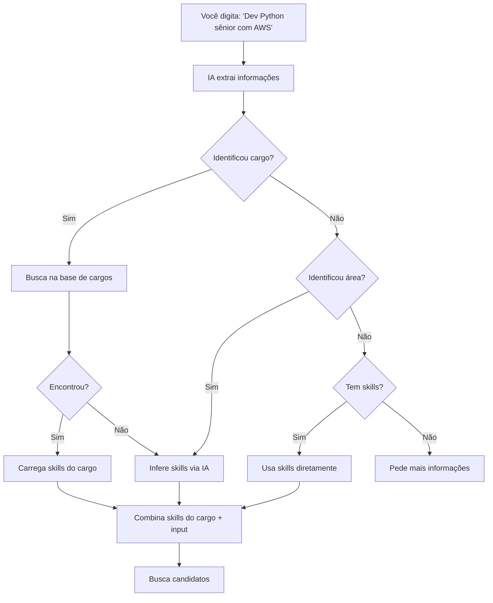

## Visão Geral

A busca por texto é a forma mais flexível de usar o Matchmaker. Você descreve o que precisa em linguagem natural e a IA extrai as informações relevantes automaticamente.

---

## Estrutura Ideal de uma Query

Para melhores resultados, inclua:

1. **Cargo/função** (mais importante)
2. **Skills específicas** (técnicas ou comportamentais)
3. **Senioridade** (opcional, mas recomendado)

### Fórmula

```
[Cargo] [senioridade] com [skill 1], [skill 2] e [skill 3]
```

---

## Exemplos por Qualidade

### Excelente (cargo + skills + senioridade)

| Query | Por que funciona |
|-------|-----------------|
| "Desenvolvedor Python sênior com microsserviços, AWS e FastAPI" | Cargo claro, 3 skills específicas, senioridade |
| "Product Manager pleno com foco em dados, SQL e analytics" | Cargo específico, skills relevantes, senioridade |
| "Designer UX/UI sênior com Figma, Design System e pesquisa com usuário" | Cargo preciso, skills do dia a dia |

### Bom (cargo + skills)

| Query | O que pode melhorar |
|-------|-------------------|
| "Desenvolvedor fullstack com React e Node.js" | Adicionar senioridade |
| "Analista de dados com Python e Power BI" | Adicionar mais skills |

### Razoável (apenas cargo)

| Query | O que pode melhorar |
|-------|-------------------|
| "Product Manager" | Adicionar skills e senioridade |
| "Desenvolvedor" | Muito genérico — especificar linguagem/área |

### Fraco (muito vago)

| Query | Problema |
|-------|----------|
| "Alguém de TI" | Não identifica cargo nem skills |
| "Preciso de ajuda" | Nenhuma informação útil |

<Tip>
  Quanto mais informação você fornecer, melhor será o resultado. O sistema funciona mesmo com pouca informação, mas a qualidade do match melhora com queries específicas.
</Tip>

---

## Tipos de Descrição

### Lista de Skills

Se você sabe exatamente quais skills precisa, pode listar diretamente:

```
Python, React, Docker, Kubernetes, PostgreSQL, CI/CD
```

O sistema não vai buscar um cargo — vai normalizar essas skills e buscar candidatos que as possuem.

### Descrição Narrativa

Descreva o que a pessoa vai fazer:

```
Preciso de alguém para liderar nosso time de backend. A pessoa vai 
trabalhar com Python, desenhar APIs REST e gerenciar deployments em AWS.
Ideal que tenha experiência com microsserviços e Docker.
```

A IA vai extrair: role="Tech Lead Backend", skills=["Python", "APIs REST", "AWS", "microsserviços", "Docker"].

### Cargo Específico

Se você tem um cargo bem definido:

```
Engenheiro de Machine Learning sênior
```

O sistema busca o cargo na base taxonômica e carrega as skills associadas automaticamente.

---

## Dicas Avançadas

### Especifique a Área

Inclua a área funcional quando o cargo for ambíguo:

| Vago | Específico |
|------|-----------|
| "Analista" | "Analista de Dados da área de BI" |
| "Engenheiro" | "Engenheiro de Software" |
| "Gerente" | "Gerente de Projetos de TI" |

### Use Nomes em Português ou Inglês

O sistema entende ambos:

| Português | Inglês |
|-----------|--------|
| "Desenvolvedor" | "Developer" |
| "Gerente de Produto" | "Product Manager" |
| "Cientista de Dados" | "Data Scientist" |

### Combine Soft e Hard Skills

```
Tech Lead com React, Node.js, gestão de equipes e comunicação assertiva
```

### Mencione Ferramentas Específicas

```
Designer com Figma, Adobe XD, Sketch e prototipagem
```

---

## O que Acontece Internamente



---

## Problemas Comuns

### "Poucos candidatos encontrados"

**Solução**: Tente uma query mais ampla — remova skills muito específicas ou reduza o nível de senioridade.

### "A IA não entendeu meu pedido"

**Solução**: Seja mais direto. Em vez de "preciso de alguém que faça coisas legais com computador", tente "Desenvolvedor Frontend com React".

### "Skills não reconhecidas"

**Solução**: Use nomes comuns das skills. "JS" pode não ser reconhecido, mas "JavaScript" sim. O sistema tem aliases, mas nem todos os apelidos estão cadastrados.
