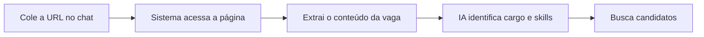

## Visão Geral

O Matchmaker pode extrair automaticamente o conteúdo de uma URL de vaga, identificar o cargo e as skills necessárias, e buscar candidatos compatíveis — tudo a partir de um simples link colado no chat.

---

## Como Funciona?



1. Você cola o link da vaga no chat
2. O sistema acessa a página e extrai o conteúdo
3. A IA lê a descrição e identifica cargo, skills e senioridade
4. O pipeline de matching roda normalmente

---

## Sites Suportados

O scraper é **genérico** — funciona com qualquer site público que tenha a descrição da vaga no HTML. Sites mais comuns:

| Site | Exemplo de URL |
|------|---------------|
| **LinkedIn Jobs** | `https://linkedin.com/jobs/view/123456789` |
| **Greenhouse** | `https://job-boards.greenhouse.io/empresa/jobs/123` |
| **Gupy** | `https://empresa.gupy.io/job/eyJqb2JJZCI6...` |
| **Lever** | `https://jobs.lever.co/empresa/uuid-da-vaga` |
| **Indeed** | `https://indeed.com/viewjob?jk=abc123` |
| **Outros** | Qualquer URL pública com descrição de vaga |

---

## Formas de Usar

### Apenas o Link

```
https://linkedin.com/jobs/view/123456789
```

O sistema detecta que é uma URL, faz scraping e processa.

### Link com Contexto

```
Quero alguém para essa vaga, mas com foco em liderança: https://linkedin.com/jobs/view/123456789
```

A IA combina o conteúdo da vaga com o contexto adicional que você forneceu.

### Link + Skills Extras

```
Essa vaga https://greenhouse.io/job/123 mas também precisa saber Docker e Kubernetes
```

O sistema extrai da URL e **adiciona** as skills extras mencionadas.

---

## O que Você Vê no Chat

Quando faz uma busca com URL, o chat mostra mensagens de progresso específicas:

| Ordem | Mensagem |
|-------|----------|
| 1 | "Capturando dados da página..." |
| 2 | "Ainda estamos trabalhando..." |
| 3 | "Extraindo conteúdo..." |
| 4 | "URL scrapeada com sucesso" |
| 5 | "Cargo: [identificado da URL]" |
| 6 | "X skills identificadas" |
| 7... | Processamento normal |

---

## Dicas para Melhores Resultados

<CardGroup cols={2}>
  <Card title="Use links diretos" icon="link">
    Prefira o link direto da vaga, não o link de listagem ou busca
  </Card>
  <Card title="Vagas públicas" icon="globe">
    O sistema só acessa páginas públicas — vagas que exigem login não funcionam
  </Card>
  <Card title="Adicione contexto" icon="plus">
    Se a vaga não tem todas as informações, complemente com texto
  </Card>
  <Card title="Verifique o link" icon="check">
    Links quebrados ou expirados não podem ser processados
  </Card>
</CardGroup>

---

## Quando o Scraping Falha

Se o sistema não consegue acessar a URL, você verá:

> "Não foi possível analisar a URL enviada. Verifique se ela está correta ou copie e cole a descrição da vaga."

### Causas Comuns

| Causa | Solução |
|-------|---------|
| Site bloqueia scraping | Cole a descrição da vaga manualmente |
| URL expirada | Busque o link atualizado da vaga |
| Site requer login | Copie o texto da vaga e cole no chat |
| URL inválida | Verifique se o link está completo |
| Timeout | Tente novamente ou cole o texto |

### Alternativa: Copiar e Colar

Se o link não funcionar, copie o texto completo da descrição da vaga e cole diretamente no chat. O sistema processará como texto normal e extrairá as mesmas informações.

<Tip>
  Copiar e colar a descrição da vaga muitas vezes dá resultados **melhores** do que o link, pois evita problemas de scraping e garante que todo o conteúdo seja processado.
</Tip>

---

## Comparação: URL vs Texto

| Aspecto | URL | Texto |
|---------|-----|-------|
| **Velocidade** | Mais lento (~2-5s extra) | Mais rápido |
| **Conteúdo** | Depende do site | Você controla |
| **Confiabilidade** | Pode falhar | Sempre funciona |
| **Conveniência** | Só colar o link | Precisa copiar texto |
| **Informação** | Toda a descrição | O que você copiar |

---

## Próximos Passos

<CardGroup cols={2}>
  <Card title="Analisar Resultados" icon="chart-bar" href="/guides/app-rh/matchmaker-analisar-resultados">
    Como interpretar os candidatos encontrados
  </Card>
  <Card title="FAQ" icon="circle-question" href="/guides/app-rh/matchmaker-faq">
    Perguntas frequentes
  </Card>
</CardGroup>
