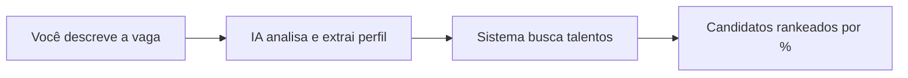

## O que é o Matchmaker?

O Matchmaker é uma ferramenta de **inteligência artificial** integrada à plataforma Leapy que ajuda profissionais de RH a encontrar talentos compatíveis com vagas ou perfis desejados. Funciona como um **chat inteligente** — você descreve o que precisa e o sistema encontra os melhores candidatos automaticamente.

## Como Funciona?

1. **Você descreve** o que precisa — digitando um texto, colando um link de vaga, ou listando skills
2. **A IA analisa** seu pedido e identifica o cargo, as skills e a senioridade
3. **O sistema busca** na base de talentos quem tem o perfil mais compatível
4. **Você recebe** uma lista de candidatos ordenada por percentual de compatibilidade

## Quando Usar?

<CardGroup cols={2}>
  <Card title="Preencher uma vaga" icon="briefcase">
    Quando precisa encontrar talentos internos para uma posição aberta
  </Card>
  <Card title="Explorar perfis" icon="magnifying-glass">
    Quando quer conhecer que talentos estão disponíveis para determinada área
  </Card>
  <Card title="Validar requisitos" icon="clipboard-check">
    Quando quer ver se há talentos com um conjunto específico de skills
  </Card>
  <Card title="Staffing de projetos" icon="users">
    Quando precisa montar um time para um projeto específico
  </Card>
</CardGroup>

## O que Você Pode Buscar?

| Tipo de busca | Exemplo |
|---------------|---------|
| **Cargo + skills** | "Desenvolvedor Python sênior com AWS e Docker" |
| **Link de vaga** | Cole o link de uma vaga do LinkedIn, Gupy, Greenhouse, etc. |
| **Apenas skills** | "Python, React, Node.js, PostgreSQL" |
| **Descrição livre** | "Preciso de alguém da área de dados com foco em machine learning" |
| **Misto** | "Quero alguém para essa vaga: https://..." |

## O que Você Recebe?

Para cada busca, o Matchmaker retorna:

### Progresso em Tempo Real

Enquanto processa, você vê mensagens como:
- "Analisando entrada..."
- "Cargo: Desenvolvedor Python"
- "8 skills identificadas"
- "Buscando candidatos..."

### Skills Utilizadas

Separadas em grupos:
- **Skills do Input**: o que você pediu
- **Skills do Cargo**: skills típicas do cargo identificado
- **Total**: todas as skills usadas na busca

### Lista de Candidatos

Para cada candidato:
- **Nome** e cargo atual
- **Percentual de match** (ex: 85%)
- **Skills em comum** com o que foi buscado
- **Explicação** de por que é compatível

## Acesso

O Matchmaker está disponível no menu lateral da plataforma:

**Rota**: `/{sua-empresa}/matchmaker`

<Note>
  O acesso ao Matchmaker requer permissão de **RH** ou **Admin** na plataforma.
</Note>

## Próximos Passos

<CardGroup cols={2}>
  <Card title="Quickstart" icon="rocket" href="/guides/app-rh/matchmaker-quickstart">
    Faça sua primeira busca em 2 minutos
  </Card>
  <Card title="Busca por Texto" icon="keyboard" href="/guides/app-rh/matchmaker-busca-por-texto">
    Dicas para melhores resultados
  </Card>
  <Card title="Busca por URL" icon="link" href="/guides/app-rh/matchmaker-busca-por-url">
    Como usar links de vagas
  </Card>
  <Card title="Analisar Resultados" icon="chart-bar" href="/guides/app-rh/matchmaker-analisar-resultados">
    Como interpretar os resultados
  </Card>
</CardGroup>
