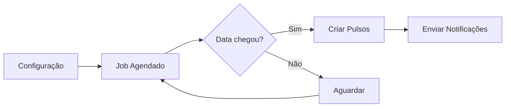

## Como Funciona o Agendamento

O sistema de Pulsos possui **agendamento automático** que cria pulsos periodicamente sem necessidade de intervenção manual.

### Componentes do Agendamento



1. **Configuração**: Você define cadência e próxima data
2. **Job Verifica**: Job do Inngest roda diariamente verificando datas
3. **Criação**: Na data configurada, pulsos são criados automaticamente
4. **Notificação**: Emails são enviados aos destinatários

---

## Configurar Cadência

Acesse **Pulsos > Configuração > Agendamento**

### Opções de Cadência

| Cadência | Configuração | Uso Recomendado |
|----------|--------------|-----------------|
| **Mensal** | 1 mês | Acompanhamento intensivo (programas curtos) |
| **Bimestral** | 2 meses | Equilíbrio entre frequência e sobrecarga |
| **Trimestral** | 3 meses | ✅ Padrão recomendado (programas 18-24 meses) |
| **Semestral** | 6 meses | Programas longos (24+ meses) |
| **Anual** | 12 meses | Apenas para pulsos de RH |

<Tip>
  **Recomendação**: Cadência **trimestral** (3 meses) para programas de estágio/aprendizagem. Permite capturar evolução sem sobrecarregar os participantes.
</Tip>

### Como Escolher a Cadência

Considere:

1. **Duração do programa**: Programas de 18 meses = 5 pulsos trimestrais
2. **Carga dos participantes**: Não sobrecarregar com pesquisas frequentes
3. **Ciclos de avaliação**: Alinhar com reviews de performance da empresa

---

## Definir Próxima Data

### Boas Práticas

<CardGroup cols={2}>
  <Card title="Primeiro dia do mês" icon="calendar">
    Facilita planejamento e comunicação
  </Card>
  <Card title="Evite final de mês" icon="ban">
    Período de fechamento, menor engajamento
  </Card>
  <Card title="Considere feriados" icon="champagne-glasses">
    Não programe para semanas com feriados
  </Card>
  <Card title="Alinhe com eventos" icon="handshake">
    Programe após feedbacks ou reviews formais
  </Card>
</CardGroup>

### Calculadora de Datas

Para programa de **18 meses com 5 pulsos trimestrais**:

```
Início: 01/01/2024
Término: 30/06/2025

Pulso 1: 01/01/2024 (início)
Pulso 2: 01/04/2024 (+3 meses)
Pulso 3: 01/07/2024 (+3 meses)
Pulso 4: 01/10/2024 (+3 meses)
Pulso 5: 01/01/2025 (+3 meses)
```

---

## Prazos de Resposta

### Configuração de Prazo

O prazo padrão é **7 dias** para resposta. Você pode ajustar conforme necessidade:

| Prazo | Quando usar |
|-------|-------------|
| **3 dias** | Pulsos urgentes ou curtos |
| **7 dias** | ✅ Padrão recomendado |
| **14 dias** | Pulsos extensos ou períodos de férias |

### Timeline de um Pulso

```
Dia 0:  Pulso criado (status: agendado)
Dia 0:  Notificação enviada
Dia 0:  Status muda para pendente
Dia 3:  Primeiro lembrete
Dia 6:  Segundo lembrete
Dia 7:  Vencimento (se não respondido → vencido)
```

---

## Pausar ou Retomar Agendamento

### Pausar Temporariamente

Use quando:
- Período de férias coletivas
- Reestruturação da empresa
- Ajustes no programa

**Como fazer:**

1. Acesse **Pulsos > Configuração**
2. Clique no botão **Pausar Agendamento**
3. Confirme a ação

<Warning>
  Pulsos já criados não são afetados. A pausa afeta apenas criações futuras.
</Warning>

### Retomar Agendamento

1. Acesse **Pulsos > Configuração**
2. Clique em **Retomar Agendamento**
3. Ajuste a **Próxima Data** se necessário
4. Salve

---

## Visualizar Próximos Pulsos

Na tela de configuração, você verá:

### Calendário de Criação

```
Próximos pulsos programados:

📅 01/04/2024 - Pulso 2
   • 25 jovens
   • 5 lideranças
   
📅 01/07/2024 - Pulso 3
   • 25 jovens
   • 5 lideranças
   
📅 01/10/2024 - Pulso 4
   • 25 jovens
   • 5 lideranças
```

### Status do Agendamento

- ✅ **Ativo**: Próximo pulso será criado na data programada
- ⏸️ **Pausado**: Nenhum pulso será criado automaticamente
- ⚠️ **Atenção**: Data passada, ajuste a próxima data

---

## Alterar Cadência

Você pode alterar a cadência a qualquer momento:

### Cenário: De Trimestral para Mensal

<Steps>
  <Step title="Acessar Configuração">
    Vá em **Pulsos > Configuração > Agendamento**
  </Step>
  
  <Step title="Alterar Cadência">
    Mude de **"3 meses"** para **"1 mês"**
  </Step>
  
  <Step title="Ajustar Próxima Data">
    Defina quando quer o próximo pulso
  </Step>
  
  <Step title="Salvar">
    O sistema recalculará automaticamente os próximos ciclos
  </Step>
</Steps>

<Note>
  A mudança afeta apenas pulsos futuros. Pulsos já criados mantêm suas datas originais.
</Note>

---

## Jobs Automáticos Relacionados

Estes jobs rodam automaticamente sem intervenção:

| Job | Quando executa | O que faz |
|-----|----------------|-----------|
| `create-pulsos-jovens` | Diariamente | Verifica data e cria pulsos de jovens |
| `create-pulsos-liderancas` | Diariamente | Verifica data e cria pulsos de lideranças |
| `update-status-to-pendente` | Diariamente | Muda pulsos agendados para pendente |
| `update-status-to-vencido` | A cada hora | Marca pulsos expirados como vencido |
| `send-lembretes` | Diariamente 10h | Envia lembretes de pulsos pendentes |

<Tip>
  Não se preocupe com esses jobs. Eles rodam automaticamente em background.
</Tip>

---

## Troubleshooting

### Pulsos não foram criados na data

**Possíveis causas:**

1. Agendamento está pausado
2. Não há talentos ativos no sistema
3. Data configurada está incorreta

**Como verificar:**

1. Acesse **Pulsos > Configuração**
2. Verifique se está **"Ativo"**
3. Confira a **"Próxima Data"**
4. Veja os logs no dashboard

### Como criar pulso manualmente

Se precisar criar pulsos fora do agendamento:

<Warning>
  Criação manual é desencorajada. Prefira ajustar o agendamento automático.
</Warning>

1. Acesse o **Backoffice (Directus)**
2. Vá em **Collections > pulsos_jovens**
3. Clique em **Create Item**
4. Preencha os campos obrigatórios
5. Salve

Consulte o [guia de operações do Backoffice](/guides/backoffice/pulsos-operacoes) para mais detalhes.

---

## Próximos Passos

<CardGroup cols={2}>
  <Card title="Visualizar Pulsos" icon="table" href="/guides/app-rh/pulsos-visualizar-editar">
    Gerenciar pulsos existentes
  </Card>
  <Card title="Analisar Resultados" icon="chart-line" href="/guides/app-rh/pulsos-analisar-resultados">
    Ver dashboards e métricas
  </Card>
  <Card title="FAQ" icon="question" href="/guides/app-rh/pulsos-faq">
    Perguntas frequentes
  </Card>
  <Card title="API Reference" icon="code" href="/api-reference/backoffice/pulsos-configuracao">
    Detalhes técnicos da API
  </Card>
</CardGroup>
