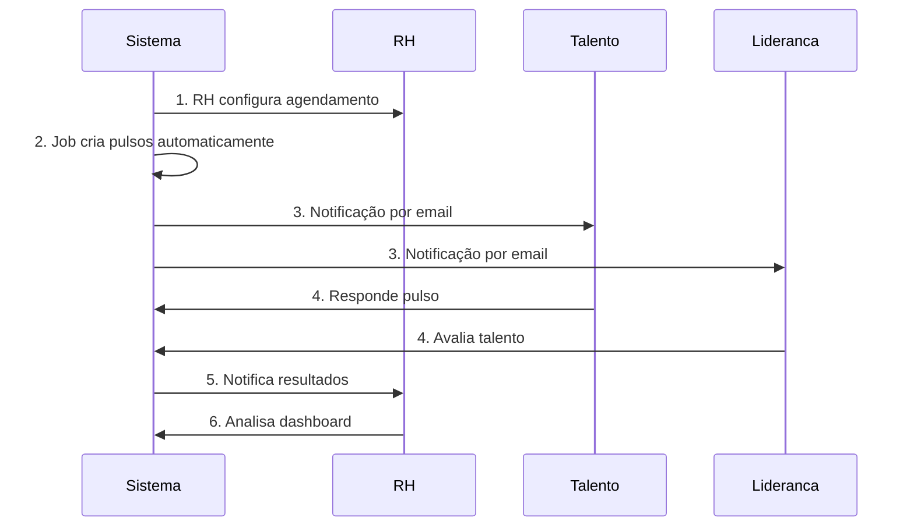
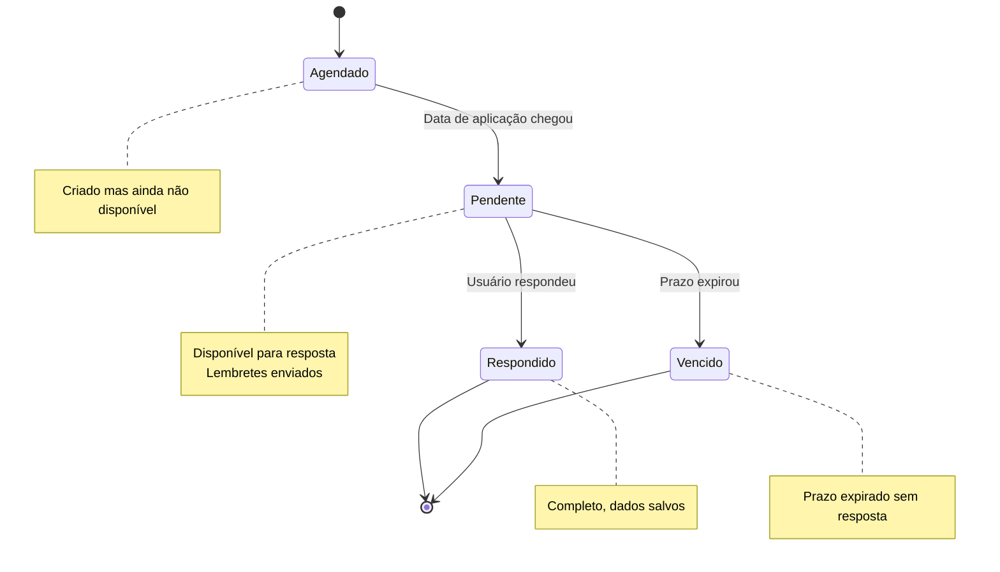

## O que são Pulsos?

Pulsos são **pesquisas periódicas** aplicadas ao longo do programa de estágio/aprendizagem para medir engajamento, satisfação e desempenho de forma contínua. Diferente de avaliações pontuais, os pulsos capturam a evolução dos talentos ao longo do tempo.

## Para que servem?

<CardGroup cols={2}>
  <Card title="Medir Engajamento" icon="heart">
    Avaliar o nível de conexão emocional dos talentos com a empresa e com a Leapy
  </Card>
  <Card title="Identificar Problemas" icon="triangle-exclamation">
    Detectar precocemente insatisfação, desmotivação ou conflitos
  </Card>
  <Card title="Avaliar Desempenho" icon="chart-line">
    Acompanhar evolução de competências e performance ao longo do tempo
  </Card>
  <Card title="Orientar Efetivação" icon="briefcase">
    Fornecer dados objetivos para decisões de contratação
  </Card>
</CardGroup>

## Tipos de Pulsos

O sistema Leapy possui **3 tipos** de pulsos, cada um com propósito específico:

### 1. Pulsos de Jovens

**Quem responde:** Talentos (estagiários e aprendizes)  
**Sobre o quê:** Autoavaliação, satisfação com empresa e Leapy, relação com liderança  
**Frequência típica:** Trimestral (a cada 3 meses)  
**Total no programa:** 5 pulsos

#### Principais perguntas:

- NPS Leapy e NPS Empresa (0-10)
- Relação com a liderança (0-10)
- Avaliação de tarefas e desafios (0-10)
- Desejo de efetivação (0-10)
- Perguntas Sim/Não sobre expectativas e aprendizado
- Feedback e depoimentos abertos

<Tip>
  Pulsos de jovens são fundamentais para identificar talentos de alto potencial e detectar riscos de evasão.
</Tip>

### 2. Pulsos de Lideranças

**Quem responde:** Gestores diretos dos talentos  
**Sobre o quê:** Avaliação de desempenho, comportamento e probabilidade de efetivação  
**Frequência típica:** Trimestral (alinhado com pulsos de jovens)  
**Total no programa:** 5 pulsos

#### Principais perguntas:

- Performance (Abaixo / Dentro / Acima)
- Probabilidade de efetivação (Alta / Média / Baixa / Nenhuma)
- Recontrataria? (Sim / Não / Talvez)
- Depoimento detalhado sobre o talento
- Pontos fortes e áreas de melhoria

<Warning>
  Respostas de lideranças são confidenciais. O talento não tem acesso direto a essas avaliações.
</Warning>

### 3. Pulsos de RH

**Quem responde:** Time de RH da empresa  
**Sobre o quê:** Satisfação com a parceria Leapy e uso da plataforma  
**Frequência típica:** Semestral ou anual  
**Propósito:** Melhoria contínua dos serviços Leapy

#### Principais perguntas:

- NPS Leapy (0-10)
- Qualidade de reports e comunicação (0-10)
- Frequência de uso da plataforma
- Probabilidade de recontratação da Leapy
- Sugestões de melhoria

---

## Fluxo Geral do Sistema

## Como Funcionam os Pulsos

### Ciclo de Vida de um Pulso

### Timeline de um Pulso

| Momento | O que acontece |
|---------|----------------|
| **T-2 dias** | Notificação de abertura enviada |
| **T=0** | Pulso fica disponível (status: pendente) |
| **T+3 dias** | Primeiro lembrete enviado |
| **T+6 dias** | Segundo lembrete enviado |
| **T+7 dias** | Data de vencimento (prazo típico) |
| **T+7 dias** | Pulso fecha automaticamente se não respondido |

---

## Características Importantes

### Anonimato e Privacidade

- **Pulsos de jovens**: Identificados (liderança e RH veem quem respondeu)
- **Pulsos de lideranças**: Confidenciais (apenas RH tem acesso)
- **Pulsos de RH**: Identificados por empresa

### Não é Possível Editar Respostas

<Warning>
  Uma vez enviado, não é possível alterar as respostas. Certifique-se de revisar antes de enviar.
</Warning>

### Prazo Típico

- **Jovens**: 7 dias para responder
- **Lideranças**: 7 dias para avaliar
- **RH**: 14 dias para responder

### Notificações Automáticas

- Email na abertura do pulso
- Lembretes a cada 3 dias (configurável)
- Notificação ao RH sobre taxa de resposta

---

## Benefícios dos Pulsos

### Para o Talento

- Dar feedback sobre a experiência
- Ser ouvido pela liderança e RH
- Influenciar decisões de efetivação
- Crescer com base em feedback estruturado

### Para a Liderança

- Avaliar talentos de forma sistemática
- Identificar necessidades de desenvolvimento
- Ter histórico de evolução
- Fundamentar decisões de efetivação

### Para o RH

- Visão consolidada de toda a turma
- Identificar tendências e padrões
- Agir proativamente em problemas
- Dados objetivos para relatórios

---

## Próximos Passos

<CardGroup cols={2}>
  <Card title="Quickstart para RH" icon="rocket" href="/guides/app-rh/pulsos-quickstart-rh">
    Crie seu primeiro pulso em 5 minutos
  </Card>
  <Card title="Como Responder (Talento)" icon="user" href="/guides/app-rh/pulsos-responder-talento">
    Guia para talentos
  </Card>
  <Card title="Como Avaliar (Liderança)" icon="users" href="/guides/app-rh/pulsos-responder-lideranca">
    Guia para lideranças
  </Card>
  <Card title="Analisar Resultados" icon="chart-pie" href="/guides/app-rh/pulsos-analisar-resultados">
    Como interpretar os dados
  </Card>
</CardGroup>
