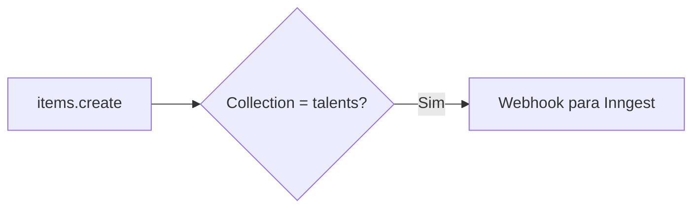

## Visão Geral

Flows são automações internas do Directus que respondem a eventos e executam ações.

## Acessando Flows

1. No menu lateral, acesse **Settings**
2. Clique em **Flows**
3. Visualize os flows existentes ou crie novos

## Tipos de Trigger

### Event Hook

Dispara quando um evento ocorre em uma collection.

| Evento | Descrição |
|--------|-----------|
| `items.create` | Registro criado |
| `items.update` | Registro atualizado |
| `items.delete` | Registro deletado |

**Exemplo: Notificar ao criar talento**



### Schedule

Execução agendada via cron.

**Exemplos de cron:**
- `0 10 * * *` - Diariamente às 10h
- `0 0 * * 1` - Toda segunda às 00h
- `*/15 * * * *` - A cada 15 minutos

### Webhook

Recebe requisições HTTP externas.

### Manual

Executado manualmente pelo usuário.

## Operações Disponíveis

### Condition

Lógica condicional para filtrar fluxo.

```json
{
  "$trigger": {
    "collection": {
      "_eq": "talents"
    }
  }
}
```

### Request (Webhook)

Faz chamadas HTTP para sistemas externos.

```json
{
  "url": "https://api.inngest.com/e/key",
  "method": "POST",
  "body": {
    "name": "talent.created",
    "data": {
      "talent_id": "{{$trigger.key}}"
    }
  }
}
```

### Transform

Transforma dados entre operações.

```json
{
  "json": {
    "id": "{{$trigger.key}}",
    "email": "{{$trigger.payload.email}}",
    "full_name": "{{$trigger.payload.first_name}} {{$trigger.payload.last_name}}"
  }
}
```

### Run Script

Executa código JavaScript.

```javascript
module.exports = async function(data) {
  const { trigger } = data;
  
  // Lógica customizada
  const result = processData(trigger.payload);
  
  return result;
};
```

### Send Notification

Envia notificações internas do Directus.

## Flows Ativos

### talent-created

**Trigger**: `items.create` em `talents`

**Ações**:
1. Envia evento para Inngest
2. Registra log de auditoria

### pulse-status-changed

**Trigger**: `items.update` em `pulses` (quando `status` muda)

**Ações**:
1. Se `status = active`: Notifica Inngest para disparar notificações
2. Se `status = closed`: Notifica Inngest para processar resultados

### opportunity-published

**Trigger**: `items.update` em `opportunities` (quando `status = published`)

**Ações**:
1. Notifica Inngest para calcular matches
2. Envia notificações para talentos elegíveis

## Criando um Flow

### 1. Definir Trigger

1. Clique em **Create Flow**
2. Nomeie o flow
3. Selecione o tipo de trigger
4. Configure os parâmetros

### 2. Adicionar Operações

1. Clique no **+** após o trigger
2. Selecione a operação
3. Configure os parâmetros
4. Conecte as operações

### 3. Testar

1. Use o botão **Run** (para triggers manuais)
2. Ou dispare o evento em staging
3. Verifique os logs

### 4. Ativar

1. Verifique se está **Active**
2. Salve o flow

## Boas Práticas

1. **Nomeie claramente**: `[collection]-[action]-[description]`
2. **Documente**: Use a descrição do flow
3. **Teste em staging**: Nunca teste flows novos em produção
4. **Logs**: Adicione operações de log para debugging
5. **Error handling**: Trate erros com conditions

<Warning>
  Alterações em flows podem afetar o sistema. Sempre coordene com engenharia.
</Warning>

## Debugging

### Logs

Acesse **Settings > Logs** para ver execuções.

### Activity Log

Verifique **Activity** para ver ações recentes.

### Inngest Dashboard

Se o flow chama Inngest, verifique o dashboard para ver se os eventos chegaram.
