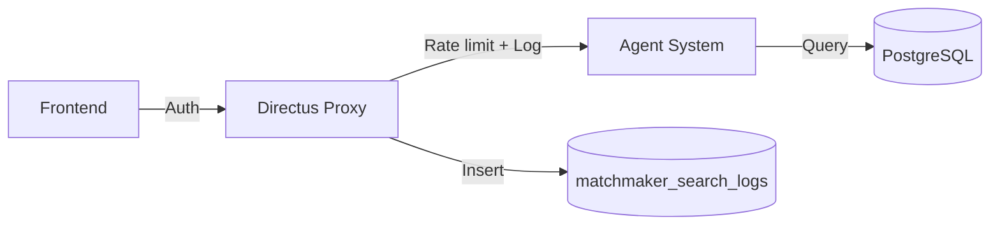

## Visão Geral

Este guia cobre as operações do dia a dia do Matchmaker no Directus, incluindo monitoramento de logs, diagnóstico de problemas e manutenção da base taxonômica.

---

## Arquitetura Operacional



O Directus é o ponto central de controle — toda requisição passa por ele, e toda busca é logada automaticamente.

---

## Monitorar Logs de Busca

### Acessar via Supabase

A tabela `matchmaker_search_logs` no Supabase contém o histórico completo de todas as buscas.

**Volume esperado**: Cada busca gera 1 registro com a resposta completa em JSONB.

### Queries de Monitoramento

**Buscas das últimas 24 horas:**
```sql
SELECT
  date_created,
  user_id,
  query,
  success,
  execution_time_ms,
  candidates_found
FROM matchmaker_search_logs
WHERE date_created > NOW() - INTERVAL '24 hours'
ORDER BY date_created DESC;
```

**Taxa de erro por dia:**
```sql
SELECT
  DATE_TRUNC('day', date_created) as dia,
  COUNT(*) as total,
  COUNT(CASE WHEN success = false THEN 1 END) as erros,
  ROUND(COUNT(CASE WHEN success = false THEN 1 END)::numeric / COUNT(*) * 100, 1) as taxa_erro
FROM matchmaker_search_logs
WHERE date_created > NOW() - INTERVAL '7 days'
GROUP BY dia
ORDER BY dia DESC;
```

**Buscas lentas (> 10 segundos):**
```sql
SELECT request_id, user_id, query, execution_time_ms
FROM matchmaker_search_logs
WHERE execution_time_ms > 10000
  AND date_created > NOW() - INTERVAL '7 days'
ORDER BY execution_time_ms DESC;
```

**Erros recentes:**
```sql
SELECT request_id, user_id, query, error_message, date_created
FROM matchmaker_search_logs
WHERE success = false
  AND date_created > NOW() - INTERVAL '24 hours'
ORDER BY date_created DESC;
```

---

## Configuração do Ambiente

### Variáveis de Ambiente do Directus

| Variável | Descrição | Obrigatória |
|----------|-----------|-------------|
| `AGENT_SYSTEM_URL` | URL do Agent System | Sim |

<Warning>
  Se `AGENT_SYSTEM_URL` não estiver configurada, o Matchmaker retorna HTTP 503 para todas as requisições.
</Warning>

### Verificar Conectividade

Para verificar se o Agent System está acessível:

```bash
curl -s https://AGENT_SYSTEM_URL/matchmaker/health
```

Resposta esperada:
```json
{"status": "healthy", "service": "matchmaker"}
```

---

## Rate Limiting

### Configuração Atual

| Parâmetro | Valor |
|-----------|-------|
| Máximo | 10 requisições por minuto |
| Janela | 60 segundos |
| Key | `matchmaker:{userId}` |

### Identificar Usuários com Rate Limit

```sql
SELECT
  du.first_name || ' ' || du.last_name as usuario,
  COUNT(*) as buscas_no_ultimo_minuto
FROM matchmaker_search_logs msl
JOIN directus_users du ON du.id = msl.user_id
WHERE msl.date_created > NOW() - INTERVAL '1 minute'
GROUP BY du.id, du.first_name, du.last_name
ORDER BY buscas_no_ultimo_minuto DESC;
```

---

## Manutenção da Base Taxonômica

A qualidade do matching depende da base taxonômica. Ações periódicas:

### Adicionar Role Aliases

Quando usuários buscam por nomes de cargo que não são encontrados:

```sql
INSERT INTO role_aliases (role_id, alias)
VALUES
  (123, 'PM'),
  (123, 'Gerente de Produto'),
  (456, 'Dev'),
  (456, 'Programador');
```

**Como identificar aliases faltantes**: Busque nos logs por buscas onde `flow_decision.role_found = false`:

```sql
SELECT
  query,
  response_data->'input_analysis'->>'role' as role_extraido,
  COUNT(*) as vezes
FROM matchmaker_search_logs
WHERE success = true
  AND (response_data->'flow_decision'->>'role_found')::boolean = false
  AND response_data->'input_analysis'->>'role' IS NOT NULL
  AND date_created > NOW() - INTERVAL '30 days'
GROUP BY query, role_extraido
ORDER BY vezes DESC
LIMIT 20;
```

### Adicionar Skill Aliases

```sql
INSERT INTO skill_aliases (skill_id, alias)
VALUES
  (789, 'PowerBI'),
  (789, 'PBI'),
  (101, 'JS'),
  (101, 'ES6');
```

### Revisar Skills Pendentes

Skills novas detectadas pelo normalizer ficam com status `pending`:

```sql
SELECT id, name, category, date_created
FROM skills
WHERE status = 'pending'
ORDER BY date_created DESC;
```

Para ativar:
```sql
UPDATE skills SET status = 'active' WHERE id IN (lista_de_ids);
```

---

## Limpeza e Manutenção

### Limpeza de Logs Antigos

Os logs crescem continuamente. Recomenda-se manter os últimos 90 dias:

```sql
DELETE FROM matchmaker_search_logs
WHERE date_created < NOW() - INTERVAL '90 days';
```

<Tip>
  Antes de limpar, exporte os dados agregados para relatórios históricos.
</Tip>

### Verificar Saúde dos Índices

```sql
SELECT
  indexrelname as indice,
  idx_scan as scans,
  idx_tup_read as leituras,
  idx_tup_fetch as fetches
FROM pg_stat_user_indexes
WHERE schemaname = 'public'
  AND relname IN ('roles', 'skills', 'role_aliases', 'skill_aliases', 'matchmaker_search_logs')
ORDER BY idx_scan DESC;
```

---

## Checklist Operacional

| Frequência | Ação |
|------------|------|
| **Diário** | Verificar taxa de erro nas últimas 24h |
| **Semanal** | Revisar buscas lentas e skills pendentes |
| **Mensal** | Analisar roles não encontrados e adicionar aliases |
| **Trimestral** | Limpeza de logs antigos |
