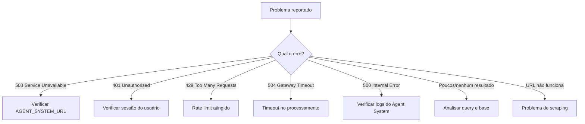

## Visão Geral

Este guia cobre os problemas mais comuns do Matchmaker e como diagnosticá-los e resolvê-los.

---

## Diagnóstico Rápido

Ao receber um report de problema, siga esta sequência:



---

## Problema: HTTP 503 - Service Unavailable

**Mensagem**: "Matchmaker não está configurado corretamente. Contate o administrador."

**Causa**: `AGENT_SYSTEM_URL` não está definida no Directus.

**Diagnóstico**:
```bash
# Verificar se a variável existe no ambiente do Directus
echo $AGENT_SYSTEM_URL
```

**Solução**:
1. Adicionar `AGENT_SYSTEM_URL=https://url-do-agent-system` ao `.env` do Directus
2. Reiniciar o serviço Directus
3. Verificar com: `curl https://AGENT_SYSTEM_URL/matchmaker/health`

---

## Problema: HTTP 429 - Rate Limit

**Mensagem**: "Limite de requisições excedido. Tente novamente em X segundos."

**Causa**: Usuário fez mais de 10 buscas em 1 minuto.

**Diagnóstico**:
```sql
SELECT COUNT(*), MIN(date_created), MAX(date_created)
FROM matchmaker_search_logs
WHERE user_id = 'UUID_DO_USUARIO'
  AND date_created > NOW() - INTERVAL '1 minute';
```

**Solução**: O usuário precisa aguardar o tempo indicado no `retry_after`. Se o limite é insuficiente para o caso de uso, o rate limiter pode ser ajustado em `extensions/endpoints/src/matchmaker/index.js`:

```javascript
const rateLimiter = createRateLimiter({
  max: 10,        // Ajustar se necessário
  windowMs: 60000,
  keyPrefix: "matchmaker",
});
```

<Warning>
  Aumentar o rate limit sem necessidade pode impactar a performance do Agent System. Avalie com cuidado.
</Warning>

---

## Problema: HTTP 504 - Gateway Timeout

**Mensagem**: "A busca demorou muito para responder."

**Causa**: O processamento excedeu 120 segundos.

**Diagnóstico**:
```sql
SELECT request_id, query, execution_time_ms, error_message
FROM matchmaker_search_logs
WHERE error_message LIKE '%timeout%' OR error_message LIKE '%Timeout%'
  AND date_created > NOW() - INTERVAL '7 days'
ORDER BY date_created DESC
LIMIT 10;
```

**Causas comuns**:

| Causa | Como identificar | Solução |
|-------|-----------------|---------|
| URL pesada para scraping | Query contém URL + timeout | Orientar colar texto manualmente |
| Muitas skills para normalizar | `response_data` mostra >30 skills | Query mais focada |
| Latência da OpenAI | Vários timeouts simultâneos | Verificar status.openai.com |
| Banco lento | P95 de queries alto | Verificar conexões do pool |

---

## Problema: Nenhum Candidato Encontrado

**Diagnóstico**: Verificar o `response_data` do log:

```sql
SELECT
  query,
  response_data->'flow_decision'->>'strategy' as estrategia,
  response_data->'skills_result'->>'final_skills' as skills_usadas,
  response_data->'normalization_result'->'stats' as normalizacao
FROM matchmaker_search_logs
WHERE request_id = 'UUID_DA_REQUISICAO';
```

**Causas e soluções**:

| Causa | Indicador | Solução |
|-------|-----------|---------|
| Estratégia IMPOSSIBLE | `strategy = "impossible"` | Query não tinha info suficiente |
| Skills não normalizadas | `stats.new` muito alto | Adicionar skills/aliases à base |
| Nenhuma skill normalizada | `skills` vazio no normalization | Base taxonômica desatualizada |
| Skills muito específicas | Poucas skills com `match_layer: exact` | Ampliar aliases e sinônimos |
| Poucos usuários com skills | Skills ok, mas 0 candidatos | Base de talentos pequena |

---

## Problema: URL de Vaga Não Funciona

**Mensagem**: "Não foi possível analisar a URL enviada."

**Causa**: O scraping falhou.

**Diagnóstico**: Verificar se a URL é acessível pelo servidor:

```bash
curl -I "URL_PROBLEMATICA"
```

**Causas comuns**:

| Causa | Solução |
|-------|---------|
| Site bloqueia bots | Orientar colar texto da vaga |
| URL expirada (vaga fechada) | Buscar link atualizado |
| URL requer autenticação | Copiar texto da vaga e colar no chat |
| Cloudflare/CAPTCHA | Copiar texto da vaga |
| Timeout do scraping | Tentar novamente ou colar texto |

**Solução definitiva**: Orientar o usuário a copiar e colar a descrição da vaga diretamente no chat.

---

## Problema: Cargo Identificado Incorretamente

**Diagnóstico**: Verificar no log o que foi extraído:

```sql
SELECT
  query,
  response_data->'input_analysis'->>'role' as role_extraido,
  response_data->'input_analysis'->>'skills' as skills_extraidas,
  response_data->'flow_decision'->>'strategy' as estrategia,
  response_data->'flow_decision'->'role_details'->>'name' as role_na_base
FROM matchmaker_search_logs
WHERE request_id = 'UUID_DA_REQUISICAO';
```

**Soluções**:

| Problema | Solução |
|----------|---------|
| LLM extraiu role errado | Orientar query mais direta |
| Role correto mas não encontrado na base | Adicionar `role_alias` |
| Trigram match errado (similaridade) | Ajustar `trigram_threshold` (padrão: 0.7) |

---

## Problema: Tempo de Resposta Alto (mas sem timeout)

**Diagnóstico**:

```sql
SELECT
  AVG(execution_time_ms) as media,
  PERCENTILE_CONT(0.95) WITHIN GROUP (ORDER BY execution_time_ms) as p95,
  COUNT(*) as total
FROM matchmaker_search_logs
WHERE success = true
  AND date_created > NOW() - INTERVAL '24 hours';
```

**Se P95 > 15 segundos, investigar**:

1. **Quantas buscas caem na camada 4 (LLM) do role matcher?**
   ```sql
   SELECT
     response_data->'flow_decision'->'role_details'->>'match_method' as metodo,
     COUNT(*) as total,
     AVG(execution_time_ms) as tempo_medio
   FROM matchmaker_search_logs
   WHERE success = true
     AND date_created > NOW() - INTERVAL '7 days'
   GROUP BY metodo;
   ```
   Se muitas caem em `llm`, adicionar aliases para os roles mais buscados.

2. **Quantas skills estão sendo normalizadas por embedding?**
   Se `stats.embedding` é alto, considerar adicionar aliases para skills comuns.

3. **Latência do banco?**
   Verificar o número de conexões ativas no pool do Supabase.

---

## Problema: Agent System Inacessível

**Sintomas**: Todos os usuários recebem erro 503 ou timeout.

**Checklist**:

1. Verificar se o Agent System está rodando:
   ```bash
   curl https://AGENT_SYSTEM_URL/matchmaker/health
   ```

2. Verificar logs do Agent System para erros de startup

3. Verificar se o `AGENT_SYSTEM_URL` no Directus aponta para o endereço correto

4. Verificar conectividade de rede entre Directus e Agent System

---

## Ferramentas de Diagnóstico

### Rastrear uma Requisição

Use o `request_id` (presente no header `X-Request-ID`) para rastrear:

```sql
SELECT *
FROM matchmaker_search_logs
WHERE request_id = 'uuid-do-request-id';
```

### Analisar Response Completa

O campo `response_data` contém a resposta completa em JSONB:

```sql
SELECT
  response_data->'input_analysis' as input,
  response_data->'flow_decision' as flow,
  response_data->'skills_result' as skills,
  response_data->'normalization_result' as normalizacao,
  response_data->'candidate_result'->'total_found' as total_candidatos
FROM matchmaker_search_logs
WHERE request_id = 'uuid';
```

### Health Check Completo

```bash
# Agent System
curl -s https://AGENT_SYSTEM_URL/matchmaker/health

# Directus
curl -s -H "Authorization: Bearer TOKEN" https://backoffice.leapy.com/matchmaker/search \
  -d '{"query": "teste de conectividade"}'
```
