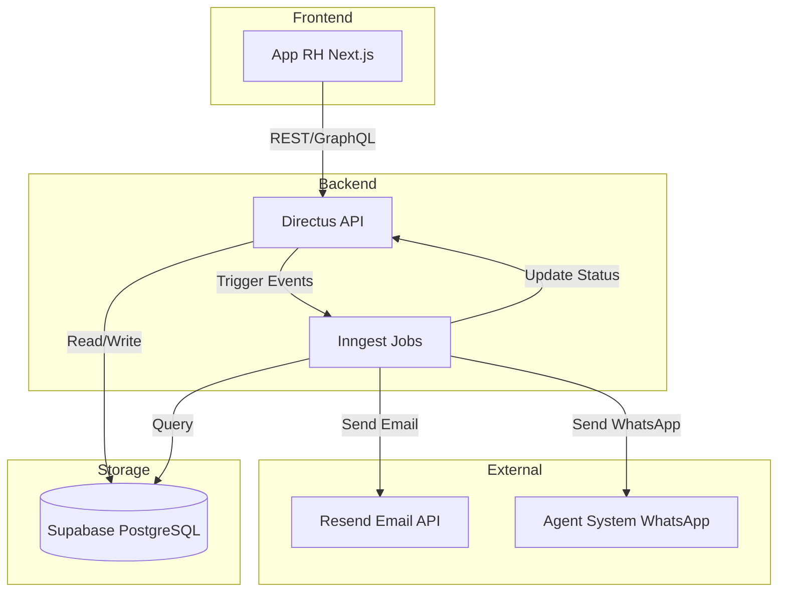
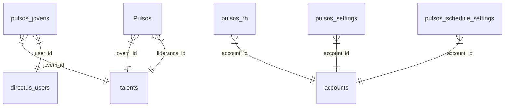

## Visão Geral

Este é o manual técnico completo do sistema de Pulsos, destinado a **desenvolvedores** e **engenheiros**. Cobre arquitetura, tecnologias, APIs, jobs e integrações.

<Note>
  Para operações rotineiras, consulte o [Guia de Operações](/guides/backoffice/pulsos-operacoes).
</Note>

---

## Arquitetura do Sistema

### Stack Tecnológico

| Componente | Tecnologia | Propósito |
|------------|------------|-----------|
| **Backend** | Directus (Node.js) | API REST/GraphQL, gerenciamento de dados |
| **Database** | PostgreSQL (Supabase) | Armazenamento de dados |
| **Jobs/Events** | Inngest | Automações e eventos assíncronos |
| **Email** | Resend | Envio de notificações |
| **Frontend** | Next.js 13+ (App Router) | Interface do usuário |
| **Messaging** | Agent System (WhatsApp) | Notificações via WhatsApp |

### Diagrama de Arquitetura



---

## Estrutura de Dados

### Tabelas Principais

#### `pulsos_jovens`

Respostas dos talentos.

```typescript
interface PulsosJovens {
  id: number; // Serial, PK
  pulso: number; // 1-5
  jovem_id: number; // FK -> talents.id
  user_id: string; // UUID, FK -> directus_users.id
  status: 'agendado' | 'pendente' | 'respondido' | 'vencido';
  data_aplicacao: Date;
  data_vencimento: Date;
  data_resposta: Date | null;
  
  // Campos de avaliação (0-10)
  nps_leapy: number | null;
  nps_empresa: number | null;
  relacao_com_a_lideranca: number | null;
  ambiente_da_empresa: number | null;
  avaliacao_tarefas_e_desafios_dia_a_dia: number | null;
  avaliacao_apoio_empresa_e_lideranca_para_desenvolvimento: number | null;
  
  // Perguntas Sim/Não
  sei_o_que_e_esperado_de_mim_na_empresa: string | null;
  sinto_que_sou_desafiado_todos_os_dias: string | null;
  estou_satisfeito_com_a_minha_area: string | null;
  // ... mais campos
  
  // Feedbacks
  feedback_para_leapy: string | null;
  depoimento_para_empresa: string | null;
  
  // Efetivação
  quanto_voce_quer_ser_efetivado: number | null;
  areas_de_interesse_em_caso_de_efetivacao: string | null;
  
  // Metadata
  created_at: Date;
  updated_at: Date;
}
```

#### `Pulsos` (Lideranças)

Avaliações das lideranças.

```typescript
interface Pulsos {
  id: number;
  pulso: number;
  jovem_id: number;
  lideranca_id: number;
  status: string;
  data_aplicacao: Date;
  data_vencimento: Date;
  data_resposta: Date | null;
  respondido_por: 'lideranca' | 'rh';
  
  performance: 'Abaixo' | 'Dentro' | 'Acima';
  prob_efetivacao: 'Alta' | 'Média' | 'Baixa' | 'Nenhuma';
  recontrataria: 'Sim' | 'Não' | 'Talvez';
  depoimento: string | null;
  pontos_fortes: string | null;
  pontos_melhoria: string | null;
  
  created_at: Date;
  updated_at: Date;
}
```

#### Configurações

```typescript
// pulsos_settings
interface PulsosSettings {
  id: string; // UUID
  account_id: string; // UUID
  profile_enabled: {
    jovens: boolean;
    liderancas: boolean;
    rh: boolean;
  };
  questions_enabled: {
    jovens: string[];
    liderancas: string[];
    rh: string[];
  };
}

// pulsos_schedule_settings
interface PulsosScheduleSettings {
  id: string;
  account_id: string;
  profile: 'jovens' | 'liderancas' | 'rh';
  enabled: boolean;
  cadence_unit: 'day' | 'week' | 'month';
  cadence_interval: number;
  next_pulso_date: Date;
}
```

### Relacionamentos



---

## APIs

### Directus REST API

**Base URL:** `https://backoffice.leapy.com`

#### Autenticação

```typescript
// Login
POST /auth/login
{
  "email": "user@empresa.com",
  "password": "senha"
}

// Response
{
  "data": {
    "access_token": "eyJhbGc...",
    "refresh_token": "abc...",
    "expires": 900000
  }
}
```

#### CRUD de Pulsos

```typescript
// Listar pulsos (com filtros e paginação)
GET /items/pulsos_jovens?filter[status][_eq]=pendente&limit=50&offset=0

// Obter pulso específico (com relacionamentos)
GET /items/pulsos_jovens/12345?fields=*,jovem_id.nome,jovem_id.email

// Criar pulso
POST /items/pulsos_jovens
{
  "jovem_id": 789,
  "pulso": 3,
  "status": "pendente",
  "data_aplicacao": "2024-03-01T09:00:00Z",
  "data_vencimento": "2024-03-08T23:59:59Z"
}

// Atualizar pulso
PATCH /items/pulsos_jovens/12345
{
  "status": "respondido",
  "nps_leapy": 9,
  "data_resposta": "2024-03-03T14:30:00Z"
}

// Deletar pulso
DELETE /items/pulsos_jovens/12345
```

#### Agregações e Filtros Avançados

```typescript
// Contar por status
GET /items/pulsos_jovens?aggregate[count]=id&groupBy[]=status

// Média de NPS
GET /items/pulsos_jovens?aggregate[avg]=nps_leapy,nps_empresa&filter[status][_eq]=respondido

// Filtros complexos
GET /items/pulsos_jovens?filter[_and][0][status][_eq]=pendente&filter[_and][1][data_vencimento][_lt]=$NOW(+7d)
```

### GraphQL API

```graphql
# Query
query GetPulsosPendentes {
  pulsos_jovens(
    filter: { status: { _eq: "pendente" } }
    limit: 10
  ) {
    id
    pulso
    status
    data_vencimento
    jovem_id {
      id
      nome
      email
    }
  }
}

# Mutation
mutation UpdatePulso($id: ID!, $status: String!) {
  update_pulsos_jovens_item(
    id: $id
    data: { status: $status }
  ) {
    id
    status
  }
}

# Subscription (Real-time)
subscription PulsosAtualizados {
  pulsos_jovens_mutated {
    event
    key
    data {
      id
      status
      data_resposta
    }
  }
}
```

---

## Inngest Jobs

### Estrutura de um Job

```typescript
import { inngest } from './client';

export const myJob = inngest.createFunction(
  {
    id: "my-job-id",
    name: "My Job Name",
    retries: 3,
    timeout: "5m"
  },
  { event: "my/event.name" },
  async ({ event, step }) => {
    // Step 1
    const data = await step.run("fetch-data", async () => {
      return await fetchData();
    });
    
    // Step 2
    await step.run("process-data", async () => {
      await processData(data);
    });
    
    // Step 3 (condicional)
    if (data.needsNotification) {
      await step.run("send-notification", async () => {
        await sendEmail(data);
      });
    }
    
    return { success: true };
  }
);
```

### Jobs Principais

#### 1. Criar Pulsos de Jovens

**File:** `src/functions/pulsos/createPulsosJovens.ts`

```typescript
export const createPulsosJovens = inngest.createFunction(
  { id: "create-pulsos-jovens", cron: "0 9 * * *" }, // Diariamente 9h
  async ({ step }) => {
    const settings = await step.run("fetch-settings", async () => {
      return await db.query(`
        SELECT * FROM pulsos_schedule_settings
        WHERE profile = 'jovens'
          AND enabled = true
          AND next_pulso_date <= CURRENT_DATE
      `);
    });
    
    for (const setting of settings) {
      await step.run(`create-pulsos-${setting.account_id}`, async () => {
        const jovens = await getActiveJovens(setting.account_id);
        
        for (const jovem of jovens) {
          await createPulso({
            jovem_id: jovem.id,
            pulso: getNextPulsoNumber(jovem),
            status: 'agendado',
            data_aplicacao: setting.next_pulso_date,
            data_vencimento: addDays(setting.next_pulso_date, 7)
          });
        }
        
        // Atualizar próxima data
        await updateNextPulsoDate(setting);
      });
    }
  }
);
```

#### 2. Enviar Lembretes

**File:** `src/functions/pulsos/sendLembretes.ts`

```typescript
export const sendLembretes = inngest.createFunction(
  { id: "send-lembretes-pulsos-jovens" },
  { event: "backoffice/pulsos_jovens/lembrete-to-jovens.send" },
  async ({ event, step }) => {
    const { pulso_ids } = event.data;
    
    const pulsos = await step.run("fetch-pulsos", async () => {
      return await db.query(`
        SELECT pj.*, t.nome, t.email
        FROM pulsos_jovens pj
        JOIN talents t ON pj.jovem_id = t.id
        WHERE pj.id = ANY($1)
      `, [pulso_ids]);
    });
    
    await step.run("send-emails", async () => {
      await Promise.all(
        pulsos.map(pulso =>
          sendEmail({
            to: pulso.email,
            template: 'pulsos-lembrete-jovens',
            data: {
              nome: pulso.nome,
              pulso_numero: pulso.pulso,
              data_vencimento: pulso.data_vencimento,
              link: `https://app.leapy.com/pulsos-jovens`
            }
          })
        )
      );
    });
  }
);
```

### Eventos Disponíveis

| Evento | Payload | Propósito |
|--------|---------|-----------|
| `backoffice/jovem.created` | `{ jovem_id, turma_id }` | Criar 5 pulsos iniciais |
| `backoffice/pulsos.change_status` | `{ pulso_id, new_status }` | Atualizar status |
| `backoffice/pulsos-jovens.update-to-pendente` | `{ pulso_ids }` | Liberar pulsos |
| `backoffice/pulsos_jovens/lembrete-to-jovens.send` | `{ pulso_ids }` | Enviar lembretes |

---

## Frontend (Next.js)

### Estrutura de Rotas

```
app/
├── [account]/
│   ├── (rh)/
│   │   ├── pulsos/
│   │   │   ├── page.tsx              # Dashboard
│   │   │   ├── talentos/
│   │   │   │   └── page.tsx          # Lista pulsos talentos
│   │   │   ├── lideranca/
│   │   │   │   └── page.tsx          # Lista pulsos lideranças
│   │   │   └── configuracao/
│   │   │       └── page.tsx          # Configurações
│   ├── (talent)/
│   │   ├── pulsos-jovens/
│   │   │   └── page.tsx              # Responder pulsos
```

### API Routes

```typescript
// app/api/pulsos/editar/route.ts
export async function PUT(request: Request) {
  const { pulso_ids, data_vencimento } = await request.json();
  
  const response = await directus.request(
    updateItems('pulsos_jovens', pulso_ids, {
      status: 'pendente',
      data_vencimento
    })
  );
  
  return Response.json(response);
}

// app/api/pulsos/send-lembrete/route.ts
export async function POST(request: Request) {
  const { pulso_ids } = await request.json();
  
  // Disparar evento Inngest
  await inngest.send({
    name: 'backoffice/pulsos_jovens/lembrete-to-jovens.send',
    data: { pulso_ids }
  });
  
  return Response.json({ success: true });
}
```

### Componentes

```typescript
// components/features/pulse/PulsosTable.tsx
'use client';

import { useEffect, useState } from 'react';
import { getPulsos } from '@/services/pulsos';

export function PulsosTable({ filtros }: Props) {
  const [pulsos, setPulsos] = useState([]);
  const [loading, setLoading] = useState(true);
  
  useEffect(() => {
    async function fetch() {
      const data = await getPulsos(filtros);
      setPulsos(data);
      setLoading(false);
    }
    fetch();
  }, [filtros]);
  
  if (loading) return <LoadingSkeleton />;
  
  return (
    <Table>
      {pulsos.map(pulso => (
        <PulsoRow key={pulso.id} pulso={pulso} />
      ))}
    </Table>
  );
}
```

---

## Testes

### Testes Unitários

```typescript
// __tests__/pulsos/calculateNPS.test.ts
import { calculateNPS } from '@/utils/metrics';

describe('calculateNPS', () => {
  it('calcula eNPS corretamente', () => {
    const respostas = [
      { nps_leapy: 9 },
      { nps_leapy: 10 },
      { nps_leapy: 8 },
      { nps_leapy: 6 },
      { nps_leapy: 5 }
    ];
    
    const nps = calculateNPS(respostas, 'nps_leapy');
    
    // 2 promotores (9-10), 2 detratores (0-6), 1 neutro (7-8)
    // eNPS = (2/5 - 2/5) * 100 = 0
    expect(nps).toBe(0);
  });
});
```

### Testes de Integração

```typescript
// __tests__/integration/pulsos.test.ts
import { testApiHandler } from 'next-test-api-route-handler';
import * as appHandler from '@/app/api/pulsos/editar/route';

describe('/api/pulsos/editar', () => {
  it('atualiza pulsos corretamente', async () => {
    await testApiHandler({
      appHandler,
      test: async ({ fetch }) => {
        const res = await fetch({
          method: 'PUT',
          headers: { 'Content-Type': 'application/json' },
          body: JSON.stringify({
            pulso_ids: [1, 2, 3],
            data_vencimento: '2024-03-15T23:59:59Z'
          })
        });
        
        expect(res.status).toBe(200);
        const json = await res.json();
        expect(json).toHaveProperty('data');
      }
    });
  });
});
```

---

## Monitoramento

### Métricas Principais

| Métrica | Ferramenta | Alerta |
|---------|------------|--------|
| **Job Success Rate** | Inngest | < 95% |
| **Email Delivery Rate** | Resend | < 98% |
| **API Response Time** | Vercel Analytics | > 2s (p95) |
| **Database Slow Queries** | Supabase | > 5s |

### Logs Estruturados

```typescript
// utils/logger.ts
export const logger = {
  info: (message: string, meta?: object) => {
    console.log(JSON.stringify({
      level: 'info',
      message,
      timestamp: new Date().toISOString(),
      ...meta
    }));
  },
  error: (message: string, error: Error, meta?: object) => {
    console.error(JSON.stringify({
      level: 'error',
      message,
      error: error.message,
      stack: error.stack,
      timestamp: new Date().toISOString(),
      ...meta
    }));
  }
};

// Uso
logger.info('Pulso criado', { pulso_id: 12345, jovem_id: 789 });
```

---

## Segurança

### Autenticação e Autorização

```typescript
// middleware.ts
export function middleware(request: NextRequest) {
  const token = request.cookies.get('auth_token');
  
  if (!token) {
    return NextResponse.redirect('/login');
  }
  
  const user = verifyToken(token);
  
  // RH pode acessar tudo
  // Liderança pode acessar pulsos de seus liderados
  // Talento pode acessar apenas seus pulsos
  if (!hasPermission(user, request.pathname)) {
    return NextResponse.json({ error: 'Forbidden' }, { status: 403 });
  }
  
  return NextResponse.next();
}
```

### Validação de Dados

```typescript
// schemas/pulsos.ts
import { z } from 'zod';

export const CreatePulsoSchema = z.object({
  jovem_id: z.number().positive(),
  pulso: z.number().min(1).max(5),
  status: z.enum(['agendado', 'pendente', 'respondido', 'vencido']),
  data_aplicacao: z.string().datetime(),
  data_vencimento: z.string().datetime()
}).refine(
  data => new Date(data.data_vencimento) > new Date(data.data_aplicacao),
  { message: "data_vencimento deve ser posterior a data_aplicacao" }
);
```

---

## Próximos Passos

<CardGroup cols={2}>
  <Card title="API Reference" icon="code" href="/api-reference/backoffice/pulsos-jovens">
    Documentação completa da API
  </Card>
  <Card title="Jobs Inngest" icon="gear" href="/documentation/domains/pulses/jobs-inngest">
    Detalhes de todos os jobs
  </Card>
  <Card title="Modelo de Dados" icon="database" href="/documentation/domains/pulses/data-model">
    Estrutura do banco de dados
  </Card>
  <Card title="Arquitetura" icon="diagram-project" href="/documentation/domains/pulses/index">
    Visão geral da arquitetura
  </Card>
</CardGroup>
